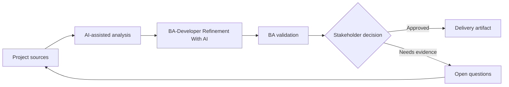

# BA-Developer Refinement With AI

<div class="case-meta">
  <span>Cross-functional BA Collaboration</span>
  <span>BA and developers</span>
  <span>Project use case</span>
</div>

## Project context

A squad prepares backlog refinement for a feature touching UI, API, validation, and permissions. Developers need clearer behavior and BA wants to find gaps before the meeting. In a real delivery environment, this work usually appears under time pressure: stakeholders want clarity, delivery needs a backlog, QA needs testable behavior, and operations needs a process that can survive exceptions. The BA uses AI here to accelerate analysis and synthesis, but the BA remains accountable for evidence, business meaning, stakeholder decisioning, and artifact quality.

## BA challenge

The BA must use AI to prepare better refinement, not to replace developer judgment. The output should surface assumptions, technical questions, API dependencies, edge cases, and decisions needed. The practical difficulty is that AI can make early material look more complete than it is. A strong BA keeps the output reviewable by separating source-backed facts, assumptions, unsupported claims, decision gaps, and recommended next actions. The objective is not to make the document longer; it is to make the project decision clearer and safer.

## Where AI fits

<div class="ba-workbench-panel">
AI is useful in this use case when it is constrained to analysis support, pattern detection, structured drafting, and critique. It should not approve scope, invent policy, decide business trade-offs, or replace accountable stakeholder judgment.
</div>

- Critique stories from developer, API, data, and integration perspectives.
- Generate refinement questions and missing behavior list.
- Draft acceptance criteria and technical dependency notes.
- Create meeting agenda focused on decisions.

## Inputs to prepare

- User stories
- Design notes
- API notes
- Current architecture constraints
- Open decisions

A BA should label these inputs before using AI: source owner, source date, approval status, sensitivity level, and whether the source is fact, opinion, policy, draft, or historical evidence. This preparation prevents the model from treating every input as equally current and authoritative.

## BA workflow

1. Package story context, design, known rules, and constraints.
2. Ask AI to review from frontend, backend, QA, and operations lenses.
3. Convert findings into refinement questions with owners.
4. Separate business decisions from technical design questions.
5. Update stories and acceptance criteria before the meeting.
6. Use the meeting to close decisions and confirm dependencies.

The workflow works best as a staged AI collaboration: first organize the evidence, then ask for analysis, then create the artifact, then run a critique pass. The BA should keep a visible decision log throughout the process so that AI-generated suggestions do not silently become approved scope.

## Diagram



## Deliverables

| Deliverable | What it contains | Owner | Done signal |
| --- | --- | --- | --- |
| Refinement prep pack | Story context, assumptions, gaps, questions, and dependency notes | BA | Meeting starts with decisions |
| Technical question log | Question, category, owner, impact, and resolution | BA and tech lead | Questions are tracked |
| Updated acceptance criteria | Behavior, edge case, API dependency, and test signal | BA | Stories are development-ready |
| Decision summary | Decision, rationale, owner, and impact on backlog | Product owner | Refinement outcomes are captured |

These deliverables should be treated as BA-owned artifacts. AI can draft them, but the BA must validate source support, stakeholder meaning, traceability, and whether the artifact is ready for handoff.

## Prompt to try

```text
Act as a senior AI-aware Business Analyst. Help me apply the "BA-Developer Refinement With AI" use case to my project. First ask for source evidence and constraints. Then create a structured analysis with project context, assumptions, AI-fit boundary, workflow steps, deliverables, risks, controls, open questions, and stakeholder decisions. Do not invent policy, thresholds, or approvals.
```

## Review checklist

- Every AI-produced statement is tied to a source, assumption, or validation question.
- The BA has separated drafting assistance from business approval.
- Workflow steps identify the human owner for decisions, review, and exceptions.
- Deliverables are traceable to project inputs and can be reviewed by QA, product, or operations.
- Risk controls are practical enough to be used in a real project meeting.
- Success metric: Refinement meetings spend more time deciding and less time discovering missing requirement basics.

## Risks and controls

| Risk | Why it matters | BA control |
| --- | --- | --- |
| AI oversteps technical design | AI may suggest architecture without context | Use AI to ask questions, not decide architecture |
| Meeting overload | Too many generated questions waste time | Prioritize by risk and dependency |
| Business/technical confusion | Teams may mix decision types | Separate business decisions and design questions |
| Untracked decisions | Refinement conclusions may disappear | Capture decision summary |

The key control is to make uncertainty visible. If evidence is weak, the output should create a validation question or decision item, not a final requirement. If the artifact influences delivery, release, compliance, customer experience, or operational workload, the BA should require explicit human review before handoff.
