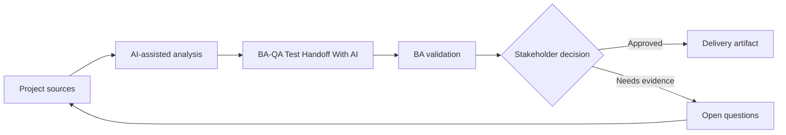

# BA-QA Test Handoff With AI

<div class="case-meta">
  <span>Cross-functional BA Collaboration</span>
  <span>BA and QA</span>
  <span>Project use case</span>
</div>

## Project context

QA receives stories late and must create tests for UI states, API errors, permissions, and integration failures. BA wants to improve handoff quality before test design starts. In a real delivery environment, this work usually appears under time pressure: stakeholders want clarity, delivery needs a backlog, QA needs testable behavior, and operations needs a process that can survive exceptions. The BA uses AI here to accelerate analysis and synthesis, but the BA remains accountable for evidence, business meaning, stakeholder decisioning, and artifact quality.

## BA challenge

The BA must provide QA with traceable behavior, not just story text. AI can generate test ideas, but the BA and QA must validate source support, risk, and expected results. The practical difficulty is that AI can make early material look more complete than it is. A strong BA keeps the output reviewable by separating source-backed facts, assumptions, unsupported claims, decision gaps, and recommended next actions. The objective is not to make the document longer; it is to make the project decision clearer and safer.

## Where AI fits

<div class="ba-workbench-panel">
AI is useful in this use case when it is constrained to analysis support, pattern detection, structured drafting, and critique. It should not approve scope, invent policy, decide business trade-offs, or replace accountable stakeholder judgment.
</div>

- Generate test scenarios from acceptance criteria and use case flow.
- Identify missing negative, boundary, permission, and API failure cases.
- Draft test data needs and expected results.
- Create QA handoff checklist and risk priority.

## Inputs to prepare

- User stories
- Acceptance criteria
- Process flow
- API contract
- Permission matrix

A BA should label these inputs before using AI: source owner, source date, approval status, sensitivity level, and whether the source is fact, opinion, policy, draft, or historical evidence. This preparation prevents the model from treating every input as equally current and authoritative.

## BA workflow

1. Ask AI to derive scenarios from each acceptance criterion.
2. Classify scenarios by positive, negative, boundary, permission, error, and integration type.
3. Review unsupported scenarios with QA and remove invented rules.
4. Add expected result, source, priority, and test data need.
5. Create handoff notes for automation and manual testing.
6. Update stories if test generation reveals requirement gaps.

The workflow works best as a staged AI collaboration: first organize the evidence, then ask for analysis, then create the artifact, then run a critique pass. The BA should keep a visible decision log throughout the process so that AI-generated suggestions do not silently become approved scope.

## Diagram



## Deliverables

| Deliverable | What it contains | Owner | Done signal |
| --- | --- | --- | --- |
| QA handoff matrix | Requirement, scenario, type, priority, source, and expected result | BA and QA | QA can design tests |
| Test data requirements | Data state, role, API condition, and setup owner | QA | Test data is ready |
| Gap list | Missing rule, missing criteria, unclear expected result, and owner | BA | Requirement gaps are resolved |
| Automation candidate list | Stable scenarios, data needs, and automation value | QA lead | Automation scope is clear |

These deliverables should be treated as BA-owned artifacts. AI can draft them, but the BA must validate source support, stakeholder meaning, traceability, and whether the artifact is ready for handoff.

## Prompt to try

```text
Act as a senior AI-aware Business Analyst. Help me apply the "BA-QA Test Handoff With AI" use case to my project. First ask for source evidence and constraints. Then create a structured analysis with project context, assumptions, AI-fit boundary, workflow steps, deliverables, risks, controls, open questions, and stakeholder decisions. Do not invent policy, thresholds, or approvals.
```

## Review checklist

- Every AI-produced statement is tied to a source, assumption, or validation question.
- The BA has separated drafting assistance from business approval.
- Workflow steps identify the human owner for decisions, review, and exceptions.
- Deliverables are traceable to project inputs and can be reviewed by QA, product, or operations.
- Risk controls are practical enough to be used in a real project meeting.
- Success metric: QA receives source-backed, prioritized scenarios with expected results and test data needs.

## Risks and controls

| Risk | Why it matters | BA control |
| --- | --- | --- |
| Invented test expectation | AI may create expected behavior not approved | Tie scenarios to source and criteria |
| Test overload | Too many scenarios reduce focus | Prioritize by risk and business impact |
| Missing data | QA cannot execute without data setup | Define test data early |
| Late gap discovery | Requirement gaps found during testing are costly | Use AI scenario generation before sprint commitment |

The key control is to make uncertainty visible. If evidence is weak, the output should create a validation question or decision item, not a final requirement. If the artifact influences delivery, release, compliance, customer experience, or operational workload, the BA should require explicit human review before handoff.
