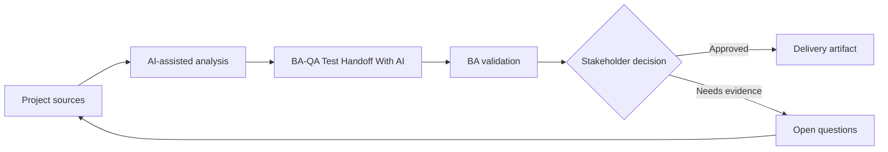

# BA-QA Test Handoff With AI

<div class="case-meta">
  <span>Cross-functional BA Collaboration</span>
  <span>BA and QA</span>
  <span>Cross-functional alignment</span>
  <span>Practitioner</span>
  <span>QA handoff matrix</span>
  <span>Project use case</span>
</div>

## Project context

QA receives stories late and must create tests for UI states, API errors, permissions, and integration failures. BA wants to improve handoff quality before test design starts. In BA and QA, this work usually starts when different roles need different artifacts, but the BA must keep decisions consistent across product, design, engineering, QA, data, and operations. The BA should treat User stories and Acceptance criteria as evidence to organize, not as raw material for an unconstrained AI answer. The goal is to make the next decision clearer for the people who own the outcome.

## BA challenge

The BA must provide QA with traceable behavior, not just story text. AI can generate test ideas, but the BA and QA must validate source support, risk, and expected results. For BA-QA Test Handoff With AI, the practical difficulty is role misalignment and hidden trade-offs. AI can accelerate role-specific synthesis, decision memo drafting, conflict surfacing, and shared artifact critique, but the BA must still expose assumptions, missing approvals, and the point where stakeholder judgment is required.

## Where AI fits

<div class="ba-workbench-panel">
AI fits this Cross-functional BA Collaboration use case when it is constrained to role-specific synthesis, decision memo drafting, conflict surfacing, and shared artifact critique. A useful first AI task is: Generate test scenarios from acceptance criteria and use case flow. AI should not approve scope, invent policy, bypass role feedback, decision log, design notes, technical constraints, test concerns, and support needs, or turn a draft into a final decision.
</div>

- Generate test scenarios from acceptance criteria and use case flow.
- Identify missing negative, boundary, permission, and API failure cases.
- Draft test data needs and expected results.
- Create QA handoff checklist and risk priority.

## Inputs to prepare

- User stories
- Acceptance criteria
- Process flow
- API contract
- Permission matrix

Before prompting for BA-QA Test Handoff With AI, label each input by owner, date, approval status, sensitivity, and role in the decision. The most important evidence lens is role feedback, decision log, design notes, technical constraints, test concerns, and support needs; without it, AI may rank old notes, draft designs, and approved rules as if they had equal authority.

## BA workflow

1. Ask AI to derive scenarios from each acceptance criterion.
2. Classify scenarios by positive, negative, boundary, permission, error, and integration type.
3. Review unsupported scenarios with QA and remove invented rules.
4. Add expected result, source, priority, and test data need.
5. Create handoff notes for automation and manual testing.
6. Update stories if test generation reveals requirement gaps.

Run the workflow as cross-role decision alignment before handoff: start with "Ask AI to derive scenarios from each acceptance criterion.", then keep a visible decision log as the artifact moves toward QA handoff matrix. This prevents AI suggestions from silently becoming backlog, design, release, or operational commitments.

## Diagram



## Deliverables

| Deliverable | What it contains | Owner | Done signal |
| --- | --- | --- | --- |
| QA handoff matrix | Requirement, scenario, type, priority, source, and expected result | BA and QA | QA can design tests |
| Test data requirements | Data state, role, API condition, and setup owner | QA | Test data is ready |
| Gap list | Missing rule, missing criteria, unclear expected result, and owner | BA | Requirement gaps are resolved |
| Automation candidate list | Stable scenarios, data needs, and automation value | QA lead | Automation scope is clear |

Treat QA handoff matrix as a BA-owned collaboration decision artifact. AI may draft structure, but the BA must validate whether "QA can design tests" is actually true, whether the artifact is traceable to source evidence, and whether the receiving team can act on it.

## Prompt to try

```text
Act as a senior AI-aware Business Analyst. Help me apply the "BA-QA Test Handoff With AI" use case to my project. First ask for source evidence and constraints. Then create a structured analysis with project context, assumptions, AI-fit boundary, workflow steps, deliverables, risks, controls, open questions, and stakeholder decisions. Do not invent policy, thresholds, or approvals.
```

## Review checklist

- User stories is labeled with owner, date, approval status, and sensitivity.
- QA handoff matrix traces to source evidence and has a named human owner.
- The AI task stays inside role-specific synthesis, decision memo drafting, conflict surfacing, and shared artifact critique and does not approve scope or policy.
- The "Invented test expectation" risk has a practical control: Tie scenarios to source and criteria.
- Open assumptions are converted into validation questions or stakeholder decisions.
- Success metric: QA receives source-backed, prioritized scenarios with expected results and test data needs.

## Risks and controls

| Risk | Why it matters | BA control |
| --- | --- | --- |
| Invented test expectation | AI may create expected behavior not approved | Tie scenarios to source and criteria |
| Test overload | Too many scenarios reduce focus | Prioritize by risk and business impact |
| Missing data | QA cannot execute without data setup | Define test data early |
| Late gap discovery | Requirement gaps found during testing are costly | Use AI scenario generation before sprint commitment |

The main control for the "Invented test expectation" risk is explicit human accountability: Tie scenarios to source and criteria. If evidence is weak, the output should create a validation question or decision item, not a final requirement.
