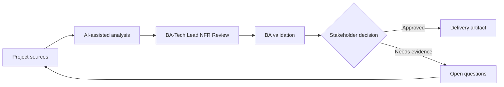

# BA-Tech Lead NFR Review

<div class="case-meta">
  <span>Cross-functional BA Collaboration</span>
  <span>BA and architecture</span>
  <span>Project use case</span>
</div>

## Project context

A feature is functionally ready for refinement, but the tech lead raises concerns about latency, data retention, audit, reliability, and supportability. In BA and architecture, this work usually starts when different roles need different artifacts, but the BA must keep decisions consistent across product, design, engineering, QA, data, and operations. The BA should treat Feature requirements and Architecture concerns as evidence to organize, not as raw material for an unconstrained AI answer. The goal is to make the next decision clearer for the people who own the outcome.

## BA challenge

The BA must turn technical concerns into business-readable NFR decisions. AI can help structure questions, but thresholds and trade-offs need owner agreement. For BA-Tech Lead NFR Review, the practical difficulty is role misalignment and hidden trade-offs. AI can accelerate role-specific synthesis, decision memo drafting, conflict surfacing, and shared artifact critique, but the BA must still expose assumptions, missing approvals, and the point where stakeholder judgment is required.

## Where AI fits

<div class="ba-workbench-panel">
AI fits this Cross-functional BA Collaboration use case when it is constrained to role-specific synthesis, decision memo drafting, conflict surfacing, and shared artifact critique. A useful first AI task is: Generate NFR questions by feature workflow and risk. AI should not approve scope, invent policy, bypass role feedback, decision log, design notes, technical constraints, test concerns, and support needs, or turn a draft into a final decision.
</div>

- Generate NFR questions by feature workflow and risk.
- Translate technical concerns into business impact statements.
- Draft measurable thresholds and acceptance signals.
- Create decision memo for trade-offs.

## Inputs to prepare

- Feature requirements
- Architecture concerns
- Operational constraints
- Compliance needs
- Usage volume estimates

Before prompting for BA-Tech Lead NFR Review, label each input by owner, date, approval status, sensitivity, and role in the decision. The most important evidence lens is role feedback, decision log, design notes, technical constraints, test concerns, and support needs; without it, AI may rank old notes, draft designs, and approved rules as if they had equal authority.

## BA workflow

1. Collect technical concerns and affected user/business outcomes.
2. Ask AI to translate concerns into NFR scenarios.
3. Define candidate thresholds and measurement methods.
4. Review trade-offs with product, tech lead, operations, and compliance.
5. Add NFR acceptance criteria and monitoring expectations.
6. Record decisions and unresolved risks.

Run the workflow as cross-role decision alignment before handoff: start with "Collect technical concerns and affected user/business outcomes.", then keep a visible decision log as the artifact moves toward NFR decision table. This prevents AI suggestions from silently becoming backlog, design, release, or operational commitments.

## Diagram



## Deliverables

| Deliverable | What it contains | Owner | Done signal |
| --- | --- | --- | --- |
| NFR decision table | Attribute, scenario, business impact, threshold, owner, and test method | BA and tech lead | NFRs are measurable |
| Trade-off memo | Option, cost, risk, user impact, and recommendation | Product owner | Stakeholders can decide |
| Monitoring requirement | Metric, threshold, alert, owner, and response | Operations | NFRs remain observable |
| Risk register update | NFR risk, mitigation, decision, and residual risk | Project manager | Risks are tracked |

Treat NFR decision table as a BA-owned collaboration decision artifact. AI may draft structure, but the BA must validate whether "NFRs are measurable" is actually true, whether the artifact is traceable to source evidence, and whether the receiving team can act on it.

## Prompt to try

```text
Act as a senior AI-aware Business Analyst. Help me apply the "BA-Tech Lead NFR Review" use case to my project. First ask for source evidence and constraints. Then create a structured analysis with project context, assumptions, AI-fit boundary, workflow steps, deliverables, risks, controls, open questions, and stakeholder decisions. Do not invent policy, thresholds, or approvals.
```

## Review checklist

- Feature requirements is labeled with owner, date, approval status, and sensitivity.
- NFR decision table traces to source evidence and has a named human owner.
- The AI task stays inside role-specific synthesis, decision memo drafting, conflict surfacing, and shared artifact critique and does not approve scope or policy.
- The "Technical jargon" risk has a practical control: Translate to user and business impact.
- Open assumptions are converted into validation questions or stakeholder decisions.
- Success metric: Technical quality concerns become measurable business decisions and delivery requirements.

## Risks and controls

| Risk | Why it matters | BA control |
| --- | --- | --- |
| Technical jargon | Business stakeholders may not understand risk | Translate to user and business impact |
| Threshold guessing | AI may invent numbers | Validate thresholds with owners |
| Late NFR | Quality controls may be hard to retrofit | Review before design lock |
| No monitoring | NFR may pass test but fail in production | Specify monitoring and response |

The main control for the "Technical jargon" risk is explicit human accountability: Translate to user and business impact. If evidence is weak, the output should create a validation question or decision item, not a final requirement.
