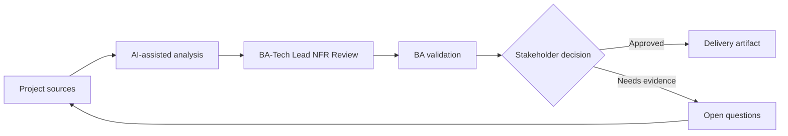

# BA-Tech Lead NFR Review

<div class="case-meta">
  <span>Cross-functional BA Collaboration</span>
  <span>BA and architecture</span>
  <span>Project use case</span>
</div>

## Project context

A feature is functionally ready for refinement, but the tech lead raises concerns about latency, data retention, audit, reliability, and supportability. In a real delivery environment, this work usually appears under time pressure: stakeholders want clarity, delivery needs a backlog, QA needs testable behavior, and operations needs a process that can survive exceptions. The BA uses AI here to accelerate analysis and synthesis, but the BA remains accountable for evidence, business meaning, stakeholder decisioning, and artifact quality.

## BA challenge

The BA must turn technical concerns into business-readable NFR decisions. AI can help structure questions, but thresholds and trade-offs need owner agreement. The practical difficulty is that AI can make early material look more complete than it is. A strong BA keeps the output reviewable by separating source-backed facts, assumptions, unsupported claims, decision gaps, and recommended next actions. The objective is not to make the document longer; it is to make the project decision clearer and safer.

## Where AI fits

<div class="ba-workbench-panel">
AI is useful in this use case when it is constrained to analysis support, pattern detection, structured drafting, and critique. It should not approve scope, invent policy, decide business trade-offs, or replace accountable stakeholder judgment.
</div>

- Generate NFR questions by feature workflow and risk.
- Translate technical concerns into business impact statements.
- Draft measurable thresholds and acceptance signals.
- Create decision memo for trade-offs.

## Inputs to prepare

- Feature requirements
- Architecture concerns
- Operational constraints
- Compliance needs
- Usage volume estimates

A BA should label these inputs before using AI: source owner, source date, approval status, sensitivity level, and whether the source is fact, opinion, policy, draft, or historical evidence. This preparation prevents the model from treating every input as equally current and authoritative.

## BA workflow

1. Collect technical concerns and affected user/business outcomes.
2. Ask AI to translate concerns into NFR scenarios.
3. Define candidate thresholds and measurement methods.
4. Review trade-offs with product, tech lead, operations, and compliance.
5. Add NFR acceptance criteria and monitoring expectations.
6. Record decisions and unresolved risks.

The workflow works best as a staged AI collaboration: first organize the evidence, then ask for analysis, then create the artifact, then run a critique pass. The BA should keep a visible decision log throughout the process so that AI-generated suggestions do not silently become approved scope.

## Diagram



## Deliverables

| Deliverable | What it contains | Owner | Done signal |
| --- | --- | --- | --- |
| NFR decision table | Attribute, scenario, business impact, threshold, owner, and test method | BA and tech lead | NFRs are measurable |
| Trade-off memo | Option, cost, risk, user impact, and recommendation | Product owner | Stakeholders can decide |
| Monitoring requirement | Metric, threshold, alert, owner, and response | Operations | NFRs remain observable |
| Risk register update | NFR risk, mitigation, decision, and residual risk | Project manager | Risks are tracked |

These deliverables should be treated as BA-owned artifacts. AI can draft them, but the BA must validate source support, stakeholder meaning, traceability, and whether the artifact is ready for handoff.

## Prompt to try

```text
Act as a senior AI-aware Business Analyst. Help me apply the "BA-Tech Lead NFR Review" use case to my project. First ask for source evidence and constraints. Then create a structured analysis with project context, assumptions, AI-fit boundary, workflow steps, deliverables, risks, controls, open questions, and stakeholder decisions. Do not invent policy, thresholds, or approvals.
```

## Review checklist

- Every AI-produced statement is tied to a source, assumption, or validation question.
- The BA has separated drafting assistance from business approval.
- Workflow steps identify the human owner for decisions, review, and exceptions.
- Deliverables are traceable to project inputs and can be reviewed by QA, product, or operations.
- Risk controls are practical enough to be used in a real project meeting.
- Success metric: Technical quality concerns become measurable business decisions and delivery requirements.

## Risks and controls

| Risk | Why it matters | BA control |
| --- | --- | --- |
| Technical jargon | Business stakeholders may not understand risk | Translate to user and business impact |
| Threshold guessing | AI may invent numbers | Validate thresholds with owners |
| Late NFR | Quality controls may be hard to retrofit | Review before design lock |
| No monitoring | NFR may pass test but fail in production | Specify monitoring and response |

The key control is to make uncertainty visible. If evidence is weak, the output should create a validation question or decision item, not a final requirement. If the artifact influences delivery, release, compliance, customer experience, or operational workload, the BA should require explicit human review before handoff.
