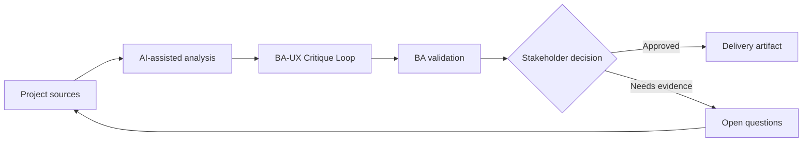

# BA-UX Critique Loop

<div class="case-meta">
  <span>Cross-functional BA Collaboration</span>
  <span>BA and UX</span>
  <span>Cross-functional alignment</span>
  <span>Practitioner</span>
  <span>BA-UX critique checklist</span>
  <span>Project use case</span>
</div>

## Project context

UX proposes a new onboarding flow. The flow is elegant, but BA sees possible policy gaps, missing error paths, unclear data fields, and operational exceptions. In BA and UX, this work usually starts when different roles need different artifacts, but the BA must keep decisions consistent across product, design, engineering, QA, data, and operations. The BA should treat Design flow and User research as evidence to organize, not as raw material for an unconstrained AI answer. The goal is to make the next decision clearer for the people who own the outcome.

## BA challenge

The BA must critique designs constructively without turning UX review into requirement policing. AI can help generate critique lenses and questions, but the BA must ground feedback in evidence and user outcomes. For BA-UX Critique Loop, the practical difficulty is role misalignment and hidden trade-offs. AI can accelerate role-specific synthesis, decision memo drafting, conflict surfacing, and shared artifact critique, but the BA must still expose assumptions, missing approvals, and the point where stakeholder judgment is required.

## Where AI fits

<div class="ba-workbench-panel">
AI fits this Cross-functional BA Collaboration use case when it is constrained to role-specific synthesis, decision memo drafting, conflict surfacing, and shared artifact critique. A useful first AI task is: Generate critique lenses for rule, data, exception, accessibility, analytics, and operations. AI should not approve scope, invent policy, bypass role feedback, decision log, design notes, technical constraints, test concerns, and support needs, or turn a draft into a final decision.
</div>

- Generate critique lenses for rule, data, exception, accessibility, analytics, and operations.
- Draft questions that preserve UX intent while exposing gaps.
- Identify where design implies unapproved business rules.
- Create decision log entries from design review.

## Inputs to prepare

- Design flow
- User research
- Business rules
- Operations constraints
- Accessibility expectations

Before prompting for BA-UX Critique Loop, label each input by owner, date, approval status, sensitivity, and role in the decision. The most important evidence lens is role feedback, decision log, design notes, technical constraints, test concerns, and support needs; without it, AI may rank old notes, draft designs, and approved rules as if they had equal authority.

## BA workflow

1. Package design goal, user problem, rules, and constraints.
2. Ask AI to critique the design using BA lenses.
3. Convert critique into questions, not directives.
4. Review with UX to separate design choice, business rule, and technical constraint.
5. Capture decisions and open gaps.
6. Update requirements and design annotations together.

Run the workflow as cross-role decision alignment before handoff: start with "Package design goal, user problem, rules, and constraints.", then keep a visible decision log as the artifact moves toward BA-UX critique checklist. This prevents AI suggestions from silently becoming backlog, design, release, or operational commitments.

## Diagram



## Deliverables

| Deliverable | What it contains | Owner | Done signal |
| --- | --- | --- | --- |
| BA-UX critique checklist | Lens, question, evidence, impact, and owner | BA | Feedback is structured |
| Design decision log | Decision, rationale, source, owner, and requirement impact | Product and UX | Design decisions are traceable |
| Gap register | Missing rule, data, state, exception, accessibility, or analytics item | BA and UX | Gaps have next action |
| Annotated flow updates | Design frame notes linked to requirement and decision | UX | Design and requirements align |

Treat BA-UX critique checklist as a BA-owned collaboration decision artifact. AI may draft structure, but the BA must validate whether "Feedback is structured" is actually true, whether the artifact is traceable to source evidence, and whether the receiving team can act on it.

## Prompt to try

```text
Act as a senior AI-aware Business Analyst. Help me apply the "BA-UX Critique Loop" use case to my project. First ask for source evidence and constraints. Then create a structured analysis with project context, assumptions, AI-fit boundary, workflow steps, deliverables, risks, controls, open questions, and stakeholder decisions. Do not invent policy, thresholds, or approvals.
```

## Review checklist

- Design flow is labeled with owner, date, approval status, and sensitivity.
- BA-UX critique checklist traces to source evidence and has a named human owner.
- The AI task stays inside role-specific synthesis, decision memo drafting, conflict surfacing, and shared artifact critique and does not approve scope or policy.
- The "Critique as opinion" risk has a practical control: Tie critique to evidence and user outcome.
- Open assumptions are converted into validation questions or stakeholder decisions.
- Success metric: BA and UX reviews produce clearer design decisions without losing user-centered intent.

## Risks and controls

| Risk | Why it matters | BA control |
| --- | --- | --- |
| Critique as opinion | UX feedback may feel subjective | Tie critique to evidence and user outcome |
| UX intent loss | BA may over-constrain design | Preserve design goal while clarifying rules |
| Hidden policy | Design may imply policy decisions | Identify implied rules and decision owners |
| Untracked review | Good discussion may not update artifacts | Capture decisions and annotations |

The main control for the "Critique as opinion" risk is explicit human accountability: Tie critique to evidence and user outcome. If evidence is weak, the output should create a validation question or decision item, not a final requirement.
