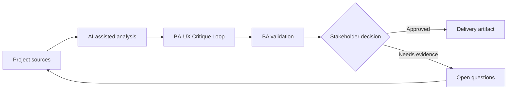

# BA-UX Critique Loop

<div class="case-meta">
  <span>Cross-functional BA Collaboration</span>
  <span>BA and UX</span>
  <span>Project use case</span>
</div>

## Project context

UX proposes a new onboarding flow. The flow is elegant, but BA sees possible policy gaps, missing error paths, unclear data fields, and operational exceptions. In a real delivery environment, this work usually appears under time pressure: stakeholders want clarity, delivery needs a backlog, QA needs testable behavior, and operations needs a process that can survive exceptions. The BA uses AI here to accelerate analysis and synthesis, but the BA remains accountable for evidence, business meaning, stakeholder decisioning, and artifact quality.

## BA challenge

The BA must critique designs constructively without turning UX review into requirement policing. AI can help generate critique lenses and questions, but the BA must ground feedback in evidence and user outcomes. The practical difficulty is that AI can make early material look more complete than it is. A strong BA keeps the output reviewable by separating source-backed facts, assumptions, unsupported claims, decision gaps, and recommended next actions. The objective is not to make the document longer; it is to make the project decision clearer and safer.

## Where AI fits

<div class="ba-workbench-panel">
AI is useful in this use case when it is constrained to analysis support, pattern detection, structured drafting, and critique. It should not approve scope, invent policy, decide business trade-offs, or replace accountable stakeholder judgment.
</div>

- Generate critique lenses for rule, data, exception, accessibility, analytics, and operations.
- Draft questions that preserve UX intent while exposing gaps.
- Identify where design implies unapproved business rules.
- Create decision log entries from design review.

## Inputs to prepare

- Design flow
- User research
- Business rules
- Operations constraints
- Accessibility expectations

A BA should label these inputs before using AI: source owner, source date, approval status, sensitivity level, and whether the source is fact, opinion, policy, draft, or historical evidence. This preparation prevents the model from treating every input as equally current and authoritative.

## BA workflow

1. Package design goal, user problem, rules, and constraints.
2. Ask AI to critique the design using BA lenses.
3. Convert critique into questions, not directives.
4. Review with UX to separate design choice, business rule, and technical constraint.
5. Capture decisions and open gaps.
6. Update requirements and design annotations together.

The workflow works best as a staged AI collaboration: first organize the evidence, then ask for analysis, then create the artifact, then run a critique pass. The BA should keep a visible decision log throughout the process so that AI-generated suggestions do not silently become approved scope.

## Diagram



## Deliverables

| Deliverable | What it contains | Owner | Done signal |
| --- | --- | --- | --- |
| BA-UX critique checklist | Lens, question, evidence, impact, and owner | BA | Feedback is structured |
| Design decision log | Decision, rationale, source, owner, and requirement impact | Product and UX | Design decisions are traceable |
| Gap register | Missing rule, data, state, exception, accessibility, or analytics item | BA and UX | Gaps have next action |
| Annotated flow updates | Design frame notes linked to requirement and decision | UX | Design and requirements align |

These deliverables should be treated as BA-owned artifacts. AI can draft them, but the BA must validate source support, stakeholder meaning, traceability, and whether the artifact is ready for handoff.

## Prompt to try

```text
Act as a senior AI-aware Business Analyst. Help me apply the "BA-UX Critique Loop" use case to my project. First ask for source evidence and constraints. Then create a structured analysis with project context, assumptions, AI-fit boundary, workflow steps, deliverables, risks, controls, open questions, and stakeholder decisions. Do not invent policy, thresholds, or approvals.
```

## Review checklist

- Every AI-produced statement is tied to a source, assumption, or validation question.
- The BA has separated drafting assistance from business approval.
- Workflow steps identify the human owner for decisions, review, and exceptions.
- Deliverables are traceable to project inputs and can be reviewed by QA, product, or operations.
- Risk controls are practical enough to be used in a real project meeting.
- Success metric: BA and UX reviews produce clearer design decisions without losing user-centered intent.

## Risks and controls

| Risk | Why it matters | BA control |
| --- | --- | --- |
| Critique as opinion | UX feedback may feel subjective | Tie critique to evidence and user outcome |
| UX intent loss | BA may over-constrain design | Preserve design goal while clarifying rules |
| Hidden policy | Design may imply policy decisions | Identify implied rules and decision owners |
| Untracked review | Good discussion may not update artifacts | Capture decisions and annotations |

The key control is to make uncertainty visible. If evidence is weak, the output should create a validation question or decision item, not a final requirement. If the artifact influences delivery, release, compliance, customer experience, or operational workload, the BA should require explicit human review before handoff.
