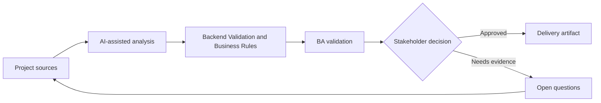

# Backend Validation and Business Rules

<div class="case-meta">
  <span>Backend and API</span>
  <span>Business rules</span>
  <span>Project use case</span>
</div>

## Project context

Frontend validation exists for a quote request form, but backend must enforce pricing limits, eligibility, approval thresholds, and fraud-related constraints regardless of UI behavior. In a real delivery environment, this work usually appears under time pressure: stakeholders want clarity, delivery needs a backlog, QA needs testable behavior, and operations needs a process that can survive exceptions. The BA uses AI here to accelerate analysis and synthesis, but the BA remains accountable for evidence, business meaning, stakeholder decisioning, and artifact quality.

## BA challenge

The BA must separate user guidance from authoritative business rule enforcement. Backend validation must be source-backed, testable, auditable, and consistent with frontend messaging. The practical difficulty is that AI can make early material look more complete than it is. A strong BA keeps the output reviewable by separating source-backed facts, assumptions, unsupported claims, decision gaps, and recommended next actions. The objective is not to make the document longer; it is to make the project decision clearer and safer.

## Where AI fits

<div class="ba-workbench-panel">
AI is useful in this use case when it is constrained to analysis support, pattern detection, structured drafting, and critique. It should not approve scope, invent policy, decide business trade-offs, or replace accountable stakeholder judgment.
</div>

- Extract business rules from policy and stories.
- Classify rules as frontend guidance, backend enforcement, or both.
- Generate backend validation scenarios and error responses.
- Identify missing audit requirements for rule failures.

## Inputs to prepare

- Policy documents
- Frontend validation spec
- Pricing rules
- Eligibility rules
- Audit requirements

A BA should label these inputs before using AI: source owner, source date, approval status, sensitivity level, and whether the source is fact, opinion, policy, draft, or historical evidence. This preparation prevents the model from treating every input as equally current and authoritative.

## BA workflow

1. Inventory all validation rules and source evidence.
2. Ask AI to classify rule enforcement location and risk.
3. Define backend validation behavior, error code, audit event, and override path.
4. Review rule conflicts with product, operations, and compliance.
5. Write API negative test scenarios.
6. Align frontend copy with backend rejection reasons.

The workflow works best as a staged AI collaboration: first organize the evidence, then ask for analysis, then create the artifact, then run a critique pass. The BA should keep a visible decision log throughout the process so that AI-generated suggestions do not silently become approved scope.

## Diagram



## Deliverables

| Deliverable | What it contains | Owner | Done signal |
| --- | --- | --- | --- |
| Backend rule matrix | Rule, source, enforcement, error code, audit need, and owner | BA and backend | Rules are enforceable |
| Validation location map | Frontend guidance, backend enforcement, both, or manual review | BA | Ownership is clear |
| Negative API test set | Invalid input, expected rejection, error code, and audit | QA | Rule failures are testable |
| Frontend-backend message map | Backend reason to user-facing copy and recovery action | UX and frontend | Users understand rejection |

These deliverables should be treated as BA-owned artifacts. AI can draft them, but the BA must validate source support, stakeholder meaning, traceability, and whether the artifact is ready for handoff.

## Prompt to try

```text
Act as a senior AI-aware Business Analyst. Help me apply the "Backend Validation and Business Rules" use case to my project. First ask for source evidence and constraints. Then create a structured analysis with project context, assumptions, AI-fit boundary, workflow steps, deliverables, risks, controls, open questions, and stakeholder decisions. Do not invent policy, thresholds, or approvals.
```

## Review checklist

- Every AI-produced statement is tied to a source, assumption, or validation question.
- The BA has separated drafting assistance from business approval.
- Workflow steps identify the human owner for decisions, review, and exceptions.
- Deliverables are traceable to project inputs and can be reviewed by QA, product, or operations.
- Risk controls are practical enough to be used in a real project meeting.
- Success metric: Backend validation is authoritative, source-backed, and aligned with frontend guidance.

## Risks and controls

| Risk | Why it matters | BA control |
| --- | --- | --- |
| Frontend-only validation | Users or integrations can bypass UI rules | Enforce material rules in backend |
| Rule source gap | Backend may implement invented thresholds | Require source evidence and owner |
| Poor recovery | Backend rejection may not help user recover | Map error reason to UI message |
| Audit gap | Rule failures may need evidence | Specify audit event and retention |

The key control is to make uncertainty visible. If evidence is weak, the output should create a validation question or decision item, not a final requirement. If the artifact influences delivery, release, compliance, customer experience, or operational workload, the BA should require explicit human review before handoff.
