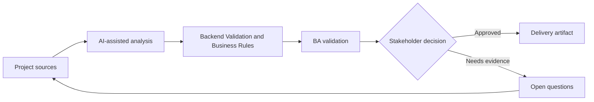

# Backend Validation and Business Rules

<div class="case-meta">
  <span>Backend and API</span>
  <span>Business rules</span>
  <span>Project use case</span>
</div>

## Project context

Frontend validation exists for a quote request form, but backend must enforce pricing limits, eligibility, approval thresholds, and fraud-related constraints regardless of UI behavior. In Business rules, this work usually starts when API contracts, permissions, errors, audit, and operational behavior must be explicit enough for backend delivery. The BA should treat Policy documents and Frontend validation spec as evidence to organize, not as raw material for an unconstrained AI answer. The goal is to make the next decision clearer for the people who own the outcome.

## BA challenge

The BA must separate user guidance from authoritative business rule enforcement. Backend validation must be source-backed, testable, auditable, and consistent with frontend messaging. For Backend Validation and Business Rules, the practical difficulty is ambiguous service behavior and security gaps. AI can accelerate contract critique, rule extraction, error taxonomy, permission review, and NFR gap detection, but the BA must still expose assumptions, missing approvals, and the point where stakeholder judgment is required.

## Where AI fits

<div class="ba-workbench-panel">
AI fits this Backend and API use case when it is constrained to contract critique, rule extraction, error taxonomy, permission review, and NFR gap detection. A useful first AI task is: Extract business rules from policy and stories. AI should not approve scope, invent policy, bypass API draft, data model, auth rules, error samples, audit policy, and integration needs, or turn a draft into a final decision.
</div>

- Extract business rules from policy and stories.
- Classify rules as frontend guidance, backend enforcement, or both.
- Generate backend validation scenarios and error responses.
- Identify missing audit requirements for rule failures.

## Inputs to prepare

- Policy documents
- Frontend validation spec
- Pricing rules
- Eligibility rules
- Audit requirements

Before prompting for Backend Validation and Business Rules, label each input by owner, date, approval status, sensitivity, and role in the decision. The most important evidence lens is API draft, data model, auth rules, error samples, audit policy, and integration needs; without it, AI may rank old notes, draft designs, and approved rules as if they had equal authority.

## BA workflow

1. Inventory all validation rules and source evidence.
2. Ask AI to classify rule enforcement location and risk.
3. Define backend validation behavior, error code, audit event, and override path.
4. Review rule conflicts with product, operations, and compliance.
5. Write API negative test scenarios.
6. Align frontend copy with backend rejection reasons.

Run the workflow as contract validation before implementation: start with "Inventory all validation rules and source evidence.", then keep a visible decision log as the artifact moves toward Backend rule matrix. This prevents AI suggestions from silently becoming backlog, design, release, or operational commitments.

## Diagram



## Deliverables

| Deliverable | What it contains | Owner | Done signal |
| --- | --- | --- | --- |
| Backend rule matrix | Rule, source, enforcement, error code, audit need, and owner | BA and backend | Rules are enforceable |
| Validation location map | Frontend guidance, backend enforcement, both, or manual review | BA | Ownership is clear |
| Negative API test set | Invalid input, expected rejection, error code, and audit | QA | Rule failures are testable |
| Frontend-backend message map | Backend reason to user-facing copy and recovery action | UX and frontend | Users understand rejection |

Treat Backend rule matrix as a BA-owned backend behavior contract. AI may draft structure, but the BA must validate whether "Rules are enforceable" is actually true, whether the artifact is traceable to source evidence, and whether the receiving team can act on it.

## Prompt to try

```text
Act as a senior AI-aware Business Analyst. Help me apply the "Backend Validation and Business Rules" use case to my project. First ask for source evidence and constraints. Then create a structured analysis with project context, assumptions, AI-fit boundary, workflow steps, deliverables, risks, controls, open questions, and stakeholder decisions. Do not invent policy, thresholds, or approvals.
```

## Review checklist

- Policy documents is labeled with owner, date, approval status, and sensitivity.
- Backend rule matrix traces to source evidence and has a named human owner.
- The AI task stays inside contract critique, rule extraction, error taxonomy, permission review, and NFR gap detection and does not approve scope or policy.
- The "Frontend-only validation" risk has a practical control: Enforce material rules in backend.
- Open assumptions are converted into validation questions or stakeholder decisions.
- Success metric: Backend validation is authoritative, source-backed, and aligned with frontend guidance.

## Risks and controls

| Risk | Why it matters | BA control |
| --- | --- | --- |
| Frontend-only validation | Users or integrations can bypass UI rules | Enforce material rules in backend |
| Rule source gap | Backend may implement invented thresholds | Require source evidence and owner |
| Poor recovery | Backend rejection may not help user recover | Map error reason to UI message |
| Audit gap | Rule failures may need evidence | Specify audit event and retention |

The main control for the "Frontend-only validation" risk is explicit human accountability: Enforce material rules in backend. If evidence is weak, the output should create a validation question or decision item, not a final requirement.
