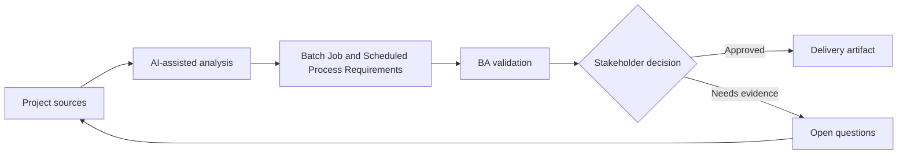

# Batch Job and Scheduled Process Requirements

<div class="case-meta">
  <span>Backend and API</span>
  <span>Scheduled processing</span>
  <span>Project use case</span>
</div>

## Project context

A nightly job recalculates customer risk scores, sends summary notifications, and updates reporting tables. Failures are currently discovered late by support teams. In a real delivery environment, this work usually appears under time pressure: stakeholders want clarity, delivery needs a backlog, QA needs testable behavior, and operations needs a process that can survive exceptions. The BA uses AI here to accelerate analysis and synthesis, but the BA remains accountable for evidence, business meaning, stakeholder decisioning, and artifact quality.

## BA challenge

The BA must specify scheduled process behavior that users may never see directly: trigger, schedule, input eligibility, processing rules, failure handling, rerun, audit, and operational monitoring. The practical difficulty is that AI can make early material look more complete than it is. A strong BA keeps the output reviewable by separating source-backed facts, assumptions, unsupported claims, decision gaps, and recommended next actions. The objective is not to make the document longer; it is to make the project decision clearer and safer.

## Where AI fits

<div class="ba-workbench-panel">
AI is useful in this use case when it is constrained to analysis support, pattern detection, structured drafting, and critique. It should not approve scope, invent policy, decide business trade-offs, or replace accountable stakeholder judgment.
</div>

- Generate batch process requirement checklist.
- Identify failure, partial success, rerun, and notification scenarios.
- Draft operational monitoring and alert rules.
- Create acceptance criteria for data freshness and audit.

## Inputs to prepare

- Process purpose
- Schedule rules
- Input data definitions
- Output consumers
- Operations runbook

A BA should label these inputs before using AI: source owner, source date, approval status, sensitivity level, and whether the source is fact, opinion, policy, draft, or historical evidence. This preparation prevents the model from treating every input as equally current and authoritative.

## BA workflow

1. Define business purpose and downstream consumers of the scheduled job.
2. Ask AI to draft scenarios for success, partial success, skipped items, and failure.
3. Specify schedule, eligibility, processing rules, output, notifications, and audit.
4. Review rerun and rollback needs with backend and operations.
5. Define monitoring, alert, SLA, and support escalation.
6. Write acceptance criteria for data freshness and failure handling.

The workflow works best as a staged AI collaboration: first organize the evidence, then ask for analysis, then create the artifact, then run a critique pass. The BA should keep a visible decision log throughout the process so that AI-generated suggestions do not silently become approved scope.

## Diagram



## Deliverables

| Deliverable | What it contains | Owner | Done signal |
| --- | --- | --- | --- |
| Batch process spec | Schedule, trigger, eligibility, input, output, and processing rule | BA and backend | Job behavior is explicit |
| Failure handling matrix | Failure type, user impact, retry, rerun, alert, and owner | Operations | Failures have action path |
| Data freshness requirement | Output, consumer, freshness target, and alert threshold | Product owner | Freshness is measurable |
| Operational runbook requirements | Monitor, alert, rerun, rollback, and support communication | Operations | Support can respond |

These deliverables should be treated as BA-owned artifacts. AI can draft them, but the BA must validate source support, stakeholder meaning, traceability, and whether the artifact is ready for handoff.

## Prompt to try

```text
Act as a senior AI-aware Business Analyst. Help me apply the "Batch Job and Scheduled Process Requirements" use case to my project. First ask for source evidence and constraints. Then create a structured analysis with project context, assumptions, AI-fit boundary, workflow steps, deliverables, risks, controls, open questions, and stakeholder decisions. Do not invent policy, thresholds, or approvals.
```

## Review checklist

- Every AI-produced statement is tied to a source, assumption, or validation question.
- The BA has separated drafting assistance from business approval.
- Workflow steps identify the human owner for decisions, review, and exceptions.
- Deliverables are traceable to project inputs and can be reviewed by QA, product, or operations.
- Risk controls are practical enough to be used in a real project meeting.
- Success metric: Scheduled backend work has clear business rules, monitoring, rerun behavior, and operational ownership.

## Risks and controls

| Risk | Why it matters | BA control |
| --- | --- | --- |
| Invisible failure | Users see wrong data before anyone knows job failed | Define monitoring and freshness alerts |
| Partial success ambiguity | Some records update and others do not | Specify partial success and reconciliation |
| Unsafe rerun | Rerun may duplicate notifications or updates | Define idempotent rerun behavior |
| No owner | Operations may not know who responds | Assign alert owner and SLA |

The key control is to make uncertainty visible. If evidence is weak, the output should create a validation question or decision item, not a final requirement. If the artifact influences delivery, release, compliance, customer experience, or operational workload, the BA should require explicit human review before handoff.
