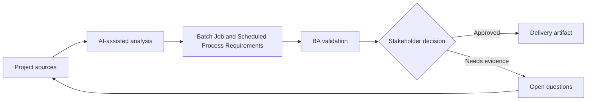

# Batch Job and Scheduled Process Requirements

<div class="case-meta">
  <span>Backend and API</span>
  <span>Scheduled processing</span>
  <span>Project use case</span>
</div>

## Project context

A nightly job recalculates customer risk scores, sends summary notifications, and updates reporting tables. Failures are currently discovered late by support teams. In Scheduled processing, this work usually starts when API contracts, permissions, errors, audit, and operational behavior must be explicit enough for backend delivery. The BA should treat Process purpose and Schedule rules as evidence to organize, not as raw material for an unconstrained AI answer. The goal is to make the next decision clearer for the people who own the outcome.

## BA challenge

The BA must specify scheduled process behavior that users may never see directly: trigger, schedule, input eligibility, processing rules, failure handling, rerun, audit, and operational monitoring. For Batch Job and Scheduled Process Requirements, the practical difficulty is ambiguous service behavior and security gaps. AI can accelerate contract critique, rule extraction, error taxonomy, permission review, and NFR gap detection, but the BA must still expose assumptions, missing approvals, and the point where stakeholder judgment is required.

## Where AI fits

<div class="ba-workbench-panel">
AI fits this Backend and API use case when it is constrained to contract critique, rule extraction, error taxonomy, permission review, and NFR gap detection. A useful first AI task is: Generate batch process requirement checklist. AI should not approve scope, invent policy, bypass API draft, data model, auth rules, error samples, audit policy, and integration needs, or turn a draft into a final decision.
</div>

- Generate batch process requirement checklist.
- Identify failure, partial success, rerun, and notification scenarios.
- Draft operational monitoring and alert rules.
- Create acceptance criteria for data freshness and audit.

## Inputs to prepare

- Process purpose
- Schedule rules
- Input data definitions
- Output consumers
- Operations runbook

Before prompting for Batch Job and Scheduled Process Requirements, label each input by owner, date, approval status, sensitivity, and role in the decision. The most important evidence lens is API draft, data model, auth rules, error samples, audit policy, and integration needs; without it, AI may rank old notes, draft designs, and approved rules as if they had equal authority.

## BA workflow

1. Define business purpose and downstream consumers of the scheduled job.
2. Ask AI to draft scenarios for success, partial success, skipped items, and failure.
3. Specify schedule, eligibility, processing rules, output, notifications, and audit.
4. Review rerun and rollback needs with backend and operations.
5. Define monitoring, alert, SLA, and support escalation.
6. Write acceptance criteria for data freshness and failure handling.

Run the workflow as contract validation before implementation: start with "Define business purpose and downstream consumers of the scheduled job.", then keep a visible decision log as the artifact moves toward Batch process spec. This prevents AI suggestions from silently becoming backlog, design, release, or operational commitments.

## Diagram



## Deliverables

| Deliverable | What it contains | Owner | Done signal |
| --- | --- | --- | --- |
| Batch process spec | Schedule, trigger, eligibility, input, output, and processing rule | BA and backend | Job behavior is explicit |
| Failure handling matrix | Failure type, user impact, retry, rerun, alert, and owner | Operations | Failures have action path |
| Data freshness requirement | Output, consumer, freshness target, and alert threshold | Product owner | Freshness is measurable |
| Operational runbook requirements | Monitor, alert, rerun, rollback, and support communication | Operations | Support can respond |

Treat Batch process spec as a BA-owned backend behavior contract. AI may draft structure, but the BA must validate whether "Job behavior is explicit" is actually true, whether the artifact is traceable to source evidence, and whether the receiving team can act on it.

## Prompt to try

```text
Act as a senior AI-aware Business Analyst. Help me apply the "Batch Job and Scheduled Process Requirements" use case to my project. First ask for source evidence and constraints. Then create a structured analysis with project context, assumptions, AI-fit boundary, workflow steps, deliverables, risks, controls, open questions, and stakeholder decisions. Do not invent policy, thresholds, or approvals.
```

## Review checklist

- Process purpose is labeled with owner, date, approval status, and sensitivity.
- Batch process spec traces to source evidence and has a named human owner.
- The AI task stays inside contract critique, rule extraction, error taxonomy, permission review, and NFR gap detection and does not approve scope or policy.
- The "Invisible failure" risk has a practical control: Define monitoring and freshness alerts.
- Open assumptions are converted into validation questions or stakeholder decisions.
- Success metric: Scheduled backend work has clear business rules, monitoring, rerun behavior, and operational ownership.

## Risks and controls

| Risk | Why it matters | BA control |
| --- | --- | --- |
| Invisible failure | Users see wrong data before anyone knows job failed | Define monitoring and freshness alerts |
| Partial success ambiguity | Some records update and others do not | Specify partial success and reconciliation |
| Unsafe rerun | Rerun may duplicate notifications or updates | Define idempotent rerun behavior |
| No owner | Operations may not know who responds | Assign alert owner and SLA |

The main control for the "Invisible failure" risk is explicit human accountability: Define monitoring and freshness alerts. If evidence is weak, the output should create a validation question or decision item, not a final requirement.
