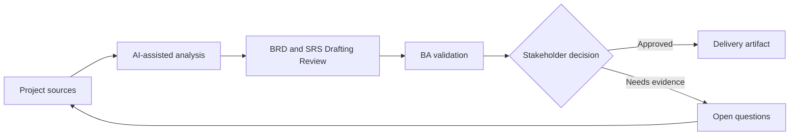

# BRD and SRS Drafting Review

<div class="case-meta">
  <span>Requirements and backlog</span>
  <span>Formal requirements documentation</span>
  <span>Refinement</span>
  <span>Core</span>
  <span>BRD or SRS outline</span>
  <span>Project use case</span>
</div>

## Project context

A regulated project requires a BRD and SRS for a customer data consent module. Stakeholders expect formal documentation, but the source material is spread across policy notes, discovery workshops, legal comments, and architecture constraints. In Formal requirements documentation, this work usually starts when stories must become testable without losing business rules, exceptions, data needs, or NFRs. The BA should treat Policy notes and Workshop outputs as evidence to organize, not as raw material for an unconstrained AI answer. The goal is to make the next decision clearer for the people who own the outcome.

## BA challenge

The BA must use AI to speed drafting without allowing AI to invent decisions, policy, or system behavior. The document must keep evidence, versioning, assumptions, open decisions, and approval checkpoints visible. For BRD and SRS Drafting Review, the practical difficulty is vague criteria and unowned assumptions. AI can accelerate gap finding, rewrite critique, edge-case expansion, and acceptance-criteria drafting, but the BA must still expose assumptions, missing approvals, and the point where stakeholder judgment is required.

## Where AI fits

<div class="ba-workbench-panel">
AI fits this Requirements and backlog use case when it is constrained to gap finding, rewrite critique, edge-case expansion, and acceptance-criteria drafting. A useful first AI task is: Create a document outline from source inventory. AI should not approve scope, invent policy, bypass approved rules, examples, edge cases, and QA expectations, or turn a draft into a final decision.
</div>

- Create a document outline from source inventory.
- Draft sections only from supplied evidence.
- Review for contradictions, missing rules, and unsupported claims.
- Generate executive summary, requirement tables, and decision log entries.

## Inputs to prepare

- Policy notes
- Workshop outputs
- Legal review comments
- Architecture constraints
- Existing consent flows

Before prompting for BRD and SRS Drafting Review, label each input by owner, date, approval status, sensitivity, and role in the decision. The most important evidence lens is approved rules, examples, edge cases, and QA expectations; without it, AI may rank old notes, draft designs, and approved rules as if they had equal authority.

## BA workflow

1. Build a source map and decision log before drafting.
2. Ask AI to create an outline with evidence required per section.
3. Draft one section at a time and require unsupported claims to be labeled.
4. Run an AI critique pass for ambiguity, conflict, and missing NFRs.
5. Validate decision-heavy sections with legal, product, and architecture owners.
6. Publish the BRD or SRS with assumptions and open decisions intact.

Run the workflow as requirement clarification before sprint commitment: start with "Build a source map and decision log before drafting.", then keep a visible decision log as the artifact moves toward BRD or SRS outline. This prevents AI suggestions from silently becoming backlog, design, release, or operational commitments.

## Diagram



## Deliverables

| Deliverable | What it contains | Owner | Done signal |
| --- | --- | --- | --- |
| BRD or SRS outline | Sections, purpose, evidence source, and approval owner | BA | No section lacks evidence expectation |
| Requirement table | Requirement ID, statement, source, assumption, owner, priority, and testability | BA | Requirements are traceable |
| Decision log | Policy and scope decisions with options and impacts | Product owner | Open decisions are not hidden |
| Review findings | Ambiguity, conflict, NFR gap, unsupported claim, and fix | BA and reviewers | Findings are resolved or assigned |

Treat BRD or SRS outline as a BA-owned delivery-ready backlog artifact. AI may draft structure, but the BA must validate whether "No section lacks evidence expectation" is actually true, whether the artifact is traceable to source evidence, and whether the receiving team can act on it.

## Prompt to try

```text
Act as a senior AI-aware Business Analyst. Help me apply the "BRD and SRS Drafting Review" use case to my project. First ask for source evidence and constraints. Then create a structured analysis with project context, assumptions, AI-fit boundary, workflow steps, deliverables, risks, controls, open questions, and stakeholder decisions. Do not invent policy, thresholds, or approvals.
```

## Review checklist

- Policy notes is labeled with owner, date, approval status, and sensitivity.
- BRD or SRS outline traces to source evidence and has a named human owner.
- The AI task stays inside gap finding, rewrite critique, edge-case expansion, and acceptance-criteria drafting and does not approve scope or policy.
- The "Polished invention" risk has a practical control: Draft from source IDs and label unsupported claims.
- Open assumptions are converted into validation questions or stakeholder decisions.
- Success metric: The BRD or SRS is faster to draft but still traceable, reviewable, and approved through the correct owners.

## Risks and controls

| Risk | Why it matters | BA control |
| --- | --- | --- |
| Polished invention | AI can produce convincing text not supported by sources | Draft from source IDs and label unsupported claims |
| Approval confusion | Readers may treat draft text as approved policy | Use version status and approval checkpoints |
| Document bloat | AI may add generic sections that dilute key decisions | Keep sections tied to project decisions and compliance needs |
| Lost assumptions | Cleaning the document can hide uncertainty | Keep assumptions and open decisions visible |

The main control for the "Polished invention" risk is explicit human accountability: Draft from source IDs and label unsupported claims. If evidence is weak, the output should create a validation question or decision item, not a final requirement.
