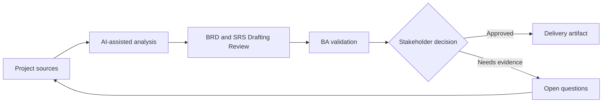

# BRD and SRS Drafting Review

<div class="case-meta">
  <span>Requirements and backlog</span>
  <span>Formal requirements documentation</span>
  <span>Project use case</span>
</div>

## Project context

A regulated project requires a BRD and SRS for a customer data consent module. Stakeholders expect formal documentation, but the source material is spread across policy notes, discovery workshops, legal comments, and architecture constraints. In a real delivery environment, this work usually appears under time pressure: stakeholders want clarity, delivery needs a backlog, QA needs testable behavior, and operations needs a process that can survive exceptions. The BA uses AI here to accelerate analysis and synthesis, but the BA remains accountable for evidence, business meaning, stakeholder decisioning, and artifact quality.

## BA challenge

The BA must use AI to speed drafting without allowing AI to invent decisions, policy, or system behavior. The document must keep evidence, versioning, assumptions, open decisions, and approval checkpoints visible. The practical difficulty is that AI can make early material look more complete than it is. A strong BA keeps the output reviewable by separating source-backed facts, assumptions, unsupported claims, decision gaps, and recommended next actions. The objective is not to make the document longer; it is to make the project decision clearer and safer.

## Where AI fits

<div class="ba-workbench-panel">
AI is useful in this use case when it is constrained to analysis support, pattern detection, structured drafting, and critique. It should not approve scope, invent policy, decide business trade-offs, or replace accountable stakeholder judgment.
</div>

- Create a document outline from source inventory.
- Draft sections only from supplied evidence.
- Review for contradictions, missing rules, and unsupported claims.
- Generate executive summary, requirement tables, and decision log entries.

## Inputs to prepare

- Policy notes
- Workshop outputs
- Legal review comments
- Architecture constraints
- Existing consent flows

A BA should label these inputs before using AI: source owner, source date, approval status, sensitivity level, and whether the source is fact, opinion, policy, draft, or historical evidence. This preparation prevents the model from treating every input as equally current and authoritative.

## BA workflow

1. Build a source map and decision log before drafting.
2. Ask AI to create an outline with evidence required per section.
3. Draft one section at a time and require unsupported claims to be labeled.
4. Run an AI critique pass for ambiguity, conflict, and missing NFRs.
5. Validate decision-heavy sections with legal, product, and architecture owners.
6. Publish the BRD or SRS with assumptions and open decisions intact.

The workflow works best as a staged AI collaboration: first organize the evidence, then ask for analysis, then create the artifact, then run a critique pass. The BA should keep a visible decision log throughout the process so that AI-generated suggestions do not silently become approved scope.

## Diagram



## Deliverables

| Deliverable | What it contains | Owner | Done signal |
| --- | --- | --- | --- |
| BRD or SRS outline | Sections, purpose, evidence source, and approval owner | BA | No section lacks evidence expectation |
| Requirement table | Requirement ID, statement, source, assumption, owner, priority, and testability | BA | Requirements are traceable |
| Decision log | Policy and scope decisions with options and impacts | Product owner | Open decisions are not hidden |
| Review findings | Ambiguity, conflict, NFR gap, unsupported claim, and fix | BA and reviewers | Findings are resolved or assigned |

These deliverables should be treated as BA-owned artifacts. AI can draft them, but the BA must validate source support, stakeholder meaning, traceability, and whether the artifact is ready for handoff.

## Prompt to try

```text
Act as a senior AI-aware Business Analyst. Help me apply the "BRD and SRS Drafting Review" use case to my project. First ask for source evidence and constraints. Then create a structured analysis with project context, assumptions, AI-fit boundary, workflow steps, deliverables, risks, controls, open questions, and stakeholder decisions. Do not invent policy, thresholds, or approvals.
```

## Review checklist

- Every AI-produced statement is tied to a source, assumption, or validation question.
- The BA has separated drafting assistance from business approval.
- Workflow steps identify the human owner for decisions, review, and exceptions.
- Deliverables are traceable to project inputs and can be reviewed by QA, product, or operations.
- Risk controls are practical enough to be used in a real project meeting.
- Success metric: The BRD or SRS is faster to draft but still traceable, reviewable, and approved through the correct owners.

## Risks and controls

| Risk | Why it matters | BA control |
| --- | --- | --- |
| Polished invention | AI can produce convincing text not supported by sources | Draft from source IDs and label unsupported claims |
| Approval confusion | Readers may treat draft text as approved policy | Use version status and approval checkpoints |
| Document bloat | AI may add generic sections that dilute key decisions | Keep sections tied to project decisions and compliance needs |
| Lost assumptions | Cleaning the document can hide uncertainty | Keep assumptions and open decisions visible |

The key control is to make uncertainty visible. If evidence is weak, the output should create a validation question or decision item, not a final requirement. If the artifact influences delivery, release, compliance, customer experience, or operational workload, the BA should require explicit human review before handoff.
