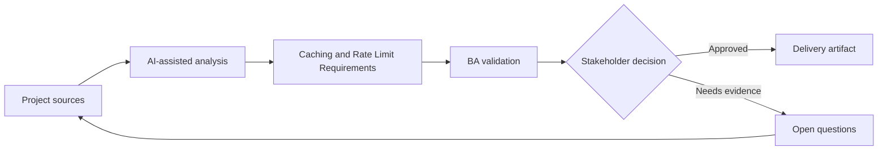

# Caching and Rate Limit Requirements

<div class="case-meta">
  <span>Backend and API</span>
  <span>Performance controls</span>
  <span>Backend/API refinement</span>
  <span>Practitioner</span>
  <span>Freshness requirement matrix</span>
  <span>Project use case</span>
</div>

## Project context

A search-heavy API is slow during peak usage. Engineering proposes caching and rate limits, but product worries about stale data and enterprise customers hitting limits. In Performance controls, this work usually starts when API contracts, permissions, errors, audit, and operational behavior must be explicit enough for backend delivery. The BA should treat Performance data and Customer tiers as evidence to organize, not as raw material for an unconstrained AI answer. The goal is to make the next decision clearer for the people who own the outcome.

## BA challenge

The BA must translate technical controls into business behavior: freshness expectations, user messaging, limit tiers, burst behavior, support exceptions, and monitoring. For Caching and Rate Limit Requirements, the practical difficulty is ambiguous service behavior and security gaps. AI can accelerate contract critique, rule extraction, error taxonomy, permission review, and NFR gap detection, but the BA must still expose assumptions, missing approvals, and the point where stakeholder judgment is required.

## Where AI fits

<div class="ba-workbench-panel">
AI fits this Backend and API use case when it is constrained to contract critique, rule extraction, error taxonomy, permission review, and NFR gap detection. A useful first AI task is: Generate caching and rate limit business questions. AI should not approve scope, invent policy, bypass API draft, data model, auth rules, error samples, audit policy, and integration needs, or turn a draft into a final decision.
</div>

- Generate caching and rate limit business questions.
- Draft freshness and stale-data acceptance criteria.
- Create rate limit tier matrix and user messaging.
- Identify support and monitoring requirements.

## Inputs to prepare

- Performance data
- Customer tiers
- Data freshness needs
- API usage analytics
- Support commitments

Before prompting for Caching and Rate Limit Requirements, label each input by owner, date, approval status, sensitivity, and role in the decision. The most important evidence lens is API draft, data model, auth rules, error samples, audit policy, and integration needs; without it, AI may rank old notes, draft designs, and approved rules as if they had equal authority.

## BA workflow

1. Define user tasks and data freshness sensitivity.
2. Ask AI to propose caching and rate limit questions by customer tier.
3. Specify cache duration, invalidation, stale display, and force refresh behavior.
4. Define rate limit thresholds, burst rules, error messages, and support path.
5. Review trade-offs with product, backend, support, and enterprise account owners.
6. Add monitoring and acceptance criteria for performance and limit behavior.

Run the workflow as contract validation before implementation: start with "Define user tasks and data freshness sensitivity.", then keep a visible decision log as the artifact moves toward Freshness requirement matrix. This prevents AI suggestions from silently becoming backlog, design, release, or operational commitments.

## Diagram



## Deliverables

| Deliverable | What it contains | Owner | Done signal |
| --- | --- | --- | --- |
| Freshness requirement matrix | Data type, freshness target, cache duration, stale display, and owner | BA and product | Stale behavior is explicit |
| Rate limit tier table | Customer tier, threshold, burst, error response, and exception path | Product owner | Limits match business model |
| User messaging spec | Stale data notice, rate limit message, retry guidance, and support path | UX | Users understand limits |
| Performance monitoring spec | Latency, cache hit rate, rate limit events, and alert owner | Operations | Controls are observable |

Treat Freshness requirement matrix as a BA-owned backend behavior contract. AI may draft structure, but the BA must validate whether "Stale behavior is explicit" is actually true, whether the artifact is traceable to source evidence, and whether the receiving team can act on it.

## Prompt to try

```text
Act as a senior AI-aware Business Analyst. Help me apply the "Caching and Rate Limit Requirements" use case to my project. First ask for source evidence and constraints. Then create a structured analysis with project context, assumptions, AI-fit boundary, workflow steps, deliverables, risks, controls, open questions, and stakeholder decisions. Do not invent policy, thresholds, or approvals.
```

## Review checklist

- Performance data is labeled with owner, date, approval status, and sensitivity.
- Freshness requirement matrix traces to source evidence and has a named human owner.
- The AI task stays inside contract critique, rule extraction, error taxonomy, permission review, and NFR gap detection and does not approve scope or policy.
- The "Stale decision" risk has a practical control: Define freshness and stale labels.
- Open assumptions are converted into validation questions or stakeholder decisions.
- Success metric: Caching and rate limits improve performance without hiding freshness or customer impact trade-offs.

## Risks and controls

| Risk | Why it matters | BA control |
| --- | --- | --- |
| Stale decision | Cached data may drive wrong user action | Define freshness and stale labels |
| Customer friction | Rate limits may block legitimate usage | Align limits to tiers and support exceptions |
| Hidden throttling | Users may not know why requests fail | Use clear error and retry guidance |
| Unmeasured control | Caching may not improve actual experience | Monitor latency and cache hit rate |

The main control for the "Stale decision" risk is explicit human accountability: Define freshness and stale labels. If evidence is weak, the output should create a validation question or decision item, not a final requirement.
