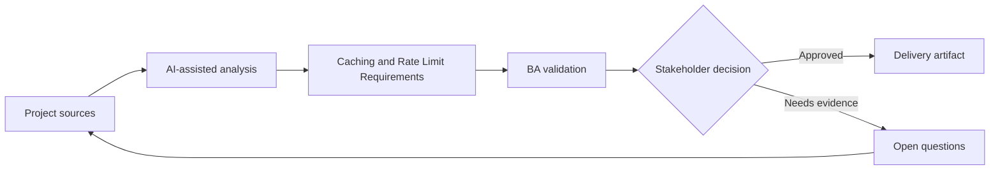

# Caching and Rate Limit Requirements

<div class="case-meta">
  <span>Backend and API</span>
  <span>Performance controls</span>
  <span>Project use case</span>
</div>

## Project context

A search-heavy API is slow during peak usage. Engineering proposes caching and rate limits, but product worries about stale data and enterprise customers hitting limits. In a real delivery environment, this work usually appears under time pressure: stakeholders want clarity, delivery needs a backlog, QA needs testable behavior, and operations needs a process that can survive exceptions. The BA uses AI here to accelerate analysis and synthesis, but the BA remains accountable for evidence, business meaning, stakeholder decisioning, and artifact quality.

## BA challenge

The BA must translate technical controls into business behavior: freshness expectations, user messaging, limit tiers, burst behavior, support exceptions, and monitoring. The practical difficulty is that AI can make early material look more complete than it is. A strong BA keeps the output reviewable by separating source-backed facts, assumptions, unsupported claims, decision gaps, and recommended next actions. The objective is not to make the document longer; it is to make the project decision clearer and safer.

## Where AI fits

<div class="ba-workbench-panel">
AI is useful in this use case when it is constrained to analysis support, pattern detection, structured drafting, and critique. It should not approve scope, invent policy, decide business trade-offs, or replace accountable stakeholder judgment.
</div>

- Generate caching and rate limit business questions.
- Draft freshness and stale-data acceptance criteria.
- Create rate limit tier matrix and user messaging.
- Identify support and monitoring requirements.

## Inputs to prepare

- Performance data
- Customer tiers
- Data freshness needs
- API usage analytics
- Support commitments

A BA should label these inputs before using AI: source owner, source date, approval status, sensitivity level, and whether the source is fact, opinion, policy, draft, or historical evidence. This preparation prevents the model from treating every input as equally current and authoritative.

## BA workflow

1. Define user tasks and data freshness sensitivity.
2. Ask AI to propose caching and rate limit questions by customer tier.
3. Specify cache duration, invalidation, stale display, and force refresh behavior.
4. Define rate limit thresholds, burst rules, error messages, and support path.
5. Review trade-offs with product, backend, support, and enterprise account owners.
6. Add monitoring and acceptance criteria for performance and limit behavior.

The workflow works best as a staged AI collaboration: first organize the evidence, then ask for analysis, then create the artifact, then run a critique pass. The BA should keep a visible decision log throughout the process so that AI-generated suggestions do not silently become approved scope.

## Diagram



## Deliverables

| Deliverable | What it contains | Owner | Done signal |
| --- | --- | --- | --- |
| Freshness requirement matrix | Data type, freshness target, cache duration, stale display, and owner | BA and product | Stale behavior is explicit |
| Rate limit tier table | Customer tier, threshold, burst, error response, and exception path | Product owner | Limits match business model |
| User messaging spec | Stale data notice, rate limit message, retry guidance, and support path | UX | Users understand limits |
| Performance monitoring spec | Latency, cache hit rate, rate limit events, and alert owner | Operations | Controls are observable |

These deliverables should be treated as BA-owned artifacts. AI can draft them, but the BA must validate source support, stakeholder meaning, traceability, and whether the artifact is ready for handoff.

## Prompt to try

```text
Act as a senior AI-aware Business Analyst. Help me apply the "Caching and Rate Limit Requirements" use case to my project. First ask for source evidence and constraints. Then create a structured analysis with project context, assumptions, AI-fit boundary, workflow steps, deliverables, risks, controls, open questions, and stakeholder decisions. Do not invent policy, thresholds, or approvals.
```

## Review checklist

- Every AI-produced statement is tied to a source, assumption, or validation question.
- The BA has separated drafting assistance from business approval.
- Workflow steps identify the human owner for decisions, review, and exceptions.
- Deliverables are traceable to project inputs and can be reviewed by QA, product, or operations.
- Risk controls are practical enough to be used in a real project meeting.
- Success metric: Caching and rate limits improve performance without hiding freshness or customer impact trade-offs.

## Risks and controls

| Risk | Why it matters | BA control |
| --- | --- | --- |
| Stale decision | Cached data may drive wrong user action | Define freshness and stale labels |
| Customer friction | Rate limits may block legitimate usage | Align limits to tiers and support exceptions |
| Hidden throttling | Users may not know why requests fail | Use clear error and retry guidance |
| Unmeasured control | Caching may not improve actual experience | Monitor latency and cache hit rate |

The key control is to make uncertainty visible. If evidence is weak, the output should create a validation question or decision item, not a final requirement. If the artifact influences delivery, release, compliance, customer experience, or operational workload, the BA should require explicit human review before handoff.
