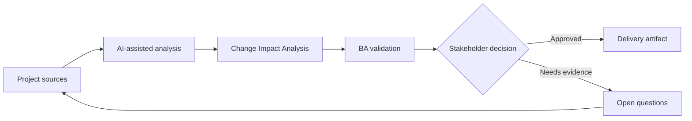

# Change Impact Analysis

<div class="case-meta">
  <span>Delivery and QA</span>
  <span>Change control</span>
  <span>Project use case</span>
</div>

## Project context

Mid-sprint, compliance changes a rule for document retention. The change affects onboarding forms, storage, notifications, audit logs, reporting, and support scripts. The team needs impact clarity before accepting the change. In a real delivery environment, this work usually appears under time pressure: stakeholders want clarity, delivery needs a backlog, QA needs testable behavior, and operations needs a process that can survive exceptions. The BA uses AI here to accelerate analysis and synthesis, but the BA remains accountable for evidence, business meaning, stakeholder decisioning, and artifact quality.

## BA challenge

The BA must analyze impact across requirements, processes, systems, data, tests, users, and release scope. AI can search for related artifacts, but the BA must confirm dependency meaning and decision impact. The practical difficulty is that AI can make early material look more complete than it is. A strong BA keeps the output reviewable by separating source-backed facts, assumptions, unsupported claims, decision gaps, and recommended next actions. The objective is not to make the document longer; it is to make the project decision clearer and safer.

## Where AI fits

<div class="ba-workbench-panel">
AI is useful in this use case when it is constrained to analysis support, pattern detection, structured drafting, and critique. It should not approve scope, invent policy, decide business trade-offs, or replace accountable stakeholder judgment.
</div>

- Search requirement and process artifacts for affected concepts.
- Draft an impact matrix across business, data, system, test, and operations areas.
- Generate questions for compliance, architecture, QA, and support.
- Summarize options for accept, defer, or split release.

## Inputs to prepare

- Change request
- Requirement repository
- Process diagrams
- Data model notes
- Test cases and release plan

A BA should label these inputs before using AI: source owner, source date, approval status, sensitivity level, and whether the source is fact, opinion, policy, draft, or historical evidence. This preparation prevents the model from treating every input as equally current and authoritative.

## BA workflow

1. Restate the change and identify exact policy rule difference.
2. Ask AI to find potentially affected artifacts and rank confidence.
3. Verify high-impact links manually with artifact owners.
4. Map impact to scope, data, integration, test, training, and operations.
5. Prepare options with timeline, risk, and dependency implications.
6. Record the decision and update affected artifacts.

The workflow works best as a staged AI collaboration: first organize the evidence, then ask for analysis, then create the artifact, then run a critique pass. The BA should keep a visible decision log throughout the process so that AI-generated suggestions do not silently become approved scope.

## Diagram



## Deliverables

| Deliverable | What it contains | Owner | Done signal |
| --- | --- | --- | --- |
| Impact matrix | Artifact, affected area, change needed, risk, owner, and effort signal | BA | Impacts cover business and technical areas |
| Decision options | Accept now, defer, split, or reject with trade-offs | Product owner | Options include risk and release impact |
| Artifact update list | Requirements, tests, diagrams, scripts, and reports to update | BA and QA | No affected artifact lacks owner |
| Stakeholder questions | Questions for compliance, architecture, support, and QA | BA | Open questions are decision-focused |

These deliverables should be treated as BA-owned artifacts. AI can draft them, but the BA must validate source support, stakeholder meaning, traceability, and whether the artifact is ready for handoff.

## Prompt to try

```text
Act as a senior AI-aware Business Analyst. Help me apply the "Change Impact Analysis" use case to my project. First ask for source evidence and constraints. Then create a structured analysis with project context, assumptions, AI-fit boundary, workflow steps, deliverables, risks, controls, open questions, and stakeholder decisions. Do not invent policy, thresholds, or approvals.
```

## Review checklist

- Every AI-produced statement is tied to a source, assumption, or validation question.
- The BA has separated drafting assistance from business approval.
- Workflow steps identify the human owner for decisions, review, and exceptions.
- Deliverables are traceable to project inputs and can be reviewed by QA, product, or operations.
- Risk controls are practical enough to be used in a real project meeting.
- Success metric: The team accepts, defers, or splits the change with visible impact and artifact owners.

## Risks and controls

| Risk | Why it matters | BA control |
| --- | --- | --- |
| Keyword-only impact | AI may miss semantic dependencies or flag irrelevant matches | Verify meaning, not only word match |
| Hidden operational impact | Support and training changes may be forgotten | Include operations and customer communication |
| Decision pressure | Team may accept change without release trade-off | Present options and consequences |
| Traceability drift | Changed artifacts may not stay aligned | Update traceability matrix after decision |

The key control is to make uncertainty visible. If evidence is weak, the output should create a validation question or decision item, not a final requirement. If the artifact influences delivery, release, compliance, customer experience, or operational workload, the BA should require explicit human review before handoff.
