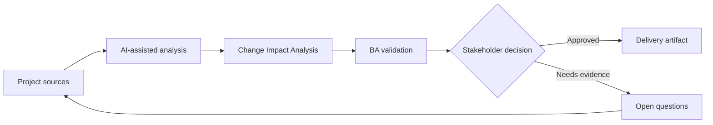

# Change Impact Analysis

<div class="case-meta">
  <span>Delivery and QA</span>
  <span>Change control</span>
  <span>Delivery validation</span>
  <span>Core</span>
  <span>Impact matrix</span>
  <span>Project use case</span>
</div>

## Project context

Mid-sprint, compliance changes a rule for document retention. The change affects onboarding forms, storage, notifications, audit logs, reporting, and support scripts. The team needs impact clarity before accepting the change. In Change control, this work usually starts when delivery decisions, test evidence, and release readiness need to stay connected to original intent. The BA should treat Change request and Requirement repository as evidence to organize, not as raw material for an unconstrained AI answer. The goal is to make the next decision clearer for the people who own the outcome.

## BA challenge

The BA must analyze impact across requirements, processes, systems, data, tests, users, and release scope. AI can search for related artifacts, but the BA must confirm dependency meaning and decision impact. For Change Impact Analysis, the practical difficulty is optimistic status and late requirement discovery. AI can accelerate scenario generation, defect triage support, readiness synthesis, and risk surfacing, but the BA must still expose assumptions, missing approvals, and the point where stakeholder judgment is required.

## Where AI fits

<div class="ba-workbench-panel">
AI fits this Delivery and QA use case when it is constrained to scenario generation, defect triage support, readiness synthesis, and risk surfacing. A useful first AI task is: Search requirement and process artifacts for affected concepts. AI should not approve scope, invent policy, bypass requirement baseline, test results, defect history, and release decisions, or turn a draft into a final decision.
</div>

- Search requirement and process artifacts for affected concepts.
- Draft an impact matrix across business, data, system, test, and operations areas.
- Generate questions for compliance, architecture, QA, and support.
- Summarize options for accept, defer, or split release.

## Inputs to prepare

- Change request
- Requirement repository
- Process diagrams
- Data model notes
- Test cases and release plan

Before prompting for Change Impact Analysis, label each input by owner, date, approval status, sensitivity, and role in the decision. The most important evidence lens is requirement baseline, test results, defect history, and release decisions; without it, AI may rank old notes, draft designs, and approved rules as if they had equal authority.

## BA workflow

1. Restate the change and identify exact policy rule difference.
2. Ask AI to find potentially affected artifacts and rank confidence.
3. Verify high-impact links manually with artifact owners.
4. Map impact to scope, data, integration, test, training, and operations.
5. Prepare options with timeline, risk, and dependency implications.
6. Record the decision and update affected artifacts.

Run the workflow as quality review before release or rework decision: start with "Restate the change and identify exact policy rule difference.", then keep a visible decision log as the artifact moves toward Impact matrix. This prevents AI suggestions from silently becoming backlog, design, release, or operational commitments.

## Diagram



## Deliverables

| Deliverable | What it contains | Owner | Done signal |
| --- | --- | --- | --- |
| Impact matrix | Artifact, affected area, change needed, risk, owner, and effort signal | BA | Impacts cover business and technical areas |
| Decision options | Accept now, defer, split, or reject with trade-offs | Product owner | Options include risk and release impact |
| Artifact update list | Requirements, tests, diagrams, scripts, and reports to update | BA and QA | No affected artifact lacks owner |
| Stakeholder questions | Questions for compliance, architecture, support, and QA | BA | Open questions are decision-focused |

Treat Impact matrix as a BA-owned QA and delivery handoff artifact. AI may draft structure, but the BA must validate whether "Impacts cover business and technical areas" is actually true, whether the artifact is traceable to source evidence, and whether the receiving team can act on it.

## Prompt to try

```text
Act as a senior AI-aware Business Analyst. Help me apply the "Change Impact Analysis" use case to my project. First ask for source evidence and constraints. Then create a structured analysis with project context, assumptions, AI-fit boundary, workflow steps, deliverables, risks, controls, open questions, and stakeholder decisions. Do not invent policy, thresholds, or approvals.
```

## Review checklist

- Change request is labeled with owner, date, approval status, and sensitivity.
- Impact matrix traces to source evidence and has a named human owner.
- The AI task stays inside scenario generation, defect triage support, readiness synthesis, and risk surfacing and does not approve scope or policy.
- The "Keyword-only impact" risk has a practical control: Verify meaning, not only word match.
- Open assumptions are converted into validation questions or stakeholder decisions.
- Success metric: The team accepts, defers, or splits the change with visible impact and artifact owners.

## Risks and controls

| Risk | Why it matters | BA control |
| --- | --- | --- |
| Keyword-only impact | AI may miss semantic dependencies or flag irrelevant matches | Verify meaning, not only word match |
| Hidden operational impact | Support and training changes may be forgotten | Include operations and customer communication |
| Decision pressure | Team may accept change without release trade-off | Present options and consequences |
| Traceability drift | Changed artifacts may not stay aligned | Update traceability matrix after decision |

The main control for the "Keyword-only impact" risk is explicit human accountability: Verify meaning, not only word match. If evidence is weak, the output should create a validation question or decision item, not a final requirement.
