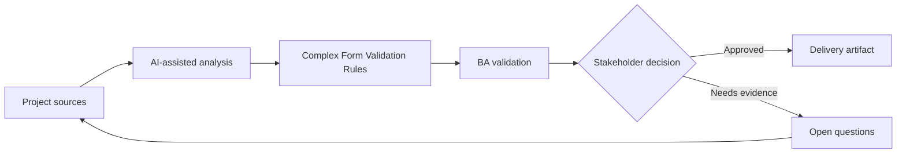

# Complex Form Validation Rules

<div class="case-meta">
  <span>Frontend, UI, and UX</span>
  <span>Forms and validation</span>
  <span>Project use case</span>
</div>

## Project context

A customer profile form has conditional fields, dependent dropdowns, country-specific tax identifiers, file attachments, and validation rules that differ between individual and business accounts. In a real delivery environment, this work usually appears under time pressure: stakeholders want clarity, delivery needs a backlog, QA needs testable behavior, and operations needs a process that can survive exceptions. The BA uses AI here to accelerate analysis and synthesis, but the BA remains accountable for evidence, business meaning, stakeholder decisioning, and artifact quality.

## BA challenge

The BA must specify validation in a way frontend and backend can implement consistently. The challenge is separating client-side guidance, server-side enforcement, conditional display, error copy, and evidence source for every rule. The practical difficulty is that AI can make early material look more complete than it is. A strong BA keeps the output reviewable by separating source-backed facts, assumptions, unsupported claims, decision gaps, and recommended next actions. The objective is not to make the document longer; it is to make the project decision clearer and safer.

## Where AI fits

<div class="ba-workbench-panel">
AI is useful in this use case when it is constrained to analysis support, pattern detection, structured drafting, and critique. It should not approve scope, invent policy, decide business trade-offs, or replace accountable stakeholder judgment.
</div>

- Generate a validation rule matrix from policy and form design.
- Identify missing conditional field rules and dependent dropdown rules.
- Draft error messages in user-friendly language.
- Compare frontend validation with backend enforcement needs.

## Inputs to prepare

- Form design
- Field list
- Policy rules
- Country-specific requirements
- Backend validation constraints

A BA should label these inputs before using AI: source owner, source date, approval status, sensitivity level, and whether the source is fact, opinion, policy, draft, or historical evidence. This preparation prevents the model from treating every input as equally current and authoritative.

## BA workflow

1. Inventory fields, field type, source rule, and dependency.
2. Ask AI to draft validation matrix including client and server behavior.
3. Review rules with product, compliance, frontend, backend, and QA.
4. Define error messages, helper text, and when validation triggers.
5. Add negative and boundary acceptance criteria.
6. Create test data sets for country, account type, and attachment variations.

The workflow works best as a staged AI collaboration: first organize the evidence, then ask for analysis, then create the artifact, then run a critique pass. The BA should keep a visible decision log throughout the process so that AI-generated suggestions do not silently become approved scope.

## Diagram



## Deliverables

| Deliverable | What it contains | Owner | Done signal |
| --- | --- | --- | --- |
| Validation matrix | Field, condition, rule, client behavior, server behavior, source, and error copy | BA | Every field rule is traceable |
| Conditional field map | Trigger field, dependent field, display rule, and reset behavior | Frontend | Dynamic form behavior is clear |
| Error copy catalog | Validation message, severity, and recovery instruction | UX writer | Messages help users recover |
| Test data set | Country, account type, file, and boundary examples | QA | Validation cases are executable |

These deliverables should be treated as BA-owned artifacts. AI can draft them, but the BA must validate source support, stakeholder meaning, traceability, and whether the artifact is ready for handoff.

## Prompt to try

```text
Act as a senior AI-aware Business Analyst. Help me apply the "Complex Form Validation Rules" use case to my project. First ask for source evidence and constraints. Then create a structured analysis with project context, assumptions, AI-fit boundary, workflow steps, deliverables, risks, controls, open questions, and stakeholder decisions. Do not invent policy, thresholds, or approvals.
```

## Review checklist

- Every AI-produced statement is tied to a source, assumption, or validation question.
- The BA has separated drafting assistance from business approval.
- Workflow steps identify the human owner for decisions, review, and exceptions.
- Deliverables are traceable to project inputs and can be reviewed by QA, product, or operations.
- Risk controls are practical enough to be used in a real project meeting.
- Success metric: Form validation is implemented consistently across frontend, backend, and QA with traceable business rules.

## Risks and controls

| Risk | Why it matters | BA control |
| --- | --- | --- |
| Client-server mismatch | Frontend may accept data backend rejects | Define both client guidance and server enforcement |
| Policy invention | AI may invent country rules | Require source evidence for every rule |
| Poor error recovery | Users may not know how to fix input | Write actionable error copy |
| Conditional reset gap | Hidden fields may retain stale values | Specify reset and persistence behavior |

The key control is to make uncertainty visible. If evidence is weak, the output should create a validation question or decision item, not a final requirement. If the artifact influences delivery, release, compliance, customer experience, or operational workload, the BA should require explicit human review before handoff.
