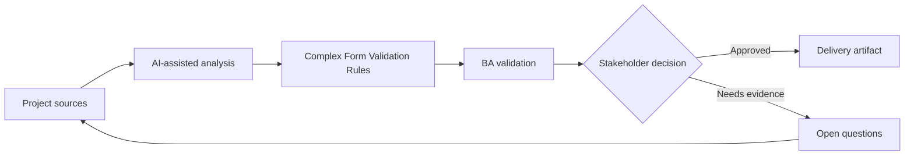

# Complex Form Validation Rules

<div class="case-meta">
  <span>Frontend, UI, and UX</span>
  <span>Forms and validation</span>
  <span>Project use case</span>
</div>

## Project context

A customer profile form has conditional fields, dependent dropdowns, country-specific tax identifiers, file attachments, and validation rules that differ between individual and business accounts. In Forms and validation, this work usually starts when screen behavior, accessibility, design states, analytics, and user feedback must become implementable requirements. The BA should treat Form design and Field list as evidence to organize, not as raw material for an unconstrained AI answer. The goal is to make the next decision clearer for the people who own the outcome.

## BA challenge

The BA must specify validation in a way frontend and backend can implement consistently. The challenge is separating client-side guidance, server-side enforcement, conditional display, error copy, and evidence source for every rule. For Complex Form Validation Rules, the practical difficulty is missing states and unmeasurable UX. AI can accelerate UI-state analysis, content critique, accessibility review, event taxonomy, and edge-case discovery, but the BA must still expose assumptions, missing approvals, and the point where stakeholder judgment is required.

## Where AI fits

<div class="ba-workbench-panel">
AI fits this Frontend, UI, and UX use case when it is constrained to UI-state analysis, content critique, accessibility review, event taxonomy, and edge-case discovery. A useful first AI task is: Generate a validation rule matrix from policy and form design. AI should not approve scope, invent policy, bypass wireframes, design tokens, user journeys, analytics questions, and accessibility expectations, or turn a draft into a final decision.
</div>

- Generate a validation rule matrix from policy and form design.
- Identify missing conditional field rules and dependent dropdown rules.
- Draft error messages in user-friendly language.
- Compare frontend validation with backend enforcement needs.

## Inputs to prepare

- Form design
- Field list
- Policy rules
- Country-specific requirements
- Backend validation constraints

Before prompting for Complex Form Validation Rules, label each input by owner, date, approval status, sensitivity, and role in the decision. The most important evidence lens is wireframes, design tokens, user journeys, analytics questions, and accessibility expectations; without it, AI may rank old notes, draft designs, and approved rules as if they had equal authority.

## BA workflow

1. Inventory fields, field type, source rule, and dependency.
2. Ask AI to draft validation matrix including client and server behavior.
3. Review rules with product, compliance, frontend, backend, and QA.
4. Define error messages, helper text, and when validation triggers.
5. Add negative and boundary acceptance criteria.
6. Create test data sets for country, account type, and attachment variations.

Run the workflow as screen-state review before frontend build: start with "Inventory fields, field type, source rule, and dependency.", then keep a visible decision log as the artifact moves toward Validation matrix. This prevents AI suggestions from silently becoming backlog, design, release, or operational commitments.

## Diagram



## Deliverables

| Deliverable | What it contains | Owner | Done signal |
| --- | --- | --- | --- |
| Validation matrix | Field, condition, rule, client behavior, server behavior, source, and error copy | BA | Every field rule is traceable |
| Conditional field map | Trigger field, dependent field, display rule, and reset behavior | Frontend | Dynamic form behavior is clear |
| Error copy catalog | Validation message, severity, and recovery instruction | UX writer | Messages help users recover |
| Test data set | Country, account type, file, and boundary examples | QA | Validation cases are executable |

Treat Validation matrix as a BA-owned frontend requirement specification. AI may draft structure, but the BA must validate whether "Every field rule is traceable" is actually true, whether the artifact is traceable to source evidence, and whether the receiving team can act on it.

## Prompt to try

```text
Act as a senior AI-aware Business Analyst. Help me apply the "Complex Form Validation Rules" use case to my project. First ask for source evidence and constraints. Then create a structured analysis with project context, assumptions, AI-fit boundary, workflow steps, deliverables, risks, controls, open questions, and stakeholder decisions. Do not invent policy, thresholds, or approvals.
```

## Review checklist

- Form design is labeled with owner, date, approval status, and sensitivity.
- Validation matrix traces to source evidence and has a named human owner.
- The AI task stays inside UI-state analysis, content critique, accessibility review, event taxonomy, and edge-case discovery and does not approve scope or policy.
- The "Client-server mismatch" risk has a practical control: Define both client guidance and server enforcement.
- Open assumptions are converted into validation questions or stakeholder decisions.
- Success metric: Form validation is implemented consistently across frontend, backend, and QA with traceable business rules.

## Risks and controls

| Risk | Why it matters | BA control |
| --- | --- | --- |
| Client-server mismatch | Frontend may accept data backend rejects | Define both client guidance and server enforcement |
| Policy invention | AI may invent country rules | Require source evidence for every rule |
| Poor error recovery | Users may not know how to fix input | Write actionable error copy |
| Conditional reset gap | Hidden fields may retain stale values | Specify reset and persistence behavior |

The main control for the "Client-server mismatch" risk is explicit human accountability: Define both client guidance and server enforcement. If evidence is weak, the output should create a validation question or decision item, not a final requirement.
