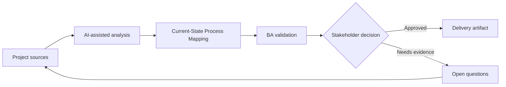

# Current-State Process Mapping

<div class="case-meta">
  <span>Discovery and alignment</span>
  <span>Operations analysis</span>
  <span>Project use case</span>
</div>

## Project context

An operations team wants to reduce request turnaround time, but the current process lives across emails, spreadsheets, ticket comments, and tribal knowledge. Different teams describe the same process differently. In a real delivery environment, this work usually appears under time pressure: stakeholders want clarity, delivery needs a backlog, QA needs testable behavior, and operations needs a process that can survive exceptions. The BA uses AI here to accelerate analysis and synthesis, but the BA remains accountable for evidence, business meaning, stakeholder decisioning, and artifact quality.

## BA challenge

The BA must build a current-state process that shows actors, systems, decisions, queues, exception paths, handoffs, and pain points. AI can transform text into draft diagrams, but the BA must validate operational reality with people doing the work. The practical difficulty is that AI can make early material look more complete than it is. A strong BA keeps the output reviewable by separating source-backed facts, assumptions, unsupported claims, decision gaps, and recommended next actions. The objective is not to make the document longer; it is to make the project decision clearer and safer.

## Where AI fits

<div class="ba-workbench-panel">
AI is useful in this use case when it is constrained to analysis support, pattern detection, structured drafting, and critique. It should not approve scope, invent policy, decide business trade-offs, or replace accountable stakeholder judgment.
</div>

- Extract process steps from interviews and SOPs.
- Generate candidate flowcharts and swimlane diagrams.
- Identify missing decision rules and exception paths.
- Compare process descriptions across stakeholder groups.

## Inputs to prepare

- SOPs
- Interview notes
- Ticket samples
- Spreadsheet trackers
- System screenshots

A BA should label these inputs before using AI: source owner, source date, approval status, sensitivity level, and whether the source is fact, opinion, policy, draft, or historical evidence. This preparation prevents the model from treating every input as equally current and authoritative.

## BA workflow

1. Create source IDs for every process description.
2. Ask AI to list steps, actors, systems, decisions, inputs, outputs, and exceptions.
3. Generate a draft flowchart and swimlane view.
4. Review the diagram with frontline users and mark corrections.
5. Separate current-state facts from improvement ideas.
6. Publish a validated process map with pain points and rule gaps.

The workflow works best as a staged AI collaboration: first organize the evidence, then ask for analysis, then create the artifact, then run a critique pass. The BA should keep a visible decision log throughout the process so that AI-generated suggestions do not silently become approved scope.

## Diagram



## Deliverables

| Deliverable | What it contains | Owner | Done signal |
| --- | --- | --- | --- |
| Current-state process map | Steps, decisions, actors, systems, queues, and exception paths | BA | Frontline users confirm it matches reality |
| Rule gap register | Missing thresholds, approval rules, routing rules, and ownership gaps | Operations owner | Every gap has owner and next action |
| Pain point heatmap | Delay, rework, handoff, and user-friction points | BA | Pain points are linked to process steps |
| Future-state questions | Questions needed before redesign | Product owner | Questions are prioritized by impact |

These deliverables should be treated as BA-owned artifacts. AI can draft them, but the BA must validate source support, stakeholder meaning, traceability, and whether the artifact is ready for handoff.

## Prompt to try

```text
Act as a senior AI-aware Business Analyst. Help me apply the "Current-State Process Mapping" use case to my project. First ask for source evidence and constraints. Then create a structured analysis with project context, assumptions, AI-fit boundary, workflow steps, deliverables, risks, controls, open questions, and stakeholder decisions. Do not invent policy, thresholds, or approvals.
```

## Review checklist

- Every AI-produced statement is tied to a source, assumption, or validation question.
- The BA has separated drafting assistance from business approval.
- Workflow steps identify the human owner for decisions, review, and exceptions.
- Deliverables are traceable to project inputs and can be reviewed by QA, product, or operations.
- Risk controls are practical enough to be used in a real project meeting.
- Success metric: The validated process map identifies delay points and decision gaps that can be prioritized for redesign.

## Risks and controls

| Risk | Why it matters | BA control |
| --- | --- | --- |
| Idealized process | Stakeholders may describe policy rather than actual work | Use ticket samples and frontline validation |
| Exception blindness | Rare cases can drive most effort | Ask AI for exception categories and validate volume |
| Diagram overconfidence | A neat diagram may hide uncertainty | Label unvalidated steps and assumptions |
| Solution bias | Improvement ideas may mix with current-state facts | Separate current-state and future-state artifacts |

The key control is to make uncertainty visible. If evidence is weak, the output should create a validation question or decision item, not a final requirement. If the artifact influences delivery, release, compliance, customer experience, or operational workload, the BA should require explicit human review before handoff.
