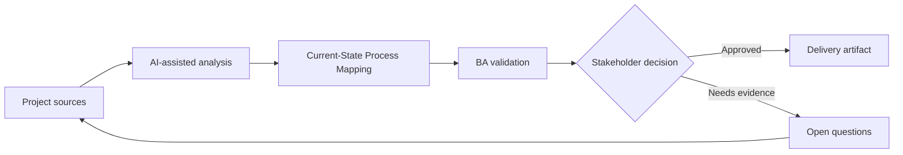

# Current-State Process Mapping

<div class="case-meta">
  <span>Discovery and alignment</span>
  <span>Operations analysis</span>
  <span>Discovery</span>
  <span>Core</span>
  <span>Current-state process map</span>
  <span>Project use case</span>
</div>

## Project context

An operations team wants to reduce request turnaround time, but the current process lives across emails, spreadsheets, ticket comments, and tribal knowledge. Different teams describe the same process differently. In Operations analysis, this work usually starts when stakeholders describe the same problem from different incentives and levels of detail. The BA should treat SOPs and Interview notes as evidence to organize, not as raw material for an unconstrained AI answer. The goal is to make the next decision clearer for the people who own the outcome.

## BA challenge

The BA must build a current-state process that shows actors, systems, decisions, queues, exception paths, handoffs, and pain points. AI can transform text into draft diagrams, but the BA must validate operational reality with people doing the work. For Current-State Process Mapping, the practical difficulty is false consensus and invented scope. AI can accelerate sensemaking, contradiction detection, question generation, and workshop preparation, but the BA must still expose assumptions, missing approvals, and the point where stakeholder judgment is required.

## Where AI fits

<div class="ba-workbench-panel">
AI fits this Discovery and alignment use case when it is constrained to sensemaking, contradiction detection, question generation, and workshop preparation. A useful first AI task is: Extract process steps from interviews and SOPs. AI should not approve scope, invent policy, bypass speaker attribution, decision authority, and source freshness, or turn a draft into a final decision.
</div>

- Extract process steps from interviews and SOPs.
- Generate candidate flowcharts and swimlane diagrams.
- Identify missing decision rules and exception paths.
- Compare process descriptions across stakeholder groups.

## Inputs to prepare

- SOPs
- Interview notes
- Ticket samples
- Spreadsheet trackers
- System screenshots

Before prompting for Current-State Process Mapping, label each input by owner, date, approval status, sensitivity, and role in the decision. The most important evidence lens is speaker attribution, decision authority, and source freshness; without it, AI may rank old notes, draft designs, and approved rules as if they had equal authority.

## BA workflow

1. Create source IDs for every process description.
2. Ask AI to list steps, actors, systems, decisions, inputs, outputs, and exceptions.
3. Generate a draft flowchart and swimlane view.
4. Review the diagram with frontline users and mark corrections.
5. Separate current-state facts from improvement ideas.
6. Publish a validated process map with pain points and rule gaps.

Run the workflow as evidence grouping before solution discussion: start with "Create source IDs for every process description.", then keep a visible decision log as the artifact moves toward Current-state process map. This prevents AI suggestions from silently becoming backlog, design, release, or operational commitments.

## Diagram



## Deliverables

| Deliverable | What it contains | Owner | Done signal |
| --- | --- | --- | --- |
| Current-state process map | Steps, decisions, actors, systems, queues, and exception paths | BA | Frontline users confirm it matches reality |
| Rule gap register | Missing thresholds, approval rules, routing rules, and ownership gaps | Operations owner | Every gap has owner and next action |
| Pain point heatmap | Delay, rework, handoff, and user-friction points | BA | Pain points are linked to process steps |
| Future-state questions | Questions needed before redesign | Product owner | Questions are prioritized by impact |

Treat Current-state process map as a BA-owned alignment artifact. AI may draft structure, but the BA must validate whether "Frontline users confirm it matches reality" is actually true, whether the artifact is traceable to source evidence, and whether the receiving team can act on it.

## Prompt to try

```text
Act as a senior AI-aware Business Analyst. Help me apply the "Current-State Process Mapping" use case to my project. First ask for source evidence and constraints. Then create a structured analysis with project context, assumptions, AI-fit boundary, workflow steps, deliverables, risks, controls, open questions, and stakeholder decisions. Do not invent policy, thresholds, or approvals.
```

## Review checklist

- SOPs is labeled with owner, date, approval status, and sensitivity.
- Current-state process map traces to source evidence and has a named human owner.
- The AI task stays inside sensemaking, contradiction detection, question generation, and workshop preparation and does not approve scope or policy.
- The "Idealized process" risk has a practical control: Use ticket samples and frontline validation.
- Open assumptions are converted into validation questions or stakeholder decisions.
- Success metric: The validated process map identifies delay points and decision gaps that can be prioritized for redesign.

## Risks and controls

| Risk | Why it matters | BA control |
| --- | --- | --- |
| Idealized process | Stakeholders may describe policy rather than actual work | Use ticket samples and frontline validation |
| Exception blindness | Rare cases can drive most effort | Ask AI for exception categories and validate volume |
| Diagram overconfidence | A neat diagram may hide uncertainty | Label unvalidated steps and assumptions |
| Solution bias | Improvement ideas may mix with current-state facts | Separate current-state and future-state artifacts |

The main control for the "Idealized process" risk is explicit human accountability: Use ticket samples and frontline validation. If evidence is weak, the output should create a validation question or decision item, not a final requirement.
