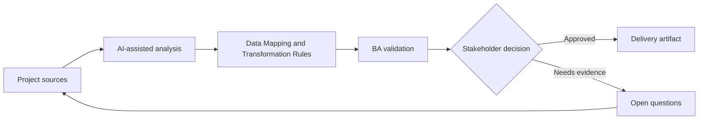

# Data Mapping and Transformation Rules

<div class="case-meta">
  <span>Data and Integration</span>
  <span>Data mapping</span>
  <span>Project use case</span>
</div>

## Project context

A CRM-to-billing integration must map customer, contract, tax, and billing contact data. Field names look similar but meanings differ across systems. In a real delivery environment, this work usually appears under time pressure: stakeholders want clarity, delivery needs a backlog, QA needs testable behavior, and operations needs a process that can survive exceptions. The BA uses AI here to accelerate analysis and synthesis, but the BA remains accountable for evidence, business meaning, stakeholder decisioning, and artifact quality.

## BA challenge

The BA must define data mapping based on business meaning, not field labels. Transformation rules, defaults, null handling, source precedence, and exception handling must be explicit. The practical difficulty is that AI can make early material look more complete than it is. A strong BA keeps the output reviewable by separating source-backed facts, assumptions, unsupported claims, decision gaps, and recommended next actions. The objective is not to make the document longer; it is to make the project decision clearer and safer.

## Where AI fits

<div class="ba-workbench-panel">
AI is useful in this use case when it is constrained to analysis support, pattern detection, structured drafting, and critique. It should not approve scope, invent policy, decide business trade-offs, or replace accountable stakeholder judgment.
</div>

- Compare source and target fields for semantic mismatches.
- Draft mapping table and transformation questions.
- Identify null, default, format, and source precedence gaps.
- Generate data quality test scenarios.

## Inputs to prepare

- Source field list
- Target field list
- Business glossary
- Sample records
- Integration requirements

A BA should label these inputs before using AI: source owner, source date, approval status, sensitivity level, and whether the source is fact, opinion, policy, draft, or historical evidence. This preparation prevents the model from treating every input as equally current and authoritative.

## BA workflow

1. Inventory source and target fields with business definitions.
2. Ask AI to propose mappings and flag semantic mismatch.
3. Define transformation, format, default, null, and precedence rules.
4. Review exceptions with data owners and operations.
5. Create sample records for normal, boundary, and bad data.
6. Publish mapping with test cases and ownership.

The workflow works best as a staged AI collaboration: first organize the evidence, then ask for analysis, then create the artifact, then run a critique pass. The BA should keep a visible decision log throughout the process so that AI-generated suggestions do not silently become approved scope.

## Diagram



## Deliverables

| Deliverable | What it contains | Owner | Done signal |
| --- | --- | --- | --- |
| Data mapping matrix | Source, target, meaning, transform, default, null rule, and owner | BA and data owner | Every field has mapping decision |
| Transformation rule catalog | Rule, example, source, exception, and validation | Data engineer | Rules are implementable |
| Data quality test set | Sample record, expected output, and failure condition | QA | Mapping can be tested |
| Exception handling plan | Bad data, missing data, conflict, owner, and remediation | Operations | Data issues have path |

These deliverables should be treated as BA-owned artifacts. AI can draft them, but the BA must validate source support, stakeholder meaning, traceability, and whether the artifact is ready for handoff.

## Prompt to try

```text
Act as a senior AI-aware Business Analyst. Help me apply the "Data Mapping and Transformation Rules" use case to my project. First ask for source evidence and constraints. Then create a structured analysis with project context, assumptions, AI-fit boundary, workflow steps, deliverables, risks, controls, open questions, and stakeholder decisions. Do not invent policy, thresholds, or approvals.
```

## Review checklist

- Every AI-produced statement is tied to a source, assumption, or validation question.
- The BA has separated drafting assistance from business approval.
- Workflow steps identify the human owner for decisions, review, and exceptions.
- Deliverables are traceable to project inputs and can be reviewed by QA, product, or operations.
- Risk controls are practical enough to be used in a real project meeting.
- Success metric: Integration mapping is driven by business semantics and validated with realistic data cases.

## Risks and controls

| Risk | Why it matters | BA control |
| --- | --- | --- |
| Name-based mapping | Similar field labels may mean different things | Map by business definition |
| Null ambiguity | Blank value may mean unknown, not applicable, or missing | Define null semantics |
| Source conflict | Systems may disagree | Define source precedence |
| No data tests | Integration may pass with clean samples only | Use realistic bad-data cases |

The key control is to make uncertainty visible. If evidence is weak, the output should create a validation question or decision item, not a final requirement. If the artifact influences delivery, release, compliance, customer experience, or operational workload, the BA should require explicit human review before handoff.
