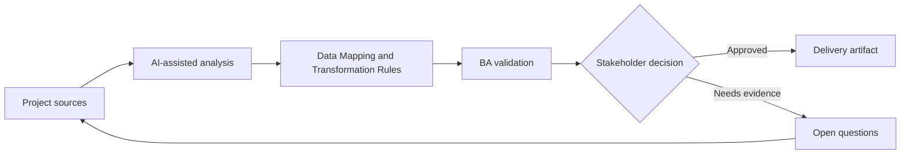

# Data Mapping and Transformation Rules

<div class="case-meta">
  <span>Data and Integration</span>
  <span>Data mapping</span>
  <span>Project use case</span>
</div>

## Project context

A CRM-to-billing integration must map customer, contract, tax, and billing contact data. Field names look similar but meanings differ across systems. In Data mapping, this work usually starts when data movement, mapping, reconciliation, privacy, and lineage decisions affect multiple systems and owners. The BA should treat Source field list and Target field list as evidence to organize, not as raw material for an unconstrained AI answer. The goal is to make the next decision clearer for the people who own the outcome.

## BA challenge

The BA must define data mapping based on business meaning, not field labels. Transformation rules, defaults, null handling, source precedence, and exception handling must be explicit. For Data Mapping and Transformation Rules, the practical difficulty is silent data loss and weak lineage. AI can accelerate field mapping, rule comparison, reconciliation design, lineage review, and exception analysis, but the BA must still expose assumptions, missing approvals, and the point where stakeholder judgment is required.

## Where AI fits

<div class="ba-workbench-panel">
AI fits this Data and Integration use case when it is constrained to field mapping, rule comparison, reconciliation design, lineage review, and exception analysis. A useful first AI task is: Compare source and target fields for semantic mismatches. AI should not approve scope, invent policy, bypass source schemas, sample payloads, mapping rules, data-quality reports, and ownership matrix, or turn a draft into a final decision.
</div>

- Compare source and target fields for semantic mismatches.
- Draft mapping table and transformation questions.
- Identify null, default, format, and source precedence gaps.
- Generate data quality test scenarios.

## Inputs to prepare

- Source field list
- Target field list
- Business glossary
- Sample records
- Integration requirements

Before prompting for Data Mapping and Transformation Rules, label each input by owner, date, approval status, sensitivity, and role in the decision. The most important evidence lens is source schemas, sample payloads, mapping rules, data-quality reports, and ownership matrix; without it, AI may rank old notes, draft designs, and approved rules as if they had equal authority.

## BA workflow

1. Inventory source and target fields with business definitions.
2. Ask AI to propose mappings and flag semantic mismatch.
3. Define transformation, format, default, null, and precedence rules.
4. Review exceptions with data owners and operations.
5. Create sample records for normal, boundary, and bad data.
6. Publish mapping with test cases and ownership.

Run the workflow as data contract review before integration build: start with "Inventory source and target fields with business definitions.", then keep a visible decision log as the artifact moves toward Data mapping matrix. This prevents AI suggestions from silently becoming backlog, design, release, or operational commitments.

## Diagram



## Deliverables

| Deliverable | What it contains | Owner | Done signal |
| --- | --- | --- | --- |
| Data mapping matrix | Source, target, meaning, transform, default, null rule, and owner | BA and data owner | Every field has mapping decision |
| Transformation rule catalog | Rule, example, source, exception, and validation | Data engineer | Rules are implementable |
| Data quality test set | Sample record, expected output, and failure condition | QA | Mapping can be tested |
| Exception handling plan | Bad data, missing data, conflict, owner, and remediation | Operations | Data issues have path |

Treat Data mapping matrix as a BA-owned data and integration control pack. AI may draft structure, but the BA must validate whether "Every field has mapping decision" is actually true, whether the artifact is traceable to source evidence, and whether the receiving team can act on it.

## Prompt to try

```text
Act as a senior AI-aware Business Analyst. Help me apply the "Data Mapping and Transformation Rules" use case to my project. First ask for source evidence and constraints. Then create a structured analysis with project context, assumptions, AI-fit boundary, workflow steps, deliverables, risks, controls, open questions, and stakeholder decisions. Do not invent policy, thresholds, or approvals.
```

## Review checklist

- Source field list is labeled with owner, date, approval status, and sensitivity.
- Data mapping matrix traces to source evidence and has a named human owner.
- The AI task stays inside field mapping, rule comparison, reconciliation design, lineage review, and exception analysis and does not approve scope or policy.
- The "Name-based mapping" risk has a practical control: Map by business definition.
- Open assumptions are converted into validation questions or stakeholder decisions.
- Success metric: Integration mapping is driven by business semantics and validated with realistic data cases.

## Risks and controls

| Risk | Why it matters | BA control |
| --- | --- | --- |
| Name-based mapping | Similar field labels may mean different things | Map by business definition |
| Null ambiguity | Blank value may mean unknown, not applicable, or missing | Define null semantics |
| Source conflict | Systems may disagree | Define source precedence |
| No data tests | Integration may pass with clean samples only | Use realistic bad-data cases |

The main control for the "Name-based mapping" risk is explicit human accountability: Map by business definition. If evidence is weak, the output should create a validation question or decision item, not a final requirement.
