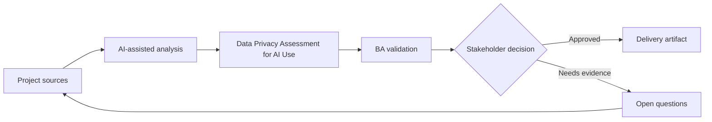

# Data Privacy Assessment for AI Use

<div class="case-meta">
  <span>Governance and adoption</span>
  <span>Privacy and compliance</span>
  <span>Project use case</span>
</div>

## Project context

A project team wants to use AI to summarize customer interviews, analyze support tickets, and draft requirements. The data includes customer names, account details, complaints, and potentially sensitive information. In Privacy and compliance, this work usually starts when AI usage must scale across teams without leaking sensitive data or creating unreviewable decisions. The BA should treat Data inventory and Privacy policy as evidence to organize, not as raw material for an unconstrained AI answer. The goal is to make the next decision clearer for the people who own the outcome.

## BA challenge

The BA must help define what data can be used with AI, what must be redacted, which tools are approved, and what review controls are required. AI productivity cannot come at the cost of privacy or trust. For Data Privacy Assessment for AI Use, the practical difficulty is shadow AI use and weak accountability. AI can accelerate portfolio analysis, policy drafting, risk-tiering, playbook creation, and adoption measurement, but the BA must still expose assumptions, missing approvals, and the point where stakeholder judgment is required.

## Where AI fits

<div class="ba-workbench-panel">
AI fits this Governance and adoption use case when it is constrained to portfolio analysis, policy drafting, risk-tiering, playbook creation, and adoption measurement. A useful first AI task is: Classify BA data types by sensitivity and approved use. AI should not approve scope, invent policy, bypass data policy, approved tools, risk appetite, audit need, and team capability, or turn a draft into a final decision.
</div>

- Classify BA data types by sensitivity and approved use.
- Generate redaction checklist and safe prompt patterns.
- Draft risk-tiered AI usage rules.
- Create review questions for legal, security, and project owners.

## Inputs to prepare

- Data inventory
- Privacy policy
- Approved tool list
- Project artifacts
- Customer data examples

Before prompting for Data Privacy Assessment for AI Use, label each input by owner, date, approval status, sensitivity, and role in the decision. The most important evidence lens is data policy, approved tools, risk appetite, audit need, and team capability; without it, AI may rank old notes, draft designs, and approved rules as if they had equal authority.

## BA workflow

1. Inventory data types used in BA work and where they appear.
2. Ask AI to propose sensitivity categories, then validate with privacy owners.
3. Define prohibited data, redaction rules, approved tools, and storage expectations.
4. Create safe prompt patterns for low-risk drafting and review tasks.
5. Set review gates for sensitive or customer-identifiable data.
6. Publish a project AI data-use checklist.

Run the workflow as governance design before broad rollout: start with "Inventory data types used in BA work and where they appear.", then keep a visible decision log as the artifact moves toward AI data-use matrix. This prevents AI suggestions from silently becoming backlog, design, release, or operational commitments.

## Diagram



## Deliverables

| Deliverable | What it contains | Owner | Done signal |
| --- | --- | --- | --- |
| AI data-use matrix | Data type, sensitivity, allowed tool, redaction, and approval need | BA and privacy owner | Teams know what is allowed |
| Redaction checklist | Fields to remove, transform, mask, or avoid | BA | Sensitive data is handled consistently |
| Risk-tier policy | Low, medium, and high-risk AI tasks with controls | Compliance | Controls match sensitivity |
| Safe prompt guide | Approved prompt patterns and prohibited examples | BA lead | BAs can work safely |

Treat AI data-use matrix as a BA-owned AI adoption control pack. AI may draft structure, but the BA must validate whether "Teams know what is allowed" is actually true, whether the artifact is traceable to source evidence, and whether the receiving team can act on it.

## Prompt to try

```text
Act as a senior AI-aware Business Analyst. Help me apply the "Data Privacy Assessment for AI Use" use case to my project. First ask for source evidence and constraints. Then create a structured analysis with project context, assumptions, AI-fit boundary, workflow steps, deliverables, risks, controls, open questions, and stakeholder decisions. Do not invent policy, thresholds, or approvals.
```

## Review checklist

- Data inventory is labeled with owner, date, approval status, and sensitivity.
- AI data-use matrix traces to source evidence and has a named human owner.
- The AI task stays inside portfolio analysis, policy drafting, risk-tiering, playbook creation, and adoption measurement and does not approve scope or policy.
- The "PII leakage" risk has a practical control: Use approved tools and redaction rules.
- Open assumptions are converted into validation questions or stakeholder decisions.
- Success metric: BA teams use AI with clear data boundaries, approved tools, and practical privacy controls.

## Risks and controls

| Risk | Why it matters | BA control |
| --- | --- | --- |
| PII leakage | Customer data may be sent to unapproved tools | Use approved tools and redaction rules |
| Over-redaction | Removing too much context can reduce analysis quality | Balance privacy with source-safe summaries |
| Policy ambiguity | Teams may interpret rules differently | Create examples of allowed and prohibited use |
| Shadow AI use | People may bypass controls if guidance is impractical | Provide usable safe workflows |

The main control for the "PII leakage" risk is explicit human accountability: Use approved tools and redaction rules. If evidence is weak, the output should create a validation question or decision item, not a final requirement.
