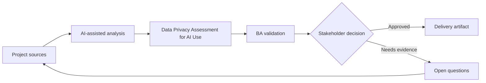

# Data Privacy Assessment for AI Use

<div class="case-meta">
  <span>Governance and adoption</span>
  <span>Privacy and compliance</span>
  <span>Project use case</span>
</div>

## Project context

A project team wants to use AI to summarize customer interviews, analyze support tickets, and draft requirements. The data includes customer names, account details, complaints, and potentially sensitive information. In a real delivery environment, this work usually appears under time pressure: stakeholders want clarity, delivery needs a backlog, QA needs testable behavior, and operations needs a process that can survive exceptions. The BA uses AI here to accelerate analysis and synthesis, but the BA remains accountable for evidence, business meaning, stakeholder decisioning, and artifact quality.

## BA challenge

The BA must help define what data can be used with AI, what must be redacted, which tools are approved, and what review controls are required. AI productivity cannot come at the cost of privacy or trust. The practical difficulty is that AI can make early material look more complete than it is. A strong BA keeps the output reviewable by separating source-backed facts, assumptions, unsupported claims, decision gaps, and recommended next actions. The objective is not to make the document longer; it is to make the project decision clearer and safer.

## Where AI fits

<div class="ba-workbench-panel">
AI is useful in this use case when it is constrained to analysis support, pattern detection, structured drafting, and critique. It should not approve scope, invent policy, decide business trade-offs, or replace accountable stakeholder judgment.
</div>

- Classify BA data types by sensitivity and approved use.
- Generate redaction checklist and safe prompt patterns.
- Draft risk-tiered AI usage rules.
- Create review questions for legal, security, and project owners.

## Inputs to prepare

- Data inventory
- Privacy policy
- Approved tool list
- Project artifacts
- Customer data examples

A BA should label these inputs before using AI: source owner, source date, approval status, sensitivity level, and whether the source is fact, opinion, policy, draft, or historical evidence. This preparation prevents the model from treating every input as equally current and authoritative.

## BA workflow

1. Inventory data types used in BA work and where they appear.
2. Ask AI to propose sensitivity categories, then validate with privacy owners.
3. Define prohibited data, redaction rules, approved tools, and storage expectations.
4. Create safe prompt patterns for low-risk drafting and review tasks.
5. Set review gates for sensitive or customer-identifiable data.
6. Publish a project AI data-use checklist.

The workflow works best as a staged AI collaboration: first organize the evidence, then ask for analysis, then create the artifact, then run a critique pass. The BA should keep a visible decision log throughout the process so that AI-generated suggestions do not silently become approved scope.

## Diagram



## Deliverables

| Deliverable | What it contains | Owner | Done signal |
| --- | --- | --- | --- |
| AI data-use matrix | Data type, sensitivity, allowed tool, redaction, and approval need | BA and privacy owner | Teams know what is allowed |
| Redaction checklist | Fields to remove, transform, mask, or avoid | BA | Sensitive data is handled consistently |
| Risk-tier policy | Low, medium, and high-risk AI tasks with controls | Compliance | Controls match sensitivity |
| Safe prompt guide | Approved prompt patterns and prohibited examples | BA lead | BAs can work safely |

These deliverables should be treated as BA-owned artifacts. AI can draft them, but the BA must validate source support, stakeholder meaning, traceability, and whether the artifact is ready for handoff.

## Prompt to try

```text
Act as a senior AI-aware Business Analyst. Help me apply the "Data Privacy Assessment for AI Use" use case to my project. First ask for source evidence and constraints. Then create a structured analysis with project context, assumptions, AI-fit boundary, workflow steps, deliverables, risks, controls, open questions, and stakeholder decisions. Do not invent policy, thresholds, or approvals.
```

## Review checklist

- Every AI-produced statement is tied to a source, assumption, or validation question.
- The BA has separated drafting assistance from business approval.
- Workflow steps identify the human owner for decisions, review, and exceptions.
- Deliverables are traceable to project inputs and can be reviewed by QA, product, or operations.
- Risk controls are practical enough to be used in a real project meeting.
- Success metric: BA teams use AI with clear data boundaries, approved tools, and practical privacy controls.

## Risks and controls

| Risk | Why it matters | BA control |
| --- | --- | --- |
| PII leakage | Customer data may be sent to unapproved tools | Use approved tools and redaction rules |
| Over-redaction | Removing too much context can reduce analysis quality | Balance privacy with source-safe summaries |
| Policy ambiguity | Teams may interpret rules differently | Create examples of allowed and prohibited use |
| Shadow AI use | People may bypass controls if guidance is impractical | Provide usable safe workflows |

The key control is to make uncertainty visible. If evidence is weak, the output should create a validation question or decision item, not a final requirement. If the artifact influences delivery, release, compliance, customer experience, or operational workload, the BA should require explicit human review before handoff.
