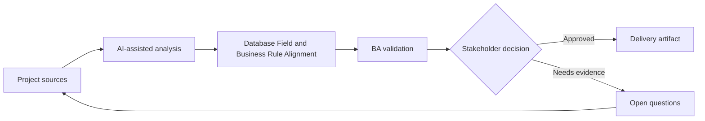

# Database Field and Business Rule Alignment

<div class="case-meta">
  <span>Data and Integration</span>
  <span>Data model alignment</span>
  <span>Project use case</span>
</div>

## Project context

A team adds new database fields for customer risk review. Business owners know the concepts, but database fields are being named and modeled before rules are fully understood. In Data model alignment, this work usually starts when data movement, mapping, reconciliation, privacy, and lineage decisions affect multiple systems and owners. The BA should treat Data model draft and Business glossary as evidence to organize, not as raw material for an unconstrained AI answer. The goal is to make the next decision clearer for the people who own the outcome.

## BA challenge

The BA must ensure data model fields represent business concepts accurately, including source, lifecycle, ownership, sensitivity, allowed values, and update rules. For Database Field and Business Rule Alignment, the practical difficulty is silent data loss and weak lineage. AI can accelerate field mapping, rule comparison, reconciliation design, lineage review, and exception analysis, but the BA must still expose assumptions, missing approvals, and the point where stakeholder judgment is required.

## Where AI fits

<div class="ba-workbench-panel">
AI fits this Data and Integration use case when it is constrained to field mapping, rule comparison, reconciliation design, lineage review, and exception analysis. A useful first AI task is: Translate proposed database fields into business definitions. AI should not approve scope, invent policy, bypass source schemas, sample payloads, mapping rules, data-quality reports, and ownership matrix, or turn a draft into a final decision.
</div>

- Translate proposed database fields into business definitions.
- Identify fields missing ownership, sensitivity, or update rules.
- Generate questions for data model review.
- Draft acceptance criteria for create, update, and audit behavior.

## Inputs to prepare

- Data model draft
- Business glossary
- Risk policy
- Update workflows
- Audit and privacy rules

Before prompting for Database Field and Business Rule Alignment, label each input by owner, date, approval status, sensitivity, and role in the decision. The most important evidence lens is source schemas, sample payloads, mapping rules, data-quality reports, and ownership matrix; without it, AI may rank old notes, draft designs, and approved rules as if they had equal authority.

## BA workflow

1. List proposed fields and business purpose.
2. Ask AI to identify unclear definitions and rule gaps.
3. Define source of truth, allowed values, update rule, sensitivity, and retention.
4. Review with data modeler, backend, compliance, and business owner.
5. Map field behavior to UI, API, reporting, and audit.
6. Create test examples and migration questions.

Run the workflow as data contract review before integration build: start with "List proposed fields and business purpose.", then keep a visible decision log as the artifact moves toward Field definition catalog. This prevents AI suggestions from silently becoming backlog, design, release, or operational commitments.

## Diagram



## Deliverables

| Deliverable | What it contains | Owner | Done signal |
| --- | --- | --- | --- |
| Field definition catalog | Field, business meaning, source, owner, allowed value, and sensitivity | BA and data owner | Fields have business meaning |
| Update rule matrix | Field, who can change, when, validation, audit, and workflow | Backend | Update behavior is clear |
| Downstream impact map | UI, API, report, integration, and audit use of field | BA | Field usage is visible |
| Data migration questions | Existing values, defaults, cleanup, and validation | Data team | Migration risks are known |

Treat Field definition catalog as a BA-owned data and integration control pack. AI may draft structure, but the BA must validate whether "Fields have business meaning" is actually true, whether the artifact is traceable to source evidence, and whether the receiving team can act on it.

## Prompt to try

```text
Act as a senior AI-aware Business Analyst. Help me apply the "Database Field and Business Rule Alignment" use case to my project. First ask for source evidence and constraints. Then create a structured analysis with project context, assumptions, AI-fit boundary, workflow steps, deliverables, risks, controls, open questions, and stakeholder decisions. Do not invent policy, thresholds, or approvals.
```

## Review checklist

- Data model draft is labeled with owner, date, approval status, and sensitivity.
- Field definition catalog traces to source evidence and has a named human owner.
- The AI task stays inside field mapping, rule comparison, reconciliation design, lineage review, and exception analysis and does not approve scope or policy.
- The "Technical naming drift" risk has a practical control: Define business meaning and examples.
- Open assumptions are converted into validation questions or stakeholder decisions.
- Success metric: Database fields are tied to business rules before implementation and migration decisions are visible.

## Risks and controls

| Risk | Why it matters | BA control |
| --- | --- | --- |
| Technical naming drift | Field names may not match business concept | Define business meaning and examples |
| Source-of-truth conflict | Multiple systems may update same field | Define owner and update rule |
| Sensitivity miss | Risk fields may expose sensitive information | Classify sensitivity and access |
| Migration surprise | Existing records may not fit new model | Plan defaults and cleanup |

The main control for the "Technical naming drift" risk is explicit human accountability: Define business meaning and examples. If evidence is weak, the output should create a validation question or decision item, not a final requirement.
