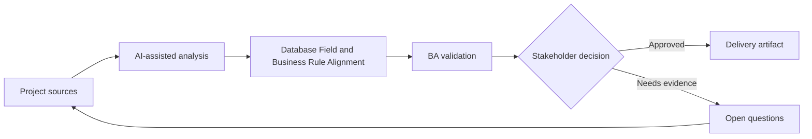

# Database Field and Business Rule Alignment

<div class="case-meta">
  <span>Data and Integration</span>
  <span>Data model alignment</span>
  <span>Project use case</span>
</div>

## Project context

A team adds new database fields for customer risk review. Business owners know the concepts, but database fields are being named and modeled before rules are fully understood. In a real delivery environment, this work usually appears under time pressure: stakeholders want clarity, delivery needs a backlog, QA needs testable behavior, and operations needs a process that can survive exceptions. The BA uses AI here to accelerate analysis and synthesis, but the BA remains accountable for evidence, business meaning, stakeholder decisioning, and artifact quality.

## BA challenge

The BA must ensure data model fields represent business concepts accurately, including source, lifecycle, ownership, sensitivity, allowed values, and update rules. The practical difficulty is that AI can make early material look more complete than it is. A strong BA keeps the output reviewable by separating source-backed facts, assumptions, unsupported claims, decision gaps, and recommended next actions. The objective is not to make the document longer; it is to make the project decision clearer and safer.

## Where AI fits

<div class="ba-workbench-panel">
AI is useful in this use case when it is constrained to analysis support, pattern detection, structured drafting, and critique. It should not approve scope, invent policy, decide business trade-offs, or replace accountable stakeholder judgment.
</div>

- Translate proposed database fields into business definitions.
- Identify fields missing ownership, sensitivity, or update rules.
- Generate questions for data model review.
- Draft acceptance criteria for create, update, and audit behavior.

## Inputs to prepare

- Data model draft
- Business glossary
- Risk policy
- Update workflows
- Audit and privacy rules

A BA should label these inputs before using AI: source owner, source date, approval status, sensitivity level, and whether the source is fact, opinion, policy, draft, or historical evidence. This preparation prevents the model from treating every input as equally current and authoritative.

## BA workflow

1. List proposed fields and business purpose.
2. Ask AI to identify unclear definitions and rule gaps.
3. Define source of truth, allowed values, update rule, sensitivity, and retention.
4. Review with data modeler, backend, compliance, and business owner.
5. Map field behavior to UI, API, reporting, and audit.
6. Create test examples and migration questions.

The workflow works best as a staged AI collaboration: first organize the evidence, then ask for analysis, then create the artifact, then run a critique pass. The BA should keep a visible decision log throughout the process so that AI-generated suggestions do not silently become approved scope.

## Diagram



## Deliverables

| Deliverable | What it contains | Owner | Done signal |
| --- | --- | --- | --- |
| Field definition catalog | Field, business meaning, source, owner, allowed value, and sensitivity | BA and data owner | Fields have business meaning |
| Update rule matrix | Field, who can change, when, validation, audit, and workflow | Backend | Update behavior is clear |
| Downstream impact map | UI, API, report, integration, and audit use of field | BA | Field usage is visible |
| Data migration questions | Existing values, defaults, cleanup, and validation | Data team | Migration risks are known |

These deliverables should be treated as BA-owned artifacts. AI can draft them, but the BA must validate source support, stakeholder meaning, traceability, and whether the artifact is ready for handoff.

## Prompt to try

```text
Act as a senior AI-aware Business Analyst. Help me apply the "Database Field and Business Rule Alignment" use case to my project. First ask for source evidence and constraints. Then create a structured analysis with project context, assumptions, AI-fit boundary, workflow steps, deliverables, risks, controls, open questions, and stakeholder decisions. Do not invent policy, thresholds, or approvals.
```

## Review checklist

- Every AI-produced statement is tied to a source, assumption, or validation question.
- The BA has separated drafting assistance from business approval.
- Workflow steps identify the human owner for decisions, review, and exceptions.
- Deliverables are traceable to project inputs and can be reviewed by QA, product, or operations.
- Risk controls are practical enough to be used in a real project meeting.
- Success metric: Database fields are tied to business rules before implementation and migration decisions are visible.

## Risks and controls

| Risk | Why it matters | BA control |
| --- | --- | --- |
| Technical naming drift | Field names may not match business concept | Define business meaning and examples |
| Source-of-truth conflict | Multiple systems may update same field | Define owner and update rule |
| Sensitivity miss | Risk fields may expose sensitive information | Classify sensitivity and access |
| Migration surprise | Existing records may not fit new model | Plan defaults and cleanup |

The key control is to make uncertainty visible. If evidence is weak, the output should create a validation question or decision item, not a final requirement. If the artifact influences delivery, release, compliance, customer experience, or operational workload, the BA should require explicit human review before handoff.
