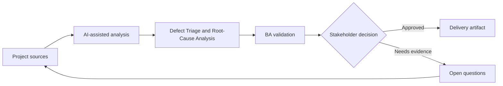

# Defect Triage and Root-Cause Analysis

<div class="case-meta">
  <span>Delivery and QA</span>
  <span>Defect management</span>
  <span>Project use case</span>
</div>

## Project context

During UAT, users report many defects across search, export, role permissions, and notifications. Some are true defects, some are unclear requirements, and others are training or data issues. In a real delivery environment, this work usually appears under time pressure: stakeholders want clarity, delivery needs a backlog, QA needs testable behavior, and operations needs a process that can survive exceptions. The BA uses AI here to accelerate analysis and synthesis, but the BA remains accountable for evidence, business meaning, stakeholder decisioning, and artifact quality.

## BA challenge

The BA must help triage defects quickly without letting AI oversimplify root cause. The goal is to classify issues, connect them to requirements and tests, identify requirement gaps, and prepare decision options for product and delivery leads. The practical difficulty is that AI can make early material look more complete than it is. A strong BA keeps the output reviewable by separating source-backed facts, assumptions, unsupported claims, decision gaps, and recommended next actions. The objective is not to make the document longer; it is to make the project decision clearer and safer.

## Where AI fits

<div class="ba-workbench-panel">
AI is useful in this use case when it is constrained to analysis support, pattern detection, structured drafting, and critique. It should not approve scope, invent policy, decide business trade-offs, or replace accountable stakeholder judgment.
</div>

- Cluster defect descriptions by symptom and affected workflow.
- Map defects to requirements, acceptance criteria, and test evidence.
- Separate bug, requirement gap, data issue, training issue, and change request.
- Draft triage notes and stakeholder questions.

## Inputs to prepare

- Defect export
- Requirement list
- Acceptance criteria
- Test evidence
- UAT notes

A BA should label these inputs before using AI: source owner, source date, approval status, sensitivity level, and whether the source is fact, opinion, policy, draft, or historical evidence. This preparation prevents the model from treating every input as equally current and authoritative.

## BA workflow

1. Normalize defect descriptions and remove duplicates carefully.
2. Ask AI to classify issues with confidence and evidence.
3. Review high-severity and ambiguous classifications manually.
4. Map each defect to requirement, test, or missing requirement.
5. Identify patterns that point to root cause.
6. Prepare triage board updates with recommendation and owner.

The workflow works best as a staged AI collaboration: first organize the evidence, then ask for analysis, then create the artifact, then run a critique pass. The BA should keep a visible decision log throughout the process so that AI-generated suggestions do not silently become approved scope.

## Diagram



## Deliverables

| Deliverable | What it contains | Owner | Done signal |
| --- | --- | --- | --- |
| Defect classification board | Defect, category, severity, evidence, requirement link, and owner | BA and QA | Every UAT issue has triage status |
| Root-cause summary | Requirement gap, build defect, data issue, training issue, or change request patterns | BA | Patterns are supported by evidence |
| Decision options | Fix now, defer, clarify, train, or raise change request | Product owner | Each option has impact |
| Requirement improvement list | Missing or unclear requirements revealed by defects | BA | Backlog is updated with root cause |

These deliverables should be treated as BA-owned artifacts. AI can draft them, but the BA must validate source support, stakeholder meaning, traceability, and whether the artifact is ready for handoff.

## Prompt to try

```text
Act as a senior AI-aware Business Analyst. Help me apply the "Defect Triage and Root-Cause Analysis" use case to my project. First ask for source evidence and constraints. Then create a structured analysis with project context, assumptions, AI-fit boundary, workflow steps, deliverables, risks, controls, open questions, and stakeholder decisions. Do not invent policy, thresholds, or approvals.
```

## Review checklist

- Every AI-produced statement is tied to a source, assumption, or validation question.
- The BA has separated drafting assistance from business approval.
- Workflow steps identify the human owner for decisions, review, and exceptions.
- Deliverables are traceable to project inputs and can be reviewed by QA, product, or operations.
- Risk controls are practical enough to be used in a real project meeting.
- Success metric: Triage decisions become faster while root causes remain evidence-based and actionable.

## Risks and controls

| Risk | Why it matters | BA control |
| --- | --- | --- |
| Misclassification | AI may label requirement gaps as bugs | Review by requirement evidence and test intent |
| Duplicate confusion | Similar defects may hide different causes | Cluster but keep source details |
| Severity inflation | Users may report impact inconsistently | Use business impact rubric |
| Blame framing | Root cause can become political | Frame findings around process and evidence |

The key control is to make uncertainty visible. If evidence is weak, the output should create a validation question or decision item, not a final requirement. If the artifact influences delivery, release, compliance, customer experience, or operational workload, the BA should require explicit human review before handoff.
