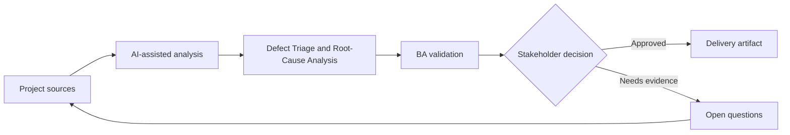

# Defect Triage and Root-Cause Analysis

<div class="case-meta">
  <span>Delivery and QA</span>
  <span>Defect management</span>
  <span>Project use case</span>
</div>

## Project context

During UAT, users report many defects across search, export, role permissions, and notifications. Some are true defects, some are unclear requirements, and others are training or data issues. In Defect management, this work usually starts when delivery decisions, test evidence, and release readiness need to stay connected to original intent. The BA should treat Defect export and Requirement list as evidence to organize, not as raw material for an unconstrained AI answer. The goal is to make the next decision clearer for the people who own the outcome.

## BA challenge

The BA must help triage defects quickly without letting AI oversimplify root cause. The goal is to classify issues, connect them to requirements and tests, identify requirement gaps, and prepare decision options for product and delivery leads. For Defect Triage and Root-Cause Analysis, the practical difficulty is optimistic status and late requirement discovery. AI can accelerate scenario generation, defect triage support, readiness synthesis, and risk surfacing, but the BA must still expose assumptions, missing approvals, and the point where stakeholder judgment is required.

## Where AI fits

<div class="ba-workbench-panel">
AI fits this Delivery and QA use case when it is constrained to scenario generation, defect triage support, readiness synthesis, and risk surfacing. A useful first AI task is: Cluster defect descriptions by symptom and affected workflow. AI should not approve scope, invent policy, bypass requirement baseline, test results, defect history, and release decisions, or turn a draft into a final decision.
</div>

- Cluster defect descriptions by symptom and affected workflow.
- Map defects to requirements, acceptance criteria, and test evidence.
- Separate bug, requirement gap, data issue, training issue, and change request.
- Draft triage notes and stakeholder questions.

## Inputs to prepare

- Defect export
- Requirement list
- Acceptance criteria
- Test evidence
- UAT notes

Before prompting for Defect Triage and Root-Cause Analysis, label each input by owner, date, approval status, sensitivity, and role in the decision. The most important evidence lens is requirement baseline, test results, defect history, and release decisions; without it, AI may rank old notes, draft designs, and approved rules as if they had equal authority.

## BA workflow

1. Normalize defect descriptions and remove duplicates carefully.
2. Ask AI to classify issues with confidence and evidence.
3. Review high-severity and ambiguous classifications manually.
4. Map each defect to requirement, test, or missing requirement.
5. Identify patterns that point to root cause.
6. Prepare triage board updates with recommendation and owner.

Run the workflow as quality review before release or rework decision: start with "Normalize defect descriptions and remove duplicates carefully.", then keep a visible decision log as the artifact moves toward Defect classification board. This prevents AI suggestions from silently becoming backlog, design, release, or operational commitments.

## Diagram



## Deliverables

| Deliverable | What it contains | Owner | Done signal |
| --- | --- | --- | --- |
| Defect classification board | Defect, category, severity, evidence, requirement link, and owner | BA and QA | Every UAT issue has triage status |
| Root-cause summary | Requirement gap, build defect, data issue, training issue, or change request patterns | BA | Patterns are supported by evidence |
| Decision options | Fix now, defer, clarify, train, or raise change request | Product owner | Each option has impact |
| Requirement improvement list | Missing or unclear requirements revealed by defects | BA | Backlog is updated with root cause |

Treat Defect classification board as a BA-owned QA and delivery handoff artifact. AI may draft structure, but the BA must validate whether "Every UAT issue has triage status" is actually true, whether the artifact is traceable to source evidence, and whether the receiving team can act on it.

## Prompt to try

```text
Act as a senior AI-aware Business Analyst. Help me apply the "Defect Triage and Root-Cause Analysis" use case to my project. First ask for source evidence and constraints. Then create a structured analysis with project context, assumptions, AI-fit boundary, workflow steps, deliverables, risks, controls, open questions, and stakeholder decisions. Do not invent policy, thresholds, or approvals.
```

## Review checklist

- Defect export is labeled with owner, date, approval status, and sensitivity.
- Defect classification board traces to source evidence and has a named human owner.
- The AI task stays inside scenario generation, defect triage support, readiness synthesis, and risk surfacing and does not approve scope or policy.
- The "Misclassification" risk has a practical control: Review by requirement evidence and test intent.
- Open assumptions are converted into validation questions or stakeholder decisions.
- Success metric: Triage decisions become faster while root causes remain evidence-based and actionable.

## Risks and controls

| Risk | Why it matters | BA control |
| --- | --- | --- |
| Misclassification | AI may label requirement gaps as bugs | Review by requirement evidence and test intent |
| Duplicate confusion | Similar defects may hide different causes | Cluster but keep source details |
| Severity inflation | Users may report impact inconsistently | Use business impact rubric |
| Blame framing | Root cause can become political | Frame findings around process and evidence |

The main control for the "Misclassification" risk is explicit human accountability: Review by requirement evidence and test intent. If evidence is weak, the output should create a validation question or decision item, not a final requirement.
