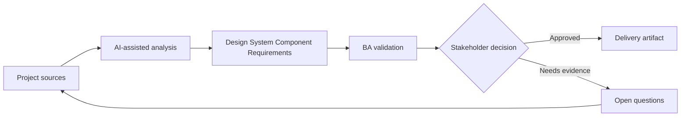

# Design System Component Requirements

<div class="case-meta">
  <span>Frontend, UI, and UX</span>
  <span>Design systems</span>
  <span>Project use case</span>
</div>

## Project context

A platform team adds reusable components for filters, data tables, status chips, action menus, and confirmation dialogs. Product teams need consistency but also domain-specific behavior. In Design systems, this work usually starts when screen behavior, accessibility, design states, analytics, and user feedback must become implementable requirements. The BA should treat Component design and Existing product examples as evidence to organize, not as raw material for an unconstrained AI answer. The goal is to make the next decision clearer for the people who own the outcome.

## BA challenge

The BA must distinguish reusable component requirements from feature-specific requirements. Component behavior should cover variants, slots, accessibility, validation, events, constraints, and what product teams can configure. For Design System Component Requirements, the practical difficulty is missing states and unmeasurable UX. AI can accelerate UI-state analysis, content critique, accessibility review, event taxonomy, and edge-case discovery, but the BA must still expose assumptions, missing approvals, and the point where stakeholder judgment is required.

## Where AI fits

<div class="ba-workbench-panel">
AI fits this Frontend, UI, and UX use case when it is constrained to UI-state analysis, content critique, accessibility review, event taxonomy, and edge-case discovery. A useful first AI task is: Generate component variant and behavior matrix. AI should not approve scope, invent policy, bypass wireframes, design tokens, user journeys, analytics questions, and accessibility expectations, or turn a draft into a final decision.
</div>

- Generate component variant and behavior matrix.
- Identify feature-specific requirements that should not pollute the component.
- Draft configuration options and constraints.
- Create documentation questions for design and frontend teams.

## Inputs to prepare

- Component design
- Existing product examples
- Design system rules
- Accessibility requirements
- Frontend architecture notes

Before prompting for Design System Component Requirements, label each input by owner, date, approval status, sensitivity, and role in the decision. The most important evidence lens is wireframes, design tokens, user journeys, analytics questions, and accessibility expectations; without it, AI may rank old notes, draft designs, and approved rules as if they had equal authority.

## BA workflow

1. Collect use cases from multiple product teams.
2. Ask AI to separate common behavior from domain-specific behavior.
3. Define component variants, properties, events, validation, and accessibility.
4. Review configurability with design and frontend.
5. Create acceptance criteria and documentation examples.
6. Publish adoption guidance and anti-patterns.

Run the workflow as screen-state review before frontend build: start with "Collect use cases from multiple product teams.", then keep a visible decision log as the artifact moves toward Component behavior spec. This prevents AI suggestions from silently becoming backlog, design, release, or operational commitments.

## Diagram



## Deliverables

| Deliverable | What it contains | Owner | Done signal |
| --- | --- | --- | --- |
| Component behavior spec | Variant, property, event, validation, state, and accessibility behavior | Platform BA | Reusable behavior is explicit |
| Configuration matrix | Option, allowed values, default, constraint, and example | Frontend | Product teams know what can change |
| Usage guidance | When to use, when not to use, examples, and anti-patterns | Design system owner | Adoption is consistent |
| Component test scenarios | State, variant, keyboard, accessibility, and error scenarios | QA | Component is testable across variants |

Treat Component behavior spec as a BA-owned frontend requirement specification. AI may draft structure, but the BA must validate whether "Reusable behavior is explicit" is actually true, whether the artifact is traceable to source evidence, and whether the receiving team can act on it.

## Prompt to try

```text
Act as a senior AI-aware Business Analyst. Help me apply the "Design System Component Requirements" use case to my project. First ask for source evidence and constraints. Then create a structured analysis with project context, assumptions, AI-fit boundary, workflow steps, deliverables, risks, controls, open questions, and stakeholder decisions. Do not invent policy, thresholds, or approvals.
```

## Review checklist

- Component design is labeled with owner, date, approval status, and sensitivity.
- Component behavior spec traces to source evidence and has a named human owner.
- The AI task stays inside UI-state analysis, content critique, accessibility review, event taxonomy, and edge-case discovery and does not approve scope or policy.
- The "Over-configurable component" risk has a practical control: Define supported variants and constraints.
- Open assumptions are converted into validation questions or stakeholder decisions.
- Success metric: Reusable components have clear behavior boundaries and product teams can adopt them consistently.

## Risks and controls

| Risk | Why it matters | BA control |
| --- | --- | --- |
| Over-configurable component | Too many options make the system hard to maintain | Define supported variants and constraints |
| Feature leakage | One product's special rule may pollute shared component | Separate common and feature-specific behavior |
| Accessibility drift | Components may be reused without accessible behavior | Bake accessibility into component spec |
| Adoption confusion | Teams may recreate components | Provide usage guidance and examples |

The main control for the "Over-configurable component" risk is explicit human accountability: Define supported variants and constraints. If evidence is weak, the output should create a validation question or decision item, not a final requirement.
