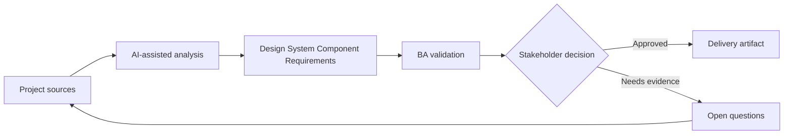

# Design System Component Requirements

<div class="case-meta">
  <span>Frontend, UI, and UX</span>
  <span>Design systems</span>
  <span>Project use case</span>
</div>

## Project context

A platform team adds reusable components for filters, data tables, status chips, action menus, and confirmation dialogs. Product teams need consistency but also domain-specific behavior. In a real delivery environment, this work usually appears under time pressure: stakeholders want clarity, delivery needs a backlog, QA needs testable behavior, and operations needs a process that can survive exceptions. The BA uses AI here to accelerate analysis and synthesis, but the BA remains accountable for evidence, business meaning, stakeholder decisioning, and artifact quality.

## BA challenge

The BA must distinguish reusable component requirements from feature-specific requirements. Component behavior should cover variants, slots, accessibility, validation, events, constraints, and what product teams can configure. The practical difficulty is that AI can make early material look more complete than it is. A strong BA keeps the output reviewable by separating source-backed facts, assumptions, unsupported claims, decision gaps, and recommended next actions. The objective is not to make the document longer; it is to make the project decision clearer and safer.

## Where AI fits

<div class="ba-workbench-panel">
AI is useful in this use case when it is constrained to analysis support, pattern detection, structured drafting, and critique. It should not approve scope, invent policy, decide business trade-offs, or replace accountable stakeholder judgment.
</div>

- Generate component variant and behavior matrix.
- Identify feature-specific requirements that should not pollute the component.
- Draft configuration options and constraints.
- Create documentation questions for design and frontend teams.

## Inputs to prepare

- Component design
- Existing product examples
- Design system rules
- Accessibility requirements
- Frontend architecture notes

A BA should label these inputs before using AI: source owner, source date, approval status, sensitivity level, and whether the source is fact, opinion, policy, draft, or historical evidence. This preparation prevents the model from treating every input as equally current and authoritative.

## BA workflow

1. Collect use cases from multiple product teams.
2. Ask AI to separate common behavior from domain-specific behavior.
3. Define component variants, properties, events, validation, and accessibility.
4. Review configurability with design and frontend.
5. Create acceptance criteria and documentation examples.
6. Publish adoption guidance and anti-patterns.

The workflow works best as a staged AI collaboration: first organize the evidence, then ask for analysis, then create the artifact, then run a critique pass. The BA should keep a visible decision log throughout the process so that AI-generated suggestions do not silently become approved scope.

## Diagram



## Deliverables

| Deliverable | What it contains | Owner | Done signal |
| --- | --- | --- | --- |
| Component behavior spec | Variant, property, event, validation, state, and accessibility behavior | Platform BA | Reusable behavior is explicit |
| Configuration matrix | Option, allowed values, default, constraint, and example | Frontend | Product teams know what can change |
| Usage guidance | When to use, when not to use, examples, and anti-patterns | Design system owner | Adoption is consistent |
| Component test scenarios | State, variant, keyboard, accessibility, and error scenarios | QA | Component is testable across variants |

These deliverables should be treated as BA-owned artifacts. AI can draft them, but the BA must validate source support, stakeholder meaning, traceability, and whether the artifact is ready for handoff.

## Prompt to try

```text
Act as a senior AI-aware Business Analyst. Help me apply the "Design System Component Requirements" use case to my project. First ask for source evidence and constraints. Then create a structured analysis with project context, assumptions, AI-fit boundary, workflow steps, deliverables, risks, controls, open questions, and stakeholder decisions. Do not invent policy, thresholds, or approvals.
```

## Review checklist

- Every AI-produced statement is tied to a source, assumption, or validation question.
- The BA has separated drafting assistance from business approval.
- Workflow steps identify the human owner for decisions, review, and exceptions.
- Deliverables are traceable to project inputs and can be reviewed by QA, product, or operations.
- Risk controls are practical enough to be used in a real project meeting.
- Success metric: Reusable components have clear behavior boundaries and product teams can adopt them consistently.

## Risks and controls

| Risk | Why it matters | BA control |
| --- | --- | --- |
| Over-configurable component | Too many options make the system hard to maintain | Define supported variants and constraints |
| Feature leakage | One product's special rule may pollute shared component | Separate common and feature-specific behavior |
| Accessibility drift | Components may be reused without accessible behavior | Bake accessibility into component spec |
| Adoption confusion | Teams may recreate components | Provide usage guidance and examples |

The key control is to make uncertainty visible. If evidence is weak, the output should create a validation question or decision item, not a final requirement. If the artifact influences delivery, release, compliance, customer experience, or operational workload, the BA should require explicit human review before handoff.
