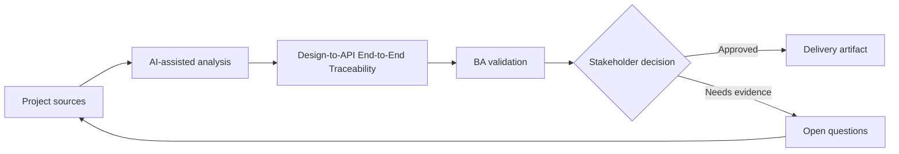

# Design-to-API End-to-End Traceability

<div class="case-meta">
  <span>Cross-functional BA Collaboration</span>
  <span>Traceability</span>
  <span>Project use case</span>
</div>

## Project context

A feature spans Figma frames, user stories, API contracts, database fields, analytics events, and QA tests. During delivery, teams lose track of which artifact owns which behavior. In a real delivery environment, this work usually appears under time pressure: stakeholders want clarity, delivery needs a backlog, QA needs testable behavior, and operations needs a process that can survive exceptions. The BA uses AI here to accelerate analysis and synthesis, but the BA remains accountable for evidence, business meaning, stakeholder decisioning, and artifact quality.

## BA challenge

The BA must create lightweight traceability across design, frontend behavior, backend contracts, data fields, analytics, and tests. The goal is delivery clarity, not documentation overhead. The practical difficulty is that AI can make early material look more complete than it is. A strong BA keeps the output reviewable by separating source-backed facts, assumptions, unsupported claims, decision gaps, and recommended next actions. The objective is not to make the document longer; it is to make the project decision clearer and safer.

## Where AI fits

<div class="ba-workbench-panel">
AI is useful in this use case when it is constrained to analysis support, pattern detection, structured drafting, and critique. It should not approve scope, invent policy, decide business trade-offs, or replace accountable stakeholder judgment.
</div>

- Generate trace links between design frames, stories, API operations, and tests.
- Identify orphan behaviors without API or test coverage.
- Draft traceability matrix and gap report.
- Create change impact questions for late design or API changes.

## Inputs to prepare

- Figma frame list
- User stories
- API contract
- Data mapping
- Test scenarios

A BA should label these inputs before using AI: source owner, source date, approval status, sensitivity level, and whether the source is fact, opinion, policy, draft, or historical evidence. This preparation prevents the model from treating every input as equally current and authoritative.

## BA workflow

1. Define trace dimensions: design, story, UI behavior, API, data, analytics, and test.
2. Ask AI to propose trace links and confidence.
3. Verify high-risk links manually with artifact owners.
4. Identify orphan design elements, untested API behavior, and missing analytics.
5. Update artifacts and decision log.
6. Use traceability for change impact and release readiness.

The workflow works best as a staged AI collaboration: first organize the evidence, then ask for analysis, then create the artifact, then run a critique pass. The BA should keep a visible decision log throughout the process so that AI-generated suggestions do not silently become approved scope.

## Diagram



## Deliverables

| Deliverable | What it contains | Owner | Done signal |
| --- | --- | --- | --- |
| End-to-end trace matrix | Design frame, story, UI behavior, API, data field, analytics, and test | BA | Behavior has trace coverage |
| Gap report | Orphan design, missing API, missing test, missing analytics, and owner | BA and QA | Gaps are actionable |
| Change impact checklist | Artifact changed, affected links, owner, and update needed | BA | Late changes are controlled |
| Release trace summary | Coverage, exceptions, accepted risks, and sign-off notes | Product owner | Release decision has evidence |

These deliverables should be treated as BA-owned artifacts. AI can draft them, but the BA must validate source support, stakeholder meaning, traceability, and whether the artifact is ready for handoff.

## Prompt to try

```text
Act as a senior AI-aware Business Analyst. Help me apply the "Design-to-API End-to-End Traceability" use case to my project. First ask for source evidence and constraints. Then create a structured analysis with project context, assumptions, AI-fit boundary, workflow steps, deliverables, risks, controls, open questions, and stakeholder decisions. Do not invent policy, thresholds, or approvals.
```

## Review checklist

- Every AI-produced statement is tied to a source, assumption, or validation question.
- The BA has separated drafting assistance from business approval.
- Workflow steps identify the human owner for decisions, review, and exceptions.
- Deliverables are traceable to project inputs and can be reviewed by QA, product, or operations.
- Risk controls are practical enough to be used in a real project meeting.
- Success metric: Critical feature behavior is traceable from design through API, data, analytics, and tests.

## Risks and controls

| Risk | Why it matters | BA control |
| --- | --- | --- |
| Traceability overhead | Matrix can become too heavy to maintain | Trace only material behavior and high-risk items |
| False AI link | AI may link artifacts by similar words, not meaning | Verify high-risk links manually |
| Orphan design behavior | A design interaction may not be in story or API | Identify orphan elements |
| Release blind spot | Untested backend behavior may ship | Use trace summary for readiness |

The key control is to make uncertainty visible. If evidence is weak, the output should create a validation question or decision item, not a final requirement. If the artifact influences delivery, release, compliance, customer experience, or operational workload, the BA should require explicit human review before handoff.
