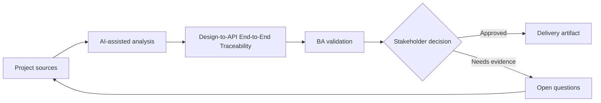

# Design-to-API End-to-End Traceability

<div class="case-meta">
  <span>Cross-functional BA Collaboration</span>
  <span>Traceability</span>
  <span>Project use case</span>
</div>

## Project context

A feature spans Figma frames, user stories, API contracts, database fields, analytics events, and QA tests. During delivery, teams lose track of which artifact owns which behavior. In Traceability, this work usually starts when different roles need different artifacts, but the BA must keep decisions consistent across product, design, engineering, QA, data, and operations. The BA should treat Figma frame list and User stories as evidence to organize, not as raw material for an unconstrained AI answer. The goal is to make the next decision clearer for the people who own the outcome.

## BA challenge

The BA must create lightweight traceability across design, frontend behavior, backend contracts, data fields, analytics, and tests. The goal is delivery clarity, not documentation overhead. For Design-to-API End-to-End Traceability, the practical difficulty is role misalignment and hidden trade-offs. AI can accelerate role-specific synthesis, decision memo drafting, conflict surfacing, and shared artifact critique, but the BA must still expose assumptions, missing approvals, and the point where stakeholder judgment is required.

## Where AI fits

<div class="ba-workbench-panel">
AI fits this Cross-functional BA Collaboration use case when it is constrained to role-specific synthesis, decision memo drafting, conflict surfacing, and shared artifact critique. A useful first AI task is: Generate trace links between design frames, stories, API operations, and tests. AI should not approve scope, invent policy, bypass role feedback, decision log, design notes, technical constraints, test concerns, and support needs, or turn a draft into a final decision.
</div>

- Generate trace links between design frames, stories, API operations, and tests.
- Identify orphan behaviors without API or test coverage.
- Draft traceability matrix and gap report.
- Create change impact questions for late design or API changes.

## Inputs to prepare

- Figma frame list
- User stories
- API contract
- Data mapping
- Test scenarios

Before prompting for Design-to-API End-to-End Traceability, label each input by owner, date, approval status, sensitivity, and role in the decision. The most important evidence lens is role feedback, decision log, design notes, technical constraints, test concerns, and support needs; without it, AI may rank old notes, draft designs, and approved rules as if they had equal authority.

## BA workflow

1. Define trace dimensions: design, story, UI behavior, API, data, analytics, and test.
2. Ask AI to propose trace links and confidence.
3. Verify high-risk links manually with artifact owners.
4. Identify orphan design elements, untested API behavior, and missing analytics.
5. Update artifacts and decision log.
6. Use traceability for change impact and release readiness.

Run the workflow as cross-role decision alignment before handoff: start with "Define trace dimensions: design, story, UI behavior, API, data, analytics, and test.", then keep a visible decision log as the artifact moves toward End-to-end trace matrix. This prevents AI suggestions from silently becoming backlog, design, release, or operational commitments.

## Diagram



## Deliverables

| Deliverable | What it contains | Owner | Done signal |
| --- | --- | --- | --- |
| End-to-end trace matrix | Design frame, story, UI behavior, API, data field, analytics, and test | BA | Behavior has trace coverage |
| Gap report | Orphan design, missing API, missing test, missing analytics, and owner | BA and QA | Gaps are actionable |
| Change impact checklist | Artifact changed, affected links, owner, and update needed | BA | Late changes are controlled |
| Release trace summary | Coverage, exceptions, accepted risks, and sign-off notes | Product owner | Release decision has evidence |

Treat End-to-end trace matrix as a BA-owned collaboration decision artifact. AI may draft structure, but the BA must validate whether "Behavior has trace coverage" is actually true, whether the artifact is traceable to source evidence, and whether the receiving team can act on it.

## Prompt to try

```text
Act as a senior AI-aware Business Analyst. Help me apply the "Design-to-API End-to-End Traceability" use case to my project. First ask for source evidence and constraints. Then create a structured analysis with project context, assumptions, AI-fit boundary, workflow steps, deliverables, risks, controls, open questions, and stakeholder decisions. Do not invent policy, thresholds, or approvals.
```

## Review checklist

- Figma frame list is labeled with owner, date, approval status, and sensitivity.
- End-to-end trace matrix traces to source evidence and has a named human owner.
- The AI task stays inside role-specific synthesis, decision memo drafting, conflict surfacing, and shared artifact critique and does not approve scope or policy.
- The "Traceability overhead" risk has a practical control: Trace only material behavior and high-risk items.
- Open assumptions are converted into validation questions or stakeholder decisions.
- Success metric: Critical feature behavior is traceable from design through API, data, analytics, and tests.

## Risks and controls

| Risk | Why it matters | BA control |
| --- | --- | --- |
| Traceability overhead | Matrix can become too heavy to maintain | Trace only material behavior and high-risk items |
| False AI link | AI may link artifacts by similar words, not meaning | Verify high-risk links manually |
| Orphan design behavior | A design interaction may not be in story or API | Identify orphan elements |
| Release blind spot | Untested backend behavior may ship | Use trace summary for readiness |

The main control for the "Traceability overhead" risk is explicit human accountability: Trace only material behavior and high-risk items. If evidence is weak, the output should create a validation question or decision item, not a final requirement.
