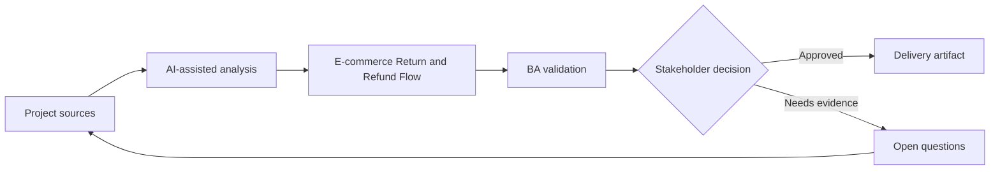

# E-commerce Return and Refund Flow

<div class="case-meta">
  <span>Domain project scenarios</span>
  <span>E-commerce</span>
  <span>Project use case</span>
</div>

## Project context

An e-commerce platform redesigns return and refund flows to reduce support contacts. The project includes eligibility checks, return reason capture, shipping label generation, refund timing, and exception handling. In E-commerce, this work usually starts when domain policies, operational exceptions, and regulatory expectations shape what the product can safely do. The BA should treat Return policy and Order state model as evidence to organize, not as raw material for an unconstrained AI answer. The goal is to make the next decision clearer for the people who own the outcome.

## BA challenge

The BA must define business rules that vary by product type, order status, region, promotion, payment method, and fraud risk. AI can expand scenarios, but policy decisions must remain traceable. For E-commerce Return and Refund Flow, the practical difficulty is policy hallucination and exception blindness. AI can accelerate domain-rule extraction, exception mapping, safe-message drafting, and owner review, but the BA must still expose assumptions, missing approvals, and the point where stakeholder judgment is required.

## Where AI fits

<div class="ba-workbench-panel">
AI fits this Domain project scenarios use case when it is constrained to domain-rule extraction, exception mapping, safe-message drafting, and owner review. A useful first AI task is: Generate return scenarios from policy and order states. AI should not approve scope, invent policy, bypass policy sources, operational samples, compliance constraints, and domain-owner decisions, or turn a draft into a final decision.
</div>

- Generate return scenarios from policy and order states.
- Identify edge cases across payment, shipping, promotion, and inventory.
- Draft customer messaging and support scripts.
- Create rule matrix and acceptance criteria.

## Inputs to prepare

- Return policy
- Order state model
- Payment rules
- Shipping carrier rules
- Support ticket themes

Before prompting for E-commerce Return and Refund Flow, label each input by owner, date, approval status, sensitivity, and role in the decision. The most important evidence lens is policy sources, operational samples, compliance constraints, and domain-owner decisions; without it, AI may rank old notes, draft designs, and approved rules as if they had equal authority.

## BA workflow

1. Map order and return states from purchase to refund completion.
2. Ask AI to generate scenario combinations and missing rules.
3. Create eligibility matrix by product, region, payment, and time window.
4. Review high-impact exceptions with finance, fraud, logistics, and customer support.
5. Draft acceptance criteria for customer and support experiences.
6. Prepare rollout support scripts and monitoring metrics.

Run the workflow as domain validation before implementation detail: start with "Map order and return states from purchase to refund completion.", then keep a visible decision log as the artifact moves toward Return eligibility matrix. This prevents AI suggestions from silently becoming backlog, design, release, or operational commitments.

## Diagram



## Deliverables

| Deliverable | What it contains | Owner | Done signal |
| --- | --- | --- | --- |
| Return eligibility matrix | Condition, rule, source, customer message, and exception path | BA | Eligibility rules are testable |
| State transition diagram | Order, return, refund, exception, and cancellation states | BA and engineering | State changes are explicit |
| Support script pack | Customer explanation, exception handling, and escalation | Support lead | Agents can explain outcomes |
| Acceptance criteria set | Positive, negative, boundary, and fraud-risk cases | BA and QA | Key scenarios are covered |

Treat Return eligibility matrix as a BA-owned domain-specific requirement pack. AI may draft structure, but the BA must validate whether "Eligibility rules are testable" is actually true, whether the artifact is traceable to source evidence, and whether the receiving team can act on it.

## Prompt to try

```text
Act as a senior AI-aware Business Analyst. Help me apply the "E-commerce Return and Refund Flow" use case to my project. First ask for source evidence and constraints. Then create a structured analysis with project context, assumptions, AI-fit boundary, workflow steps, deliverables, risks, controls, open questions, and stakeholder decisions. Do not invent policy, thresholds, or approvals.
```

## Review checklist

- Return policy is labeled with owner, date, approval status, and sensitivity.
- Return eligibility matrix traces to source evidence and has a named human owner.
- The AI task stays inside domain-rule extraction, exception mapping, safe-message drafting, and owner review and does not approve scope or policy.
- The "Policy conflict" risk has a practical control: Use source hierarchy and conflict resolution.
- Open assumptions are converted into validation questions or stakeholder decisions.
- Success metric: Customers can complete eligible returns with fewer support contacts and clearer refund expectations.

## Risks and controls

| Risk | Why it matters | BA control |
| --- | --- | --- |
| Policy conflict | Regional or promotion rules may conflict with generic policy | Use source hierarchy and conflict resolution |
| Refund timing ambiguity | Customers may not know when money returns | Specify status messages and payment-method timing |
| Fraud loophole | Overly simple rules can be exploited | Include fraud review triggers |
| Inventory mismatch | Return acceptance may not align with inventory process | Review logistics and warehouse states |

The main control for the "Policy conflict" risk is explicit human accountability: Use source hierarchy and conflict resolution. If evidence is weak, the output should create a validation question or decision item, not a final requirement.
