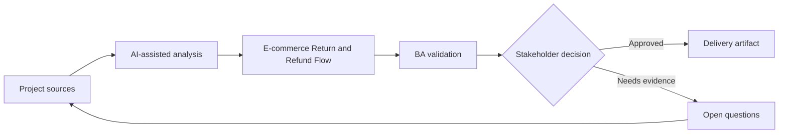

# E-commerce Return and Refund Flow

<div class="case-meta">
  <span>Domain project scenarios</span>
  <span>E-commerce</span>
  <span>Project use case</span>
</div>

## Project context

An e-commerce platform redesigns return and refund flows to reduce support contacts. The project includes eligibility checks, return reason capture, shipping label generation, refund timing, and exception handling. In a real delivery environment, this work usually appears under time pressure: stakeholders want clarity, delivery needs a backlog, QA needs testable behavior, and operations needs a process that can survive exceptions. The BA uses AI here to accelerate analysis and synthesis, but the BA remains accountable for evidence, business meaning, stakeholder decisioning, and artifact quality.

## BA challenge

The BA must define business rules that vary by product type, order status, region, promotion, payment method, and fraud risk. AI can expand scenarios, but policy decisions must remain traceable. The practical difficulty is that AI can make early material look more complete than it is. A strong BA keeps the output reviewable by separating source-backed facts, assumptions, unsupported claims, decision gaps, and recommended next actions. The objective is not to make the document longer; it is to make the project decision clearer and safer.

## Where AI fits

<div class="ba-workbench-panel">
AI is useful in this use case when it is constrained to analysis support, pattern detection, structured drafting, and critique. It should not approve scope, invent policy, decide business trade-offs, or replace accountable stakeholder judgment.
</div>

- Generate return scenarios from policy and order states.
- Identify edge cases across payment, shipping, promotion, and inventory.
- Draft customer messaging and support scripts.
- Create rule matrix and acceptance criteria.

## Inputs to prepare

- Return policy
- Order state model
- Payment rules
- Shipping carrier rules
- Support ticket themes

A BA should label these inputs before using AI: source owner, source date, approval status, sensitivity level, and whether the source is fact, opinion, policy, draft, or historical evidence. This preparation prevents the model from treating every input as equally current and authoritative.

## BA workflow

1. Map order and return states from purchase to refund completion.
2. Ask AI to generate scenario combinations and missing rules.
3. Create eligibility matrix by product, region, payment, and time window.
4. Review high-impact exceptions with finance, fraud, logistics, and customer support.
5. Draft acceptance criteria for customer and support experiences.
6. Prepare rollout support scripts and monitoring metrics.

The workflow works best as a staged AI collaboration: first organize the evidence, then ask for analysis, then create the artifact, then run a critique pass. The BA should keep a visible decision log throughout the process so that AI-generated suggestions do not silently become approved scope.

## Diagram



## Deliverables

| Deliverable | What it contains | Owner | Done signal |
| --- | --- | --- | --- |
| Return eligibility matrix | Condition, rule, source, customer message, and exception path | BA | Eligibility rules are testable |
| State transition diagram | Order, return, refund, exception, and cancellation states | BA and engineering | State changes are explicit |
| Support script pack | Customer explanation, exception handling, and escalation | Support lead | Agents can explain outcomes |
| Acceptance criteria set | Positive, negative, boundary, and fraud-risk cases | BA and QA | Key scenarios are covered |

These deliverables should be treated as BA-owned artifacts. AI can draft them, but the BA must validate source support, stakeholder meaning, traceability, and whether the artifact is ready for handoff.

## Prompt to try

```text
Act as a senior AI-aware Business Analyst. Help me apply the "E-commerce Return and Refund Flow" use case to my project. First ask for source evidence and constraints. Then create a structured analysis with project context, assumptions, AI-fit boundary, workflow steps, deliverables, risks, controls, open questions, and stakeholder decisions. Do not invent policy, thresholds, or approvals.
```

## Review checklist

- Every AI-produced statement is tied to a source, assumption, or validation question.
- The BA has separated drafting assistance from business approval.
- Workflow steps identify the human owner for decisions, review, and exceptions.
- Deliverables are traceable to project inputs and can be reviewed by QA, product, or operations.
- Risk controls are practical enough to be used in a real project meeting.
- Success metric: Customers can complete eligible returns with fewer support contacts and clearer refund expectations.

## Risks and controls

| Risk | Why it matters | BA control |
| --- | --- | --- |
| Policy conflict | Regional or promotion rules may conflict with generic policy | Use source hierarchy and conflict resolution |
| Refund timing ambiguity | Customers may not know when money returns | Specify status messages and payment-method timing |
| Fraud loophole | Overly simple rules can be exploited | Include fraud review triggers |
| Inventory mismatch | Return acceptance may not align with inventory process | Review logistics and warehouse states |

The key control is to make uncertainty visible. If evidence is weak, the output should create a validation question or decision item, not a final requirement. If the artifact influences delivery, release, compliance, customer experience, or operational workload, the BA should require explicit human review before handoff.
