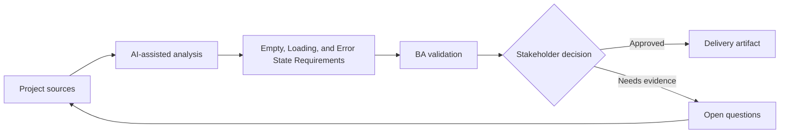

# Empty, Loading, and Error State Requirements

<div class="case-meta">
  <span>Frontend, UI, and UX</span>
  <span>UI states</span>
  <span>Project use case</span>
</div>

## Project context

A reporting page depends on multiple APIs. The initial story covers displaying data, but not what users see when data is missing, loading slowly, partially unavailable, or blocked by permission. In a real delivery environment, this work usually appears under time pressure: stakeholders want clarity, delivery needs a backlog, QA needs testable behavior, and operations needs a process that can survive exceptions. The BA uses AI here to accelerate analysis and synthesis, but the BA remains accountable for evidence, business meaning, stakeholder decisioning, and artifact quality.

## BA challenge

The BA must define non-happy-path UI states as functional requirements. These states affect trust, support volume, and perceived quality, especially when backend services are slow or unavailable. The practical difficulty is that AI can make early material look more complete than it is. A strong BA keeps the output reviewable by separating source-backed facts, assumptions, unsupported claims, decision gaps, and recommended next actions. The objective is not to make the document longer; it is to make the project decision clearer and safer.

## Where AI fits

<div class="ba-workbench-panel">
AI is useful in this use case when it is constrained to analysis support, pattern detection, structured drafting, and critique. It should not approve scope, invent policy, decide business trade-offs, or replace accountable stakeholder judgment.
</div>

- Generate state coverage for loading, empty, error, permission, partial, stale, and retry states.
- Draft user-facing copy for each state.
- Identify backend signals needed to distinguish states.
- Create acceptance criteria for skeletons, retries, and fallback messages.

## Inputs to prepare

- Screen design
- API dependency list
- Permission rules
- Service reliability notes
- Support ticket examples

A BA should label these inputs before using AI: source owner, source date, approval status, sensitivity level, and whether the source is fact, opinion, policy, draft, or historical evidence. This preparation prevents the model from treating every input as equally current and authoritative.

## BA workflow

1. List every data dependency and possible response condition.
2. Ask AI to generate UI state matrix and missing signals.
3. Define copy, icon, action, retry, and escalation for each state.
4. Review backend feasibility for partial and stale data signals.
5. Write acceptance criteria for slow loading, empty data, failure, permission, and partial results.
6. Add analytics events for state frequency and user retry behavior.

The workflow works best as a staged AI collaboration: first organize the evidence, then ask for analysis, then create the artifact, then run a critique pass. The BA should keep a visible decision log throughout the process so that AI-generated suggestions do not silently become approved scope.

## Diagram



## Deliverables

| Deliverable | What it contains | Owner | Done signal |
| --- | --- | --- | --- |
| UI state matrix | State, trigger, backend signal, copy, user action, and analytics | BA | Every non-happy path has behavior |
| Fallback copy set | Empty, error, permission, stale, and retry messages | UX writer | Messages are clear and actionable |
| Backend signal list | Status, error code, freshness, and partial result indicators | Backend lead | Frontend can distinguish states |
| QA scenario list | Slow API, no data, partial data, error, permission, and retry | QA | Non-happy paths are tested |

These deliverables should be treated as BA-owned artifacts. AI can draft them, but the BA must validate source support, stakeholder meaning, traceability, and whether the artifact is ready for handoff.

## Prompt to try

```text
Act as a senior AI-aware Business Analyst. Help me apply the "Empty, Loading, and Error State Requirements" use case to my project. First ask for source evidence and constraints. Then create a structured analysis with project context, assumptions, AI-fit boundary, workflow steps, deliverables, risks, controls, open questions, and stakeholder decisions. Do not invent policy, thresholds, or approvals.
```

## Review checklist

- Every AI-produced statement is tied to a source, assumption, or validation question.
- The BA has separated drafting assistance from business approval.
- Workflow steps identify the human owner for decisions, review, and exceptions.
- Deliverables are traceable to project inputs and can be reviewed by QA, product, or operations.
- Risk controls are practical enough to be used in a real project meeting.
- Success metric: Users receive clear state-specific guidance and QA covers non-happy-path UI behavior.

## Risks and controls

| Risk | Why it matters | BA control |
| --- | --- | --- |
| Generic error message | Users cannot recover or know what happened | Use state-specific copy and action |
| Backend signal gap | Frontend cannot distinguish no data from failure | Specify response signals and error codes |
| Support burden | Unclear states create tickets | Add recovery instruction and status visibility |
| Untested partial data | Page may break when one API fails | Add partial availability scenarios |

The key control is to make uncertainty visible. If evidence is weak, the output should create a validation question or decision item, not a final requirement. If the artifact influences delivery, release, compliance, customer experience, or operational workload, the BA should require explicit human review before handoff.
