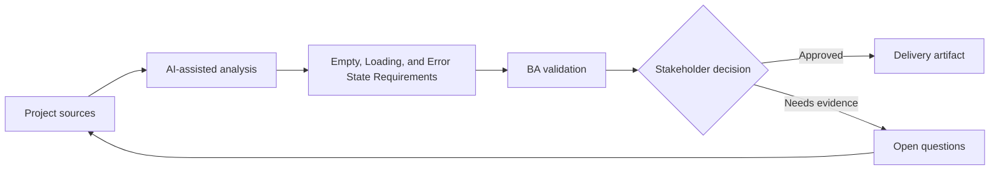

# Empty, Loading, and Error State Requirements

<div class="case-meta">
  <span>Frontend, UI, and UX</span>
  <span>UI states</span>
  <span>Project use case</span>
</div>

## Project context

A reporting page depends on multiple APIs. The initial story covers displaying data, but not what users see when data is missing, loading slowly, partially unavailable, or blocked by permission. In UI states, this work usually starts when screen behavior, accessibility, design states, analytics, and user feedback must become implementable requirements. The BA should treat Screen design and API dependency list as evidence to organize, not as raw material for an unconstrained AI answer. The goal is to make the next decision clearer for the people who own the outcome.

## BA challenge

The BA must define non-happy-path UI states as functional requirements. These states affect trust, support volume, and perceived quality, especially when backend services are slow or unavailable. For Empty, Loading, and Error State Requirements, the practical difficulty is missing states and unmeasurable UX. AI can accelerate UI-state analysis, content critique, accessibility review, event taxonomy, and edge-case discovery, but the BA must still expose assumptions, missing approvals, and the point where stakeholder judgment is required.

## Where AI fits

<div class="ba-workbench-panel">
AI fits this Frontend, UI, and UX use case when it is constrained to UI-state analysis, content critique, accessibility review, event taxonomy, and edge-case discovery. A useful first AI task is: Generate state coverage for loading, empty, error, permission, partial, stale, and retry states. AI should not approve scope, invent policy, bypass wireframes, design tokens, user journeys, analytics questions, and accessibility expectations, or turn a draft into a final decision.
</div>

- Generate state coverage for loading, empty, error, permission, partial, stale, and retry states.
- Draft user-facing copy for each state.
- Identify backend signals needed to distinguish states.
- Create acceptance criteria for skeletons, retries, and fallback messages.

## Inputs to prepare

- Screen design
- API dependency list
- Permission rules
- Service reliability notes
- Support ticket examples

Before prompting for Empty, Loading, and Error State Requirements, label each input by owner, date, approval status, sensitivity, and role in the decision. The most important evidence lens is wireframes, design tokens, user journeys, analytics questions, and accessibility expectations; without it, AI may rank old notes, draft designs, and approved rules as if they had equal authority.

## BA workflow

1. List every data dependency and possible response condition.
2. Ask AI to generate UI state matrix and missing signals.
3. Define copy, icon, action, retry, and escalation for each state.
4. Review backend feasibility for partial and stale data signals.
5. Write acceptance criteria for slow loading, empty data, failure, permission, and partial results.
6. Add analytics events for state frequency and user retry behavior.

Run the workflow as screen-state review before frontend build: start with "List every data dependency and possible response condition.", then keep a visible decision log as the artifact moves toward UI state matrix. This prevents AI suggestions from silently becoming backlog, design, release, or operational commitments.

## Diagram



## Deliverables

| Deliverable | What it contains | Owner | Done signal |
| --- | --- | --- | --- |
| UI state matrix | State, trigger, backend signal, copy, user action, and analytics | BA | Every non-happy path has behavior |
| Fallback copy set | Empty, error, permission, stale, and retry messages | UX writer | Messages are clear and actionable |
| Backend signal list | Status, error code, freshness, and partial result indicators | Backend lead | Frontend can distinguish states |
| QA scenario list | Slow API, no data, partial data, error, permission, and retry | QA | Non-happy paths are tested |

Treat UI state matrix as a BA-owned frontend requirement specification. AI may draft structure, but the BA must validate whether "Every non-happy path has behavior" is actually true, whether the artifact is traceable to source evidence, and whether the receiving team can act on it.

## Prompt to try

```text
Act as a senior AI-aware Business Analyst. Help me apply the "Empty, Loading, and Error State Requirements" use case to my project. First ask for source evidence and constraints. Then create a structured analysis with project context, assumptions, AI-fit boundary, workflow steps, deliverables, risks, controls, open questions, and stakeholder decisions. Do not invent policy, thresholds, or approvals.
```

## Review checklist

- Screen design is labeled with owner, date, approval status, and sensitivity.
- UI state matrix traces to source evidence and has a named human owner.
- The AI task stays inside UI-state analysis, content critique, accessibility review, event taxonomy, and edge-case discovery and does not approve scope or policy.
- The "Generic error message" risk has a practical control: Use state-specific copy and action.
- Open assumptions are converted into validation questions or stakeholder decisions.
- Success metric: Users receive clear state-specific guidance and QA covers non-happy-path UI behavior.

## Risks and controls

| Risk | Why it matters | BA control |
| --- | --- | --- |
| Generic error message | Users cannot recover or know what happened | Use state-specific copy and action |
| Backend signal gap | Frontend cannot distinguish no data from failure | Specify response signals and error codes |
| Support burden | Unclear states create tickets | Add recovery instruction and status visibility |
| Untested partial data | Page may break when one API fails | Add partial availability scenarios |

The main control for the "Generic error message" risk is explicit human accountability: Use state-specific copy and action. If evidence is weak, the output should create a validation question or decision item, not a final requirement.
