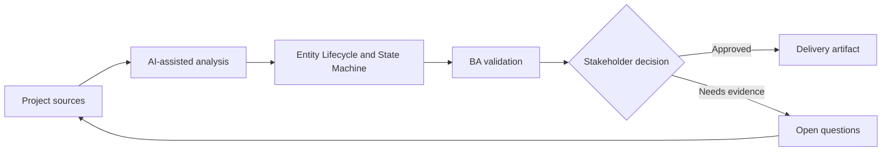

# Entity Lifecycle and State Machine

<div class="case-meta">
  <span>Data and Integration</span>
  <span>Entity lifecycle</span>
  <span>Data and integration</span>
  <span>Advanced</span>
  <span>State model</span>
  <span>Project use case</span>
</div>

## Project context

A subscription entity moves through trial, active, suspended, cancelled, expired, and reactivated states. Teams disagree about allowed transitions and what events trigger each change. In Entity lifecycle, this work usually starts when data movement, mapping, reconciliation, privacy, and lineage decisions affect multiple systems and owners. The BA should treat Lifecycle notes and Billing rules as evidence to organize, not as raw material for an unconstrained AI answer. The goal is to make the next decision clearer for the people who own the outcome.

## BA challenge

The BA must specify lifecycle states and transitions so UI, backend, API, reporting, billing, and support share the same model. For Entity Lifecycle and State Machine, the practical difficulty is silent data loss and weak lineage. AI can accelerate field mapping, rule comparison, reconciliation design, lineage review, and exception analysis, but the BA must still expose assumptions, missing approvals, and the point where stakeholder judgment is required.

## Where AI fits

<div class="ba-workbench-panel">
AI fits this Data and Integration use case when it is constrained to field mapping, rule comparison, reconciliation design, lineage review, and exception analysis. A useful first AI task is: Generate state machine from process notes. AI should not approve scope, invent policy, bypass source schemas, sample payloads, mapping rules, data-quality reports, and ownership matrix, or turn a draft into a final decision.
</div>

- Generate state machine from process notes.
- Identify missing transitions, invalid transitions, and terminal states.
- Draft transition rules and event triggers.
- Create test scenarios by state and transition.

## Inputs to prepare

- Lifecycle notes
- Billing rules
- Support scripts
- API events
- Reporting definitions

Before prompting for Entity Lifecycle and State Machine, label each input by owner, date, approval status, sensitivity, and role in the decision. The most important evidence lens is source schemas, sample payloads, mapping rules, data-quality reports, and ownership matrix; without it, AI may rank old notes, draft designs, and approved rules as if they had equal authority.

## BA workflow

1. List all known states and synonyms used by teams.
2. Ask AI to propose state machine and transition gaps.
3. Define allowed transition, trigger, actor, validation, audit, and side effects.
4. Review downstream impact on UI, billing, reporting, and notifications.
5. Write acceptance criteria for valid and invalid transitions.
6. Publish lifecycle model and update glossary.

Run the workflow as data contract review before integration build: start with "List all known states and synonyms used by teams.", then keep a visible decision log as the artifact moves toward State model. This prevents AI suggestions from silently becoming backlog, design, release, or operational commitments.

## Diagram



## Deliverables

| Deliverable | What it contains | Owner | Done signal |
| --- | --- | --- | --- |
| State model | State, definition, entry rule, exit rule, and terminal status | BA | States have shared meaning |
| Transition table | From, to, trigger, actor, validation, side effect, and audit | Backend and BA | Transitions are enforceable |
| Impact map | State impact on UI, API, billing, reporting, and support | Product owner | Downstream behavior is aligned |
| Transition test set | Valid transition, invalid transition, and edge case | QA | State machine is testable |

Treat State model as a BA-owned data and integration control pack. AI may draft structure, but the BA must validate whether "States have shared meaning" is actually true, whether the artifact is traceable to source evidence, and whether the receiving team can act on it.

## Prompt to try

```text
Act as a senior AI-aware Business Analyst. Help me apply the "Entity Lifecycle and State Machine" use case to my project. First ask for source evidence and constraints. Then create a structured analysis with project context, assumptions, AI-fit boundary, workflow steps, deliverables, risks, controls, open questions, and stakeholder decisions. Do not invent policy, thresholds, or approvals.
```

## Review checklist

- Lifecycle notes is labeled with owner, date, approval status, and sensitivity.
- State model traces to source evidence and has a named human owner.
- The AI task stays inside field mapping, rule comparison, reconciliation design, lineage review, and exception analysis and does not approve scope or policy.
- The "State synonym confusion" risk has a practical control: Create glossary and state definitions.
- Open assumptions are converted into validation questions or stakeholder decisions.
- Success metric: Lifecycle behavior is shared across UI, backend, APIs, reporting, and operations.

## Risks and controls

| Risk | Why it matters | BA control |
| --- | --- | --- |
| State synonym confusion | Different teams may use different names for same state | Create glossary and state definitions |
| Invalid transition | System may allow impossible lifecycle moves | Define and test invalid transitions |
| Side-effect gap | Notifications or billing may not update | Map downstream impact |
| Reporting mismatch | Reports may count states differently | Align reporting definitions to state model |

The main control for the "State synonym confusion" risk is explicit human accountability: Create glossary and state definitions. If evidence is weak, the output should create a validation question or decision item, not a final requirement.
