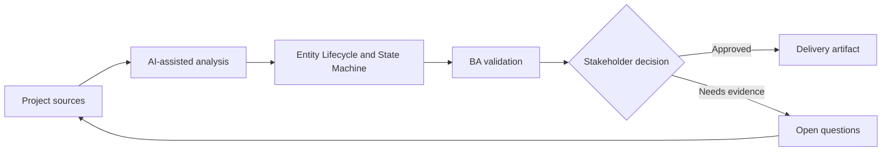

# Entity Lifecycle and State Machine

<div class="case-meta">
  <span>Data and Integration</span>
  <span>Entity lifecycle</span>
  <span>Project use case</span>
</div>

## Project context

A subscription entity moves through trial, active, suspended, cancelled, expired, and reactivated states. Teams disagree about allowed transitions and what events trigger each change. In a real delivery environment, this work usually appears under time pressure: stakeholders want clarity, delivery needs a backlog, QA needs testable behavior, and operations needs a process that can survive exceptions. The BA uses AI here to accelerate analysis and synthesis, but the BA remains accountable for evidence, business meaning, stakeholder decisioning, and artifact quality.

## BA challenge

The BA must specify lifecycle states and transitions so UI, backend, API, reporting, billing, and support share the same model. The practical difficulty is that AI can make early material look more complete than it is. A strong BA keeps the output reviewable by separating source-backed facts, assumptions, unsupported claims, decision gaps, and recommended next actions. The objective is not to make the document longer; it is to make the project decision clearer and safer.

## Where AI fits

<div class="ba-workbench-panel">
AI is useful in this use case when it is constrained to analysis support, pattern detection, structured drafting, and critique. It should not approve scope, invent policy, decide business trade-offs, or replace accountable stakeholder judgment.
</div>

- Generate state machine from process notes.
- Identify missing transitions, invalid transitions, and terminal states.
- Draft transition rules and event triggers.
- Create test scenarios by state and transition.

## Inputs to prepare

- Lifecycle notes
- Billing rules
- Support scripts
- API events
- Reporting definitions

A BA should label these inputs before using AI: source owner, source date, approval status, sensitivity level, and whether the source is fact, opinion, policy, draft, or historical evidence. This preparation prevents the model from treating every input as equally current and authoritative.

## BA workflow

1. List all known states and synonyms used by teams.
2. Ask AI to propose state machine and transition gaps.
3. Define allowed transition, trigger, actor, validation, audit, and side effects.
4. Review downstream impact on UI, billing, reporting, and notifications.
5. Write acceptance criteria for valid and invalid transitions.
6. Publish lifecycle model and update glossary.

The workflow works best as a staged AI collaboration: first organize the evidence, then ask for analysis, then create the artifact, then run a critique pass. The BA should keep a visible decision log throughout the process so that AI-generated suggestions do not silently become approved scope.

## Diagram



## Deliverables

| Deliverable | What it contains | Owner | Done signal |
| --- | --- | --- | --- |
| State model | State, definition, entry rule, exit rule, and terminal status | BA | States have shared meaning |
| Transition table | From, to, trigger, actor, validation, side effect, and audit | Backend and BA | Transitions are enforceable |
| Impact map | State impact on UI, API, billing, reporting, and support | Product owner | Downstream behavior is aligned |
| Transition test set | Valid transition, invalid transition, and edge case | QA | State machine is testable |

These deliverables should be treated as BA-owned artifacts. AI can draft them, but the BA must validate source support, stakeholder meaning, traceability, and whether the artifact is ready for handoff.

## Prompt to try

```text
Act as a senior AI-aware Business Analyst. Help me apply the "Entity Lifecycle and State Machine" use case to my project. First ask for source evidence and constraints. Then create a structured analysis with project context, assumptions, AI-fit boundary, workflow steps, deliverables, risks, controls, open questions, and stakeholder decisions. Do not invent policy, thresholds, or approvals.
```

## Review checklist

- Every AI-produced statement is tied to a source, assumption, or validation question.
- The BA has separated drafting assistance from business approval.
- Workflow steps identify the human owner for decisions, review, and exceptions.
- Deliverables are traceable to project inputs and can be reviewed by QA, product, or operations.
- Risk controls are practical enough to be used in a real project meeting.
- Success metric: Lifecycle behavior is shared across UI, backend, APIs, reporting, and operations.

## Risks and controls

| Risk | Why it matters | BA control |
| --- | --- | --- |
| State synonym confusion | Different teams may use different names for same state | Create glossary and state definitions |
| Invalid transition | System may allow impossible lifecycle moves | Define and test invalid transitions |
| Side-effect gap | Notifications or billing may not update | Map downstream impact |
| Reporting mismatch | Reports may count states differently | Align reporting definitions to state model |

The key control is to make uncertainty visible. If evidence is weak, the output should create a validation question or decision item, not a final requirement. If the artifact influences delivery, release, compliance, customer experience, or operational workload, the BA should require explicit human review before handoff.
