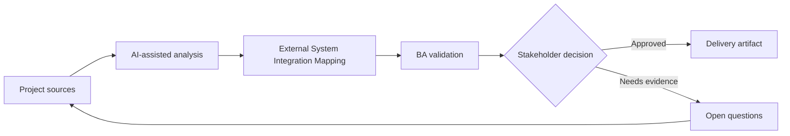

# External System Integration Mapping

<div class="case-meta">
  <span>Data and Integration</span>
  <span>External integrations</span>
  <span>Data and integration</span>
  <span>Advanced</span>
  <span>Integration inventory</span>
  <span>Project use case</span>
</div>

## Project context

A platform integrates with a tax provider, CRM, payment gateway, and document verification service. Each system has its own data model, SLA, authentication, and error behavior. In External integrations, this work usually starts when data movement, mapping, reconciliation, privacy, and lineage decisions affect multiple systems and owners. The BA should treat System context diagram and Provider docs as evidence to organize, not as raw material for an unconstrained AI answer. The goal is to make the next decision clearer for the people who own the outcome.

## BA challenge

The BA must map integration behavior end to end so teams know what data moves, why it moves, when it moves, what can fail, and who owns each failure. For External System Integration Mapping, the practical difficulty is silent data loss and weak lineage. AI can accelerate field mapping, rule comparison, reconciliation design, lineage review, and exception analysis, but the BA must still expose assumptions, missing approvals, and the point where stakeholder judgment is required.

## Where AI fits

<div class="ba-workbench-panel">
AI fits this Data and Integration use case when it is constrained to field mapping, rule comparison, reconciliation design, lineage review, and exception analysis. A useful first AI task is: Generate integration context diagrams and dependency questions. AI should not approve scope, invent policy, bypass source schemas, sample payloads, mapping rules, data-quality reports, and ownership matrix, or turn a draft into a final decision.
</div>

- Generate integration context diagrams and dependency questions.
- Identify data mapping, auth, SLA, and failure behavior gaps.
- Draft integration scenario matrix.
- Create operational support and escalation requirements.

## Inputs to prepare

- System context diagram
- Provider docs
- Data mapping drafts
- SLA commitments
- Support process

Before prompting for External System Integration Mapping, label each input by owner, date, approval status, sensitivity, and role in the decision. The most important evidence lens is source schemas, sample payloads, mapping rules, data-quality reports, and ownership matrix; without it, AI may rank old notes, draft designs, and approved rules as if they had equal authority.

## BA workflow

1. Create system context map and integration inventory.
2. Ask AI to generate questions for data, auth, SLA, errors, retries, and support.
3. Define integration scenarios for success, failure, timeout, duplicate, and provider outage.
4. Map ownership across internal and external teams.
5. Review data privacy and contractual obligations.
6. Publish integration requirements and operational escalation paths.

Run the workflow as data contract review before integration build: start with "Create system context map and integration inventory.", then keep a visible decision log as the artifact moves toward Integration inventory. This prevents AI suggestions from silently becoming backlog, design, release, or operational commitments.

## Diagram



## Deliverables

| Deliverable | What it contains | Owner | Done signal |
| --- | --- | --- | --- |
| Integration inventory | System, purpose, data, auth, SLA, owner, and dependency | BA and architect | All integrations are visible |
| Scenario matrix | Success, failure, timeout, duplicate, retry, and provider outage behavior | BA | Failure behavior is defined |
| Data exchange map | Source, target, transform, frequency, and privacy classification | Data owner | Data movement is controlled |
| Escalation playbook | Issue, owner, provider contact, SLA, and support communication | Operations | Support can escalate |

Treat Integration inventory as a BA-owned data and integration control pack. AI may draft structure, but the BA must validate whether "All integrations are visible" is actually true, whether the artifact is traceable to source evidence, and whether the receiving team can act on it.

## Prompt to try

```text
Act as a senior AI-aware Business Analyst. Help me apply the "External System Integration Mapping" use case to my project. First ask for source evidence and constraints. Then create a structured analysis with project context, assumptions, AI-fit boundary, workflow steps, deliverables, risks, controls, open questions, and stakeholder decisions. Do not invent policy, thresholds, or approvals.
```

## Review checklist

- System context diagram is labeled with owner, date, approval status, and sensitivity.
- Integration inventory traces to source evidence and has a named human owner.
- The AI task stays inside field mapping, rule comparison, reconciliation design, lineage review, and exception analysis and does not approve scope or policy.
- The "Dependency opacity" risk has a practical control: Map dependencies and owners.
- Open assumptions are converted into validation questions or stakeholder decisions.
- Success metric: External integrations have clear data, failure, ownership, and escalation behavior.

## Risks and controls

| Risk | Why it matters | BA control |
| --- | --- | --- |
| Dependency opacity | Teams may not understand external failure impact | Map dependencies and owners |
| Provider behavior mismatch | Provider errors may not match internal expectations | Review provider docs and scenarios |
| Data privacy issue | External systems receive sensitive data | Classify data and review contract |
| Escalation delay | Incidents stall without owner | Define escalation playbook |

The main control for the "Dependency opacity" risk is explicit human accountability: Map dependencies and owners. If evidence is weak, the output should create a validation question or decision item, not a final requirement.
