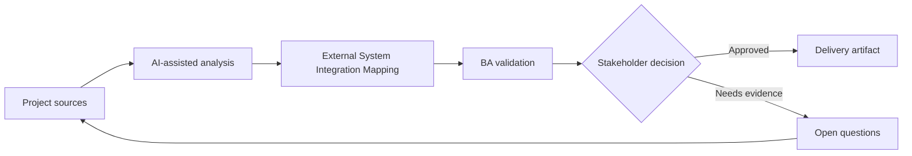

# External System Integration Mapping

<div class="case-meta">
  <span>Data and Integration</span>
  <span>External integrations</span>
  <span>Project use case</span>
</div>

## Project context

A platform integrates with a tax provider, CRM, payment gateway, and document verification service. Each system has its own data model, SLA, authentication, and error behavior. In a real delivery environment, this work usually appears under time pressure: stakeholders want clarity, delivery needs a backlog, QA needs testable behavior, and operations needs a process that can survive exceptions. The BA uses AI here to accelerate analysis and synthesis, but the BA remains accountable for evidence, business meaning, stakeholder decisioning, and artifact quality.

## BA challenge

The BA must map integration behavior end to end so teams know what data moves, why it moves, when it moves, what can fail, and who owns each failure. The practical difficulty is that AI can make early material look more complete than it is. A strong BA keeps the output reviewable by separating source-backed facts, assumptions, unsupported claims, decision gaps, and recommended next actions. The objective is not to make the document longer; it is to make the project decision clearer and safer.

## Where AI fits

<div class="ba-workbench-panel">
AI is useful in this use case when it is constrained to analysis support, pattern detection, structured drafting, and critique. It should not approve scope, invent policy, decide business trade-offs, or replace accountable stakeholder judgment.
</div>

- Generate integration context diagrams and dependency questions.
- Identify data mapping, auth, SLA, and failure behavior gaps.
- Draft integration scenario matrix.
- Create operational support and escalation requirements.

## Inputs to prepare

- System context diagram
- Provider docs
- Data mapping drafts
- SLA commitments
- Support process

A BA should label these inputs before using AI: source owner, source date, approval status, sensitivity level, and whether the source is fact, opinion, policy, draft, or historical evidence. This preparation prevents the model from treating every input as equally current and authoritative.

## BA workflow

1. Create system context map and integration inventory.
2. Ask AI to generate questions for data, auth, SLA, errors, retries, and support.
3. Define integration scenarios for success, failure, timeout, duplicate, and provider outage.
4. Map ownership across internal and external teams.
5. Review data privacy and contractual obligations.
6. Publish integration requirements and operational escalation paths.

The workflow works best as a staged AI collaboration: first organize the evidence, then ask for analysis, then create the artifact, then run a critique pass. The BA should keep a visible decision log throughout the process so that AI-generated suggestions do not silently become approved scope.

## Diagram



## Deliverables

| Deliverable | What it contains | Owner | Done signal |
| --- | --- | --- | --- |
| Integration inventory | System, purpose, data, auth, SLA, owner, and dependency | BA and architect | All integrations are visible |
| Scenario matrix | Success, failure, timeout, duplicate, retry, and provider outage behavior | BA | Failure behavior is defined |
| Data exchange map | Source, target, transform, frequency, and privacy classification | Data owner | Data movement is controlled |
| Escalation playbook | Issue, owner, provider contact, SLA, and support communication | Operations | Support can escalate |

These deliverables should be treated as BA-owned artifacts. AI can draft them, but the BA must validate source support, stakeholder meaning, traceability, and whether the artifact is ready for handoff.

## Prompt to try

```text
Act as a senior AI-aware Business Analyst. Help me apply the "External System Integration Mapping" use case to my project. First ask for source evidence and constraints. Then create a structured analysis with project context, assumptions, AI-fit boundary, workflow steps, deliverables, risks, controls, open questions, and stakeholder decisions. Do not invent policy, thresholds, or approvals.
```

## Review checklist

- Every AI-produced statement is tied to a source, assumption, or validation question.
- The BA has separated drafting assistance from business approval.
- Workflow steps identify the human owner for decisions, review, and exceptions.
- Deliverables are traceable to project inputs and can be reviewed by QA, product, or operations.
- Risk controls are practical enough to be used in a real project meeting.
- Success metric: External integrations have clear data, failure, ownership, and escalation behavior.

## Risks and controls

| Risk | Why it matters | BA control |
| --- | --- | --- |
| Dependency opacity | Teams may not understand external failure impact | Map dependencies and owners |
| Provider behavior mismatch | Provider errors may not match internal expectations | Review provider docs and scenarios |
| Data privacy issue | External systems receive sensitive data | Classify data and review contract |
| Escalation delay | Incidents stall without owner | Define escalation playbook |

The key control is to make uncertainty visible. If evidence is weak, the output should create a validation question or decision item, not a final requirement. If the artifact influences delivery, release, compliance, customer experience, or operational workload, the BA should require explicit human review before handoff.
