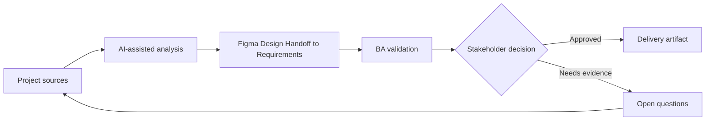

# Figma Design Handoff to Requirements

<div class="case-meta">
  <span>Frontend, UI, and UX</span>
  <span>Design handoff</span>
  <span>Project use case</span>
</div>

## Project context

A product designer shares a Figma file for a customer self-service dashboard. Developers ask for behavior rules because the design shows frames but not permissions, states, API dependencies, or analytics events. In a real delivery environment, this work usually appears under time pressure: stakeholders want clarity, delivery needs a backlog, QA needs testable behavior, and operations needs a process that can survive exceptions. The BA uses AI here to accelerate analysis and synthesis, but the BA remains accountable for evidence, business meaning, stakeholder decisioning, and artifact quality.

## BA challenge

The BA must translate visual design into buildable requirements without flattening UX intent. The BA needs to capture screen purpose, user actions, dynamic states, data dependencies, empty and error states, and what must be validated with product, UX, frontend, backend, and QA. The practical difficulty is that AI can make early material look more complete than it is. A strong BA keeps the output reviewable by separating source-backed facts, assumptions, unsupported claims, decision gaps, and recommended next actions. The objective is not to make the document longer; it is to make the project decision clearer and safer.

## Where AI fits

<div class="ba-workbench-panel">
AI is useful in this use case when it is constrained to analysis support, pattern detection, structured drafting, and critique. It should not approve scope, invent policy, decide business trade-offs, or replace accountable stakeholder judgment.
</div>

- Extract screens, components, actions, and state gaps from Figma notes.
- Generate a UI behavior matrix for normal, empty, loading, error, and permission states.
- Draft questions for UX, frontend, backend, analytics, and QA.
- Critique the handoff for missing data, validation, and interaction rules.

## Inputs to prepare

- Figma frames and design annotations
- User flow or journey map
- Component library rules
- Permission matrix
- Known API or data source notes

A BA should label these inputs before using AI: source owner, source date, approval status, sensitivity level, and whether the source is fact, opinion, policy, draft, or historical evidence. This preparation prevents the model from treating every input as equally current and authoritative.

## BA workflow

1. Inventory every screen, component, action, and visible data element.
2. Ask AI to turn the design into a behavior matrix with state coverage.
3. Review generated behavior against UX intent and product rules.
4. Identify backend data dependencies and unresolved API questions.
5. Add acceptance criteria for state, copy, validation, accessibility, and analytics.
6. Run a handoff review with UX, frontend, backend, QA, and product owners.

The workflow works best as a staged AI collaboration: first organize the evidence, then ask for analysis, then create the artifact, then run a critique pass. The BA should keep a visible decision log throughout the process so that AI-generated suggestions do not silently become approved scope.

## Diagram



## Deliverables

| Deliverable | What it contains | Owner | Done signal |
| --- | --- | --- | --- |
| UI behavior matrix | Screen, component, trigger, state, rule, data source, and owner | BA | Developers can implement without guessing state behavior |
| Design gap register | Missing copy, data, permission, validation, and interaction rules | BA and UX | Every gap has an owner |
| Frontend acceptance criteria | Given-When-Then criteria for UI states and interactions | BA and QA | QA can test screen behavior |
| API dependency list | Data fields, source endpoint, loading behavior, and fallback | Backend lead | Backend questions are visible before build |

These deliverables should be treated as BA-owned artifacts. AI can draft them, but the BA must validate source support, stakeholder meaning, traceability, and whether the artifact is ready for handoff.

## Prompt to try

```text
Act as a senior AI-aware Business Analyst. Help me apply the "Figma Design Handoff to Requirements" use case to my project. First ask for source evidence and constraints. Then create a structured analysis with project context, assumptions, AI-fit boundary, workflow steps, deliverables, risks, controls, open questions, and stakeholder decisions. Do not invent policy, thresholds, or approvals.
```

## Review checklist

- Every AI-produced statement is tied to a source, assumption, or validation question.
- The BA has separated drafting assistance from business approval.
- Workflow steps identify the human owner for decisions, review, and exceptions.
- Deliverables are traceable to project inputs and can be reviewed by QA, product, or operations.
- Risk controls are practical enough to be used in a real project meeting.
- Success metric: The design handoff becomes a testable UI specification with clear state behavior and backend dependencies.

## Risks and controls

| Risk | Why it matters | BA control |
| --- | --- | --- |
| Design-only handoff | Frames may look complete while behavior is missing | Require behavior matrix and state coverage |
| UX intent loss | Developers may implement layout but miss decision logic | Record screen purpose and user goal |
| Backend surprise | UI fields may need data not available from API | Create API dependency list early |
| QA ambiguity | QA may not know expected behavior for empty or error states | Add acceptance criteria for every state |

The key control is to make uncertainty visible. If evidence is weak, the output should create a validation question or decision item, not a final requirement. If the artifact influences delivery, release, compliance, customer experience, or operational workload, the BA should require explicit human review before handoff.
