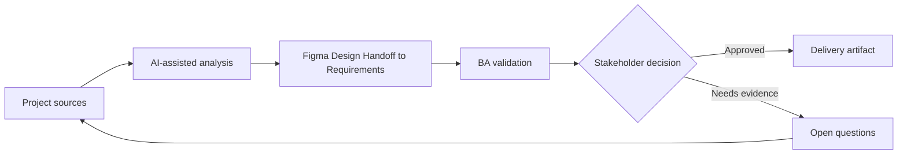

# Figma Design Handoff to Requirements

<div class="case-meta">
  <span>Frontend, UI, and UX</span>
  <span>Design handoff</span>
  <span>Frontend/UI refinement</span>
  <span>Practitioner</span>
  <span>UI behavior matrix</span>
  <span>Project use case</span>
</div>

## Project context

A product designer shares a Figma file for a customer self-service dashboard. Developers ask for behavior rules because the design shows frames but not permissions, states, API dependencies, or analytics events. In Design handoff, this work usually starts when screen behavior, accessibility, design states, analytics, and user feedback must become implementable requirements. The BA should treat Figma frames and design annotations and User flow or journey map as evidence to organize, not as raw material for an unconstrained AI answer. The goal is to make the next decision clearer for the people who own the outcome.

## BA challenge

The BA must translate visual design into buildable requirements without flattening UX intent. The BA needs to capture screen purpose, user actions, dynamic states, data dependencies, empty and error states, and what must be validated with product, UX, frontend, backend, and QA. For Figma Design Handoff to Requirements, the practical difficulty is missing states and unmeasurable UX. AI can accelerate UI-state analysis, content critique, accessibility review, event taxonomy, and edge-case discovery, but the BA must still expose assumptions, missing approvals, and the point where stakeholder judgment is required.

## Where AI fits

<div class="ba-workbench-panel">
AI fits this Frontend, UI, and UX use case when it is constrained to UI-state analysis, content critique, accessibility review, event taxonomy, and edge-case discovery. A useful first AI task is: Extract screens, components, actions, and state gaps from Figma notes. AI should not approve scope, invent policy, bypass wireframes, design tokens, user journeys, analytics questions, and accessibility expectations, or turn a draft into a final decision.
</div>

- Extract screens, components, actions, and state gaps from Figma notes.
- Generate a UI behavior matrix for normal, empty, loading, error, and permission states.
- Draft questions for UX, frontend, backend, analytics, and QA.
- Critique the handoff for missing data, validation, and interaction rules.

## Inputs to prepare

- Figma frames and design annotations
- User flow or journey map
- Component library rules
- Permission matrix
- Known API or data source notes

Before prompting for Figma Design Handoff to Requirements, label each input by owner, date, approval status, sensitivity, and role in the decision. The most important evidence lens is wireframes, design tokens, user journeys, analytics questions, and accessibility expectations; without it, AI may rank old notes, draft designs, and approved rules as if they had equal authority.

## BA workflow

1. Inventory every screen, component, action, and visible data element.
2. Ask AI to turn the design into a behavior matrix with state coverage.
3. Review generated behavior against UX intent and product rules.
4. Identify backend data dependencies and unresolved API questions.
5. Add acceptance criteria for state, copy, validation, accessibility, and analytics.
6. Run a handoff review with UX, frontend, backend, QA, and product owners.

Run the workflow as screen-state review before frontend build: start with "Inventory every screen, component, action, and visible data element.", then keep a visible decision log as the artifact moves toward UI behavior matrix. This prevents AI suggestions from silently becoming backlog, design, release, or operational commitments.

## Diagram



## Deliverables

| Deliverable | What it contains | Owner | Done signal |
| --- | --- | --- | --- |
| UI behavior matrix | Screen, component, trigger, state, rule, data source, and owner | BA | Developers can implement without guessing state behavior |
| Design gap register | Missing copy, data, permission, validation, and interaction rules | BA and UX | Every gap has an owner |
| Frontend acceptance criteria | Given-When-Then criteria for UI states and interactions | BA and QA | QA can test screen behavior |
| API dependency list | Data fields, source endpoint, loading behavior, and fallback | Backend lead | Backend questions are visible before build |

Treat UI behavior matrix as a BA-owned frontend requirement specification. AI may draft structure, but the BA must validate whether "Developers can implement without guessing state behavior" is actually true, whether the artifact is traceable to source evidence, and whether the receiving team can act on it.

## Prompt to try

```text
Act as a senior AI-aware Business Analyst. Help me apply the "Figma Design Handoff to Requirements" use case to my project. First ask for source evidence and constraints. Then create a structured analysis with project context, assumptions, AI-fit boundary, workflow steps, deliverables, risks, controls, open questions, and stakeholder decisions. Do not invent policy, thresholds, or approvals.
```

## Review checklist

- Figma frames and design annotations is labeled with owner, date, approval status, and sensitivity.
- UI behavior matrix traces to source evidence and has a named human owner.
- The AI task stays inside UI-state analysis, content critique, accessibility review, event taxonomy, and edge-case discovery and does not approve scope or policy.
- The "Design-only handoff" risk has a practical control: Require behavior matrix and state coverage.
- Open assumptions are converted into validation questions or stakeholder decisions.
- Success metric: The design handoff becomes a testable UI specification with clear state behavior and backend dependencies.

## Risks and controls

| Risk | Why it matters | BA control |
| --- | --- | --- |
| Design-only handoff | Frames may look complete while behavior is missing | Require behavior matrix and state coverage |
| UX intent loss | Developers may implement layout but miss decision logic | Record screen purpose and user goal |
| Backend surprise | UI fields may need data not available from API | Create API dependency list early |
| QA ambiguity | QA may not know expected behavior for empty or error states | Add acceptance criteria for every state |

The main control for the "Design-only handoff" risk is explicit human accountability: Require behavior matrix and state coverage. If evidence is weak, the output should create a validation question or decision item, not a final requirement.
