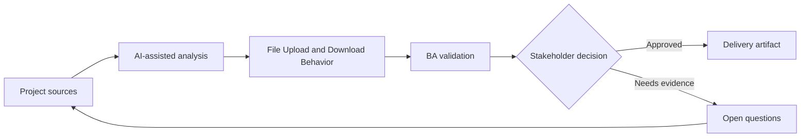

# File Upload and Download Behavior

<div class="case-meta">
  <span>Data and Integration</span>
  <span>Files and documents</span>
  <span>Project use case</span>
</div>

## Project context

A document portal lets customers upload contracts, certificates, and evidence files. Users need progress, validation, virus scanning, preview, download permissions, and failure recovery. In a real delivery environment, this work usually appears under time pressure: stakeholders want clarity, delivery needs a backlog, QA needs testable behavior, and operations needs a process that can survive exceptions. The BA uses AI here to accelerate analysis and synthesis, but the BA remains accountable for evidence, business meaning, stakeholder decisioning, and artifact quality.

## BA challenge

The BA must specify file behavior across UI, backend, storage, security, and operations. File handling includes size, type, scan, retention, access, preview, versioning, and error recovery. The practical difficulty is that AI can make early material look more complete than it is. A strong BA keeps the output reviewable by separating source-backed facts, assumptions, unsupported claims, decision gaps, and recommended next actions. The objective is not to make the document longer; it is to make the project decision clearer and safer.

## Where AI fits

<div class="ba-workbench-panel">
AI is useful in this use case when it is constrained to analysis support, pattern detection, structured drafting, and critique. It should not approve scope, invent policy, decide business trade-offs, or replace accountable stakeholder judgment.
</div>

- Generate file handling requirement checklist.
- Identify validation, scanning, storage, and permission gaps.
- Draft upload/download state matrix.
- Create QA scenarios for large files, bad files, and permission cases.

## Inputs to prepare

- Document type list
- Storage policy
- Security scanning rules
- UI design
- Access control requirements

A BA should label these inputs before using AI: source owner, source date, approval status, sensitivity level, and whether the source is fact, opinion, policy, draft, or historical evidence. This preparation prevents the model from treating every input as equally current and authoritative.

## BA workflow

1. List document types, allowed formats, size limits, and required metadata.
2. Ask AI to generate upload/download state and error scenarios.
3. Define validation, scan, quarantine, preview, versioning, and retention behavior.
4. Review access rules for upload, view, download, replace, and delete.
5. Write acceptance criteria for progress, failure, retry, and permission states.
6. Create support and operational requirements for infected or failed files.

The workflow works best as a staged AI collaboration: first organize the evidence, then ask for analysis, then create the artifact, then run a critique pass. The BA should keep a visible decision log throughout the process so that AI-generated suggestions do not silently become approved scope.

## Diagram



## Deliverables

| Deliverable | What it contains | Owner | Done signal |
| --- | --- | --- | --- |
| File behavior matrix | Action, state, validation, scan, permission, message, and owner | BA | File states are explicit |
| Document type rule table | Type, allowed formats, size, metadata, retention, and source | Compliance | Rules are source-backed |
| Access control matrix | Role, upload, view, download, replace, delete, and audit | Security | File permissions are testable |
| File QA scenario set | Large, invalid, infected, retry, permission, preview, and download cases | QA | File behavior is covered |

These deliverables should be treated as BA-owned artifacts. AI can draft them, but the BA must validate source support, stakeholder meaning, traceability, and whether the artifact is ready for handoff.

## Prompt to try

```text
Act as a senior AI-aware Business Analyst. Help me apply the "File Upload and Download Behavior" use case to my project. First ask for source evidence and constraints. Then create a structured analysis with project context, assumptions, AI-fit boundary, workflow steps, deliverables, risks, controls, open questions, and stakeholder decisions. Do not invent policy, thresholds, or approvals.
```

## Review checklist

- Every AI-produced statement is tied to a source, assumption, or validation question.
- The BA has separated drafting assistance from business approval.
- Workflow steps identify the human owner for decisions, review, and exceptions.
- Deliverables are traceable to project inputs and can be reviewed by QA, product, or operations.
- Risk controls are practical enough to be used in a real project meeting.
- Success metric: File handling is safe, recoverable, permission-aware, and testable across UI and backend.

## Risks and controls

| Risk | Why it matters | BA control |
| --- | --- | --- |
| Unsafe file | Malicious files may be stored or downloaded | Specify scanning and quarantine |
| Permission leakage | Users may download files they should not see | Define role-based access and audit |
| Upload frustration | Users may lose progress without recovery | Specify progress, retry, and error messages |
| Retention miss | Files may be kept too long or deleted too early | Define retention by document type |

The key control is to make uncertainty visible. If evidence is weak, the output should create a validation question or decision item, not a final requirement. If the artifact influences delivery, release, compliance, customer experience, or operational workload, the BA should require explicit human review before handoff.
