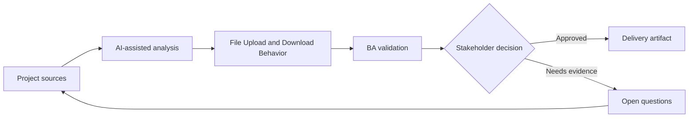

# File Upload and Download Behavior

<div class="case-meta">
  <span>Data and Integration</span>
  <span>Files and documents</span>
  <span>Project use case</span>
</div>

## Project context

A document portal lets customers upload contracts, certificates, and evidence files. Users need progress, validation, virus scanning, preview, download permissions, and failure recovery. In Files and documents, this work usually starts when data movement, mapping, reconciliation, privacy, and lineage decisions affect multiple systems and owners. The BA should treat Document type list and Storage policy as evidence to organize, not as raw material for an unconstrained AI answer. The goal is to make the next decision clearer for the people who own the outcome.

## BA challenge

The BA must specify file behavior across UI, backend, storage, security, and operations. File handling includes size, type, scan, retention, access, preview, versioning, and error recovery. For File Upload and Download Behavior, the practical difficulty is silent data loss and weak lineage. AI can accelerate field mapping, rule comparison, reconciliation design, lineage review, and exception analysis, but the BA must still expose assumptions, missing approvals, and the point where stakeholder judgment is required.

## Where AI fits

<div class="ba-workbench-panel">
AI fits this Data and Integration use case when it is constrained to field mapping, rule comparison, reconciliation design, lineage review, and exception analysis. A useful first AI task is: Generate file handling requirement checklist. AI should not approve scope, invent policy, bypass source schemas, sample payloads, mapping rules, data-quality reports, and ownership matrix, or turn a draft into a final decision.
</div>

- Generate file handling requirement checklist.
- Identify validation, scanning, storage, and permission gaps.
- Draft upload/download state matrix.
- Create QA scenarios for large files, bad files, and permission cases.

## Inputs to prepare

- Document type list
- Storage policy
- Security scanning rules
- UI design
- Access control requirements

Before prompting for File Upload and Download Behavior, label each input by owner, date, approval status, sensitivity, and role in the decision. The most important evidence lens is source schemas, sample payloads, mapping rules, data-quality reports, and ownership matrix; without it, AI may rank old notes, draft designs, and approved rules as if they had equal authority.

## BA workflow

1. List document types, allowed formats, size limits, and required metadata.
2. Ask AI to generate upload/download state and error scenarios.
3. Define validation, scan, quarantine, preview, versioning, and retention behavior.
4. Review access rules for upload, view, download, replace, and delete.
5. Write acceptance criteria for progress, failure, retry, and permission states.
6. Create support and operational requirements for infected or failed files.

Run the workflow as data contract review before integration build: start with "List document types, allowed formats, size limits, and required metadata.", then keep a visible decision log as the artifact moves toward File behavior matrix. This prevents AI suggestions from silently becoming backlog, design, release, or operational commitments.

## Diagram



## Deliverables

| Deliverable | What it contains | Owner | Done signal |
| --- | --- | --- | --- |
| File behavior matrix | Action, state, validation, scan, permission, message, and owner | BA | File states are explicit |
| Document type rule table | Type, allowed formats, size, metadata, retention, and source | Compliance | Rules are source-backed |
| Access control matrix | Role, upload, view, download, replace, delete, and audit | Security | File permissions are testable |
| File QA scenario set | Large, invalid, infected, retry, permission, preview, and download cases | QA | File behavior is covered |

Treat File behavior matrix as a BA-owned data and integration control pack. AI may draft structure, but the BA must validate whether "File states are explicit" is actually true, whether the artifact is traceable to source evidence, and whether the receiving team can act on it.

## Prompt to try

```text
Act as a senior AI-aware Business Analyst. Help me apply the "File Upload and Download Behavior" use case to my project. First ask for source evidence and constraints. Then create a structured analysis with project context, assumptions, AI-fit boundary, workflow steps, deliverables, risks, controls, open questions, and stakeholder decisions. Do not invent policy, thresholds, or approvals.
```

## Review checklist

- Document type list is labeled with owner, date, approval status, and sensitivity.
- File behavior matrix traces to source evidence and has a named human owner.
- The AI task stays inside field mapping, rule comparison, reconciliation design, lineage review, and exception analysis and does not approve scope or policy.
- The "Unsafe file" risk has a practical control: Specify scanning and quarantine.
- Open assumptions are converted into validation questions or stakeholder decisions.
- Success metric: File handling is safe, recoverable, permission-aware, and testable across UI and backend.

## Risks and controls

| Risk | Why it matters | BA control |
| --- | --- | --- |
| Unsafe file | Malicious files may be stored or downloaded | Specify scanning and quarantine |
| Permission leakage | Users may download files they should not see | Define role-based access and audit |
| Upload frustration | Users may lose progress without recovery | Specify progress, retry, and error messages |
| Retention miss | Files may be kept too long or deleted too early | Define retention by document type |

The main control for the "Unsafe file" risk is explicit human accountability: Specify scanning and quarantine. If evidence is weak, the output should create a validation question or decision item, not a final requirement.
