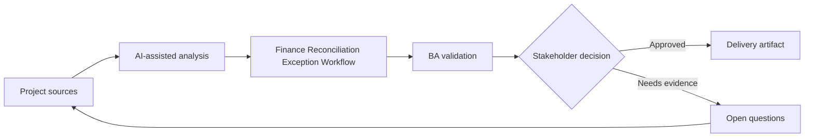

# Finance Reconciliation Exception Workflow

<div class="case-meta">
  <span>Domain project scenarios</span>
  <span>Finance operations</span>
  <span>Domain workflow</span>
  <span>Core</span>
  <span>Exception taxonomy</span>
  <span>Project use case</span>
</div>

## Project context

A finance operations team reconciles payments, invoices, and ledger entries. Exceptions are handled manually through spreadsheets, emails, and analyst judgment, causing delays and audit concerns. In Finance operations, this work usually starts when domain policies, operational exceptions, and regulatory expectations shape what the product can safely do. The BA should treat Exception logs and Reconciliation rules as evidence to organize, not as raw material for an unconstrained AI answer. The goal is to make the next decision clearer for the people who own the outcome.

## BA challenge

The BA must specify an exception workflow that classifies mismatch types, captures evidence, routes work, supports analyst decisions, and preserves auditability. AI can suggest matches or categories, but finance approval remains human-owned. For Finance Reconciliation Exception Workflow, the practical difficulty is policy hallucination and exception blindness. AI can accelerate domain-rule extraction, exception mapping, safe-message drafting, and owner review, but the BA must still expose assumptions, missing approvals, and the point where stakeholder judgment is required.

## Where AI fits

<div class="ba-workbench-panel">
AI fits this Domain project scenarios use case when it is constrained to domain-rule extraction, exception mapping, safe-message drafting, and owner review. A useful first AI task is: Cluster exception types and recurring mismatch patterns. AI should not approve scope, invent policy, bypass policy sources, operational samples, compliance constraints, and domain-owner decisions, or turn a draft into a final decision.
</div>

- Cluster exception types and recurring mismatch patterns.
- Draft analyst work queue requirements.
- Generate evidence capture and decision reason codes.
- Create human review and audit trail requirements.

## Inputs to prepare

- Exception logs
- Reconciliation rules
- Invoice and payment data definitions
- Audit requirements
- Analyst SOPs

Before prompting for Finance Reconciliation Exception Workflow, label each input by owner, date, approval status, sensitivity, and role in the decision. The most important evidence lens is policy sources, operational samples, compliance constraints, and domain-owner decisions; without it, AI may rank old notes, draft designs, and approved rules as if they had equal authority.

## BA workflow

1. Analyze exception history and classify mismatch categories.
2. Ask AI to propose routing rules and decision support fields.
3. Define evidence needed for each exception type.
4. Specify analyst actions: match, split, escalate, write off, or request information.
5. Design audit trail, approval, and segregation-of-duty requirements.
6. Create metrics for aging, resolution, override, and repeat exception patterns.

Run the workflow as domain validation before implementation detail: start with "Analyze exception history and classify mismatch categories.", then keep a visible decision log as the artifact moves toward Exception taxonomy. This prevents AI suggestions from silently becoming backlog, design, release, or operational commitments.

## Diagram



## Deliverables

| Deliverable | What it contains | Owner | Done signal |
| --- | --- | --- | --- |
| Exception taxonomy | Mismatch type, example, root cause, owner, and priority | Finance operations | Analysts share common language |
| Work queue specification | Routing, priority, SLA, status, and assignment rules | BA | Exceptions move predictably |
| Decision reason codes | Allowed actions, evidence, approval, and audit need | Finance controller | Decisions are explainable |
| Monitoring metrics | Aging, resolution, repeat exception, and override trends | Operations lead | Process health is visible |

Treat Exception taxonomy as a BA-owned domain-specific requirement pack. AI may draft structure, but the BA must validate whether "Analysts share common language" is actually true, whether the artifact is traceable to source evidence, and whether the receiving team can act on it.

## Prompt to try

```text
Act as a senior AI-aware Business Analyst. Help me apply the "Finance Reconciliation Exception Workflow" use case to my project. First ask for source evidence and constraints. Then create a structured analysis with project context, assumptions, AI-fit boundary, workflow steps, deliverables, risks, controls, open questions, and stakeholder decisions. Do not invent policy, thresholds, or approvals.
```

## Review checklist

- Exception logs is labeled with owner, date, approval status, and sensitivity.
- Exception taxonomy traces to source evidence and has a named human owner.
- The AI task stays inside domain-rule extraction, exception mapping, safe-message drafting, and owner review and does not approve scope or policy.
- The "Automated finance decision" risk has a practical control: Keep analyst approval and audit trail.
- Open assumptions are converted into validation questions or stakeholder decisions.
- Success metric: Exception resolution becomes faster while finance decisions remain controlled and auditable.

## Risks and controls

| Risk | Why it matters | BA control |
| --- | --- | --- |
| Automated finance decision | AI suggestions may be treated as approval | Keep analyst approval and audit trail |
| Poor taxonomy | Categories may not match real analyst work | Validate with exception samples |
| Audit weakness | Reason for resolution may be missing | Require evidence and reason codes |
| Segregation issue | Same user may create and approve adjustments | Define role controls and approvals |

The main control for the "Automated finance decision" risk is explicit human accountability: Keep analyst approval and audit trail. If evidence is weak, the output should create a validation question or decision item, not a final requirement.
