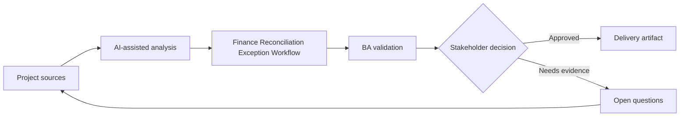

# Finance Reconciliation Exception Workflow

<div class="case-meta">
  <span>Domain project scenarios</span>
  <span>Finance operations</span>
  <span>Project use case</span>
</div>

## Project context

A finance operations team reconciles payments, invoices, and ledger entries. Exceptions are handled manually through spreadsheets, emails, and analyst judgment, causing delays and audit concerns. In a real delivery environment, this work usually appears under time pressure: stakeholders want clarity, delivery needs a backlog, QA needs testable behavior, and operations needs a process that can survive exceptions. The BA uses AI here to accelerate analysis and synthesis, but the BA remains accountable for evidence, business meaning, stakeholder decisioning, and artifact quality.

## BA challenge

The BA must specify an exception workflow that classifies mismatch types, captures evidence, routes work, supports analyst decisions, and preserves auditability. AI can suggest matches or categories, but finance approval remains human-owned. The practical difficulty is that AI can make early material look more complete than it is. A strong BA keeps the output reviewable by separating source-backed facts, assumptions, unsupported claims, decision gaps, and recommended next actions. The objective is not to make the document longer; it is to make the project decision clearer and safer.

## Where AI fits

<div class="ba-workbench-panel">
AI is useful in this use case when it is constrained to analysis support, pattern detection, structured drafting, and critique. It should not approve scope, invent policy, decide business trade-offs, or replace accountable stakeholder judgment.
</div>

- Cluster exception types and recurring mismatch patterns.
- Draft analyst work queue requirements.
- Generate evidence capture and decision reason codes.
- Create human review and audit trail requirements.

## Inputs to prepare

- Exception logs
- Reconciliation rules
- Invoice and payment data definitions
- Audit requirements
- Analyst SOPs

A BA should label these inputs before using AI: source owner, source date, approval status, sensitivity level, and whether the source is fact, opinion, policy, draft, or historical evidence. This preparation prevents the model from treating every input as equally current and authoritative.

## BA workflow

1. Analyze exception history and classify mismatch categories.
2. Ask AI to propose routing rules and decision support fields.
3. Define evidence needed for each exception type.
4. Specify analyst actions: match, split, escalate, write off, or request information.
5. Design audit trail, approval, and segregation-of-duty requirements.
6. Create metrics for aging, resolution, override, and repeat exception patterns.

The workflow works best as a staged AI collaboration: first organize the evidence, then ask for analysis, then create the artifact, then run a critique pass. The BA should keep a visible decision log throughout the process so that AI-generated suggestions do not silently become approved scope.

## Diagram



## Deliverables

| Deliverable | What it contains | Owner | Done signal |
| --- | --- | --- | --- |
| Exception taxonomy | Mismatch type, example, root cause, owner, and priority | Finance operations | Analysts share common language |
| Work queue specification | Routing, priority, SLA, status, and assignment rules | BA | Exceptions move predictably |
| Decision reason codes | Allowed actions, evidence, approval, and audit need | Finance controller | Decisions are explainable |
| Monitoring metrics | Aging, resolution, repeat exception, and override trends | Operations lead | Process health is visible |

These deliverables should be treated as BA-owned artifacts. AI can draft them, but the BA must validate source support, stakeholder meaning, traceability, and whether the artifact is ready for handoff.

## Prompt to try

```text
Act as a senior AI-aware Business Analyst. Help me apply the "Finance Reconciliation Exception Workflow" use case to my project. First ask for source evidence and constraints. Then create a structured analysis with project context, assumptions, AI-fit boundary, workflow steps, deliverables, risks, controls, open questions, and stakeholder decisions. Do not invent policy, thresholds, or approvals.
```

## Review checklist

- Every AI-produced statement is tied to a source, assumption, or validation question.
- The BA has separated drafting assistance from business approval.
- Workflow steps identify the human owner for decisions, review, and exceptions.
- Deliverables are traceable to project inputs and can be reviewed by QA, product, or operations.
- Risk controls are practical enough to be used in a real project meeting.
- Success metric: Exception resolution becomes faster while finance decisions remain controlled and auditable.

## Risks and controls

| Risk | Why it matters | BA control |
| --- | --- | --- |
| Automated finance decision | AI suggestions may be treated as approval | Keep analyst approval and audit trail |
| Poor taxonomy | Categories may not match real analyst work | Validate with exception samples |
| Audit weakness | Reason for resolution may be missing | Require evidence and reason codes |
| Segregation issue | Same user may create and approve adjustments | Define role controls and approvals |

The key control is to make uncertainty visible. If evidence is weak, the output should create a validation question or decision item, not a final requirement. If the artifact influences delivery, release, compliance, customer experience, or operational workload, the BA should require explicit human review before handoff.
