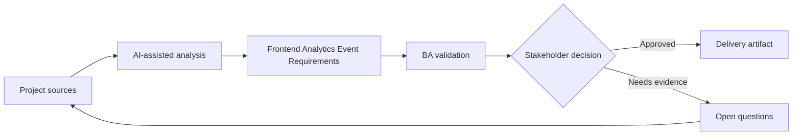

# Frontend Analytics Event Requirements

<div class="case-meta">
  <span>Frontend, UI, and UX</span>
  <span>Product analytics</span>
  <span>Project use case</span>
</div>

## Project context

Product wants to measure whether users complete a new onboarding flow. The team has screens and stories, but no clear event taxonomy, property definitions, funnel steps, or privacy controls. In a real delivery environment, this work usually appears under time pressure: stakeholders want clarity, delivery needs a backlog, QA needs testable behavior, and operations needs a process that can survive exceptions. The BA uses AI here to accelerate analysis and synthesis, but the BA remains accountable for evidence, business meaning, stakeholder decisioning, and artifact quality.

## BA challenge

The BA must define analytics as part of requirements so product decisions can be measured after release. Events must be meaningful, privacy-safe, technically feasible, and aligned with business questions. The practical difficulty is that AI can make early material look more complete than it is. A strong BA keeps the output reviewable by separating source-backed facts, assumptions, unsupported claims, decision gaps, and recommended next actions. The objective is not to make the document longer; it is to make the project decision clearer and safer.

## Where AI fits

<div class="ba-workbench-panel">
AI is useful in this use case when it is constrained to analysis support, pattern detection, structured drafting, and critique. It should not approve scope, invent policy, decide business trade-offs, or replace accountable stakeholder judgment.
</div>

- Generate event taxonomy from user flow and product questions.
- Identify missing event properties and privacy-sensitive fields.
- Draft funnel measurement and success metrics.
- Create QA checks for event firing and payload correctness.

## Inputs to prepare

- User flow
- Business questions
- Analytics platform constraints
- Privacy rules
- Screen behavior spec

A BA should label these inputs before using AI: source owner, source date, approval status, sensitivity level, and whether the source is fact, opinion, policy, draft, or historical evidence. This preparation prevents the model from treating every input as equally current and authoritative.

## BA workflow

1. Start with product questions and decisions the data must support.
2. Ask AI to propose event names, triggers, properties, and funnel steps.
3. Remove properties that expose sensitive data or duplicate existing events.
4. Review feasibility with frontend and analytics owners.
5. Add acceptance criteria for event trigger, payload, and non-trigger cases.
6. Create QA and monitoring checklist for analytics release.

The workflow works best as a staged AI collaboration: first organize the evidence, then ask for analysis, then create the artifact, then run a critique pass. The BA should keep a visible decision log throughout the process so that AI-generated suggestions do not silently become approved scope.

## Diagram



## Deliverables

| Deliverable | What it contains | Owner | Done signal |
| --- | --- | --- | --- |
| Analytics event spec | Event, trigger, property, data type, source, and privacy classification | BA and analytics owner | Events answer business questions |
| Funnel map | Step, event, success signal, drop-off question, and owner | Product owner | Flow measurement is clear |
| Privacy review list | Sensitive property, redaction, consent, and approval | Privacy owner | Events are safe |
| Analytics QA checklist | Trigger, payload, duplicate, non-trigger, and environment tests | QA | Instrumentation is testable |

These deliverables should be treated as BA-owned artifacts. AI can draft them, but the BA must validate source support, stakeholder meaning, traceability, and whether the artifact is ready for handoff.

## Prompt to try

```text
Act as a senior AI-aware Business Analyst. Help me apply the "Frontend Analytics Event Requirements" use case to my project. First ask for source evidence and constraints. Then create a structured analysis with project context, assumptions, AI-fit boundary, workflow steps, deliverables, risks, controls, open questions, and stakeholder decisions. Do not invent policy, thresholds, or approvals.
```

## Review checklist

- Every AI-produced statement is tied to a source, assumption, or validation question.
- The BA has separated drafting assistance from business approval.
- Workflow steps identify the human owner for decisions, review, and exceptions.
- Deliverables are traceable to project inputs and can be reviewed by QA, product, or operations.
- Risk controls are practical enough to be used in a real project meeting.
- Success metric: Frontend instrumentation produces decision-ready product data without violating privacy.

## Risks and controls

| Risk | Why it matters | BA control |
| --- | --- | --- |
| Vanity events | Events may not answer a decision question | Tie every event to a product question |
| PII exposure | Payload may include sensitive fields | Classify and redact properties |
| Duplicate firing | Metrics may inflate | Define exact trigger and QA checks |
| Missing funnel step | Drop-off cannot be diagnosed | Map funnel before implementation |

The key control is to make uncertainty visible. If evidence is weak, the output should create a validation question or decision item, not a final requirement. If the artifact influences delivery, release, compliance, customer experience, or operational workload, the BA should require explicit human review before handoff.
