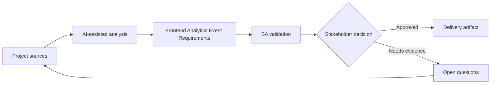

# Frontend Analytics Event Requirements

<div class="case-meta">
  <span>Frontend, UI, and UX</span>
  <span>Product analytics</span>
  <span>Frontend/UI refinement</span>
  <span>Practitioner</span>
  <span>Analytics event spec</span>
  <span>Project use case</span>
</div>

## Project context

Product wants to measure whether users complete a new onboarding flow. The team has screens and stories, but no clear event taxonomy, property definitions, funnel steps, or privacy controls. In Product analytics, this work usually starts when screen behavior, accessibility, design states, analytics, and user feedback must become implementable requirements. The BA should treat User flow and Business questions as evidence to organize, not as raw material for an unconstrained AI answer. The goal is to make the next decision clearer for the people who own the outcome.

## BA challenge

The BA must define analytics as part of requirements so product decisions can be measured after release. Events must be meaningful, privacy-safe, technically feasible, and aligned with business questions. For Frontend Analytics Event Requirements, the practical difficulty is missing states and unmeasurable UX. AI can accelerate UI-state analysis, content critique, accessibility review, event taxonomy, and edge-case discovery, but the BA must still expose assumptions, missing approvals, and the point where stakeholder judgment is required.

## Where AI fits

<div class="ba-workbench-panel">
AI fits this Frontend, UI, and UX use case when it is constrained to UI-state analysis, content critique, accessibility review, event taxonomy, and edge-case discovery. A useful first AI task is: Generate event taxonomy from user flow and product questions. AI should not approve scope, invent policy, bypass wireframes, design tokens, user journeys, analytics questions, and accessibility expectations, or turn a draft into a final decision.
</div>

- Generate event taxonomy from user flow and product questions.
- Identify missing event properties and privacy-sensitive fields.
- Draft funnel measurement and success metrics.
- Create QA checks for event firing and payload correctness.

## Inputs to prepare

- User flow
- Business questions
- Analytics platform constraints
- Privacy rules
- Screen behavior spec

Before prompting for Frontend Analytics Event Requirements, label each input by owner, date, approval status, sensitivity, and role in the decision. The most important evidence lens is wireframes, design tokens, user journeys, analytics questions, and accessibility expectations; without it, AI may rank old notes, draft designs, and approved rules as if they had equal authority.

## BA workflow

1. Start with product questions and decisions the data must support.
2. Ask AI to propose event names, triggers, properties, and funnel steps.
3. Remove properties that expose sensitive data or duplicate existing events.
4. Review feasibility with frontend and analytics owners.
5. Add acceptance criteria for event trigger, payload, and non-trigger cases.
6. Create QA and monitoring checklist for analytics release.

Run the workflow as screen-state review before frontend build: start with "Start with product questions and decisions the data must support.", then keep a visible decision log as the artifact moves toward Analytics event spec. This prevents AI suggestions from silently becoming backlog, design, release, or operational commitments.

## Diagram



## Deliverables

| Deliverable | What it contains | Owner | Done signal |
| --- | --- | --- | --- |
| Analytics event spec | Event, trigger, property, data type, source, and privacy classification | BA and analytics owner | Events answer business questions |
| Funnel map | Step, event, success signal, drop-off question, and owner | Product owner | Flow measurement is clear |
| Privacy review list | Sensitive property, redaction, consent, and approval | Privacy owner | Events are safe |
| Analytics QA checklist | Trigger, payload, duplicate, non-trigger, and environment tests | QA | Instrumentation is testable |

Treat Analytics event spec as a BA-owned frontend requirement specification. AI may draft structure, but the BA must validate whether "Events answer business questions" is actually true, whether the artifact is traceable to source evidence, and whether the receiving team can act on it.

## Prompt to try

```text
Act as a senior AI-aware Business Analyst. Help me apply the "Frontend Analytics Event Requirements" use case to my project. First ask for source evidence and constraints. Then create a structured analysis with project context, assumptions, AI-fit boundary, workflow steps, deliverables, risks, controls, open questions, and stakeholder decisions. Do not invent policy, thresholds, or approvals.
```

## Review checklist

- User flow is labeled with owner, date, approval status, and sensitivity.
- Analytics event spec traces to source evidence and has a named human owner.
- The AI task stays inside UI-state analysis, content critique, accessibility review, event taxonomy, and edge-case discovery and does not approve scope or policy.
- The "Vanity events" risk has a practical control: Tie every event to a product question.
- Open assumptions are converted into validation questions or stakeholder decisions.
- Success metric: Frontend instrumentation produces decision-ready product data without violating privacy.

## Risks and controls

| Risk | Why it matters | BA control |
| --- | --- | --- |
| Vanity events | Events may not answer a decision question | Tie every event to a product question |
| PII exposure | Payload may include sensitive fields | Classify and redact properties |
| Duplicate firing | Metrics may inflate | Define exact trigger and QA checks |
| Missing funnel step | Drop-off cannot be diagnosed | Map funnel before implementation |

The main control for the "Vanity events" risk is explicit human accountability: Tie every event to a product question. If evidence is weak, the output should create a validation question or decision item, not a final requirement.
