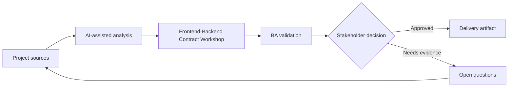

# Frontend-Backend Contract Workshop

<div class="case-meta">
  <span>Cross-functional BA Collaboration</span>
  <span>Contract workshops</span>
  <span>Project use case</span>
</div>

## Project context

Frontend needs data and behavior for a new dashboard, backend is still designing APIs, and product wants delivery estimates. Misalignment could create rework. In Contract workshops, this work usually starts when different roles need different artifacts, but the BA must keep decisions consistent across product, design, engineering, QA, data, and operations. The BA should treat Screen behavior matrix and API draft as evidence to organize, not as raw material for an unconstrained AI answer. The goal is to make the next decision clearer for the people who own the outcome.

## BA challenge

The BA must facilitate a contract workshop that aligns screen behavior, API contract, error handling, data semantics, and test responsibilities. For Frontend-Backend Contract Workshop, the practical difficulty is role misalignment and hidden trade-offs. AI can accelerate role-specific synthesis, decision memo drafting, conflict surfacing, and shared artifact critique, but the BA must still expose assumptions, missing approvals, and the point where stakeholder judgment is required.

## Where AI fits

<div class="ba-workbench-panel">
AI fits this Cross-functional BA Collaboration use case when it is constrained to role-specific synthesis, decision memo drafting, conflict surfacing, and shared artifact critique. A useful first AI task is: Generate agenda and contract questions from screen and API notes. AI should not approve scope, invent policy, bypass role feedback, decision log, design notes, technical constraints, test concerns, and support needs, or turn a draft into a final decision.
</div>

- Generate agenda and contract questions from screen and API notes.
- Identify missing data fields, state behavior, and error handling.
- Draft contract decision log and dependency list.
- Create follow-up acceptance criteria.

## Inputs to prepare

- Screen behavior matrix
- API draft
- Data glossary
- Error taxonomy
- Open technical questions

Before prompting for Frontend-Backend Contract Workshop, label each input by owner, date, approval status, sensitivity, and role in the decision. The most important evidence lens is role feedback, decision log, design notes, technical constraints, test concerns, and support needs; without it, AI may rank old notes, draft designs, and approved rules as if they had equal authority.

## BA workflow

1. Prepare source pack with UI states, data needs, and API draft.
2. Ask AI to generate workshop questions and dependency risks.
3. Facilitate decisions on fields, validation, errors, pagination, and states.
4. Record contract decisions, owners, and unresolved gaps.
5. Update UI stories and API requirements after workshop.
6. Create contract test scenarios for QA.

Run the workflow as cross-role decision alignment before handoff: start with "Prepare source pack with UI states, data needs, and API draft.", then keep a visible decision log as the artifact moves toward Workshop agenda. This prevents AI suggestions from silently becoming backlog, design, release, or operational commitments.

## Diagram



## Deliverables

| Deliverable | What it contains | Owner | Done signal |
| --- | --- | --- | --- |
| Workshop agenda | Decision topics, questions, evidence, and required owners | BA | Workshop is decision-focused |
| Contract decision log | Field, rule, error, owner, decision, and open item | BA and tech lead | Decisions are traceable |
| Updated UI/API artifacts | Story criteria, API behavior, and schema updates | BA | Artifacts stay aligned |
| Contract test list | Scenario, request, response, error, and expected UI | QA | Contract is testable |

Treat Workshop agenda as a BA-owned collaboration decision artifact. AI may draft structure, but the BA must validate whether "Workshop is decision-focused" is actually true, whether the artifact is traceable to source evidence, and whether the receiving team can act on it.

## Prompt to try

```text
Act as a senior AI-aware Business Analyst. Help me apply the "Frontend-Backend Contract Workshop" use case to my project. First ask for source evidence and constraints. Then create a structured analysis with project context, assumptions, AI-fit boundary, workflow steps, deliverables, risks, controls, open questions, and stakeholder decisions. Do not invent policy, thresholds, or approvals.
```

## Review checklist

- Screen behavior matrix is labeled with owner, date, approval status, and sensitivity.
- Workshop agenda traces to source evidence and has a named human owner.
- The AI task stays inside role-specific synthesis, decision memo drafting, conflict surfacing, and shared artifact critique and does not approve scope or policy.
- The "Meeting without decisions" risk has a practical control: Use decision agenda and owner list.
- Open assumptions are converted into validation questions or stakeholder decisions.
- Success metric: Frontend and backend leave the workshop with aligned contract decisions and test scenarios.

## Risks and controls

| Risk | Why it matters | BA control |
| --- | --- | --- |
| Meeting without decisions | Workshop may become discussion only | Use decision agenda and owner list |
| Field ambiguity | Frontend and backend may use same word differently | Define field meaning and examples |
| Error gap | Contract may ignore negative cases | Include error taxonomy |
| Artifact divergence | Decisions may not update stories and API docs | Update artifacts immediately |

The main control for the "Meeting without decisions" risk is explicit human accountability: Use decision agenda and owner list. If evidence is weak, the output should create a validation question or decision item, not a final requirement.
